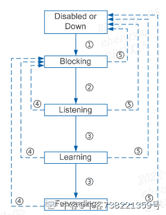

# 【2021】奇安信春招测试方向试卷 1

## 1

在 STP 协议中，端口会在不同的端口状态中进行转换，当一个端口从不转发状态进入转发状态时，需要等待（ ）Forward Delay 间隔。

正确答案: A   你的答案: 空 (错误)

```cpp
2 个
```

```cpp
3 个
```

```cpp
4 个
```

```cpp
1 个
```

None

讨论

[牛客 738221359 号](https://www.nowcoder.com/profile/738221359)



发表于 2022-02-05 16:50:10

* * *

## 2

一个数据报总长度 2900 字节，MTU 值 1500 字节，分片后，第二个分片数据报的首部“片偏移”字段，数值为

正确答案: C   你的答案: 空 (错误)

```cpp
2
```

```cpp
175
```

```cpp
185
```

```cpp
1480
```

```cpp
1500
```

None

## 3

下面那个是 OSPF stub 区域的特性

正确答案: C   你的答案: 空 (错误)

```cpp
AS-exter-LSA 允许被发布到其他 stub 区域内
```

```cpp
到 AS 外部的路由只能基于有 ABR 手工生成的一条默认路由
```

```cpp
虚连接不能跨越 stub 区域
```

```cpp
任何区域都可以成为 stub 区域
```

None

## 4

mysql 中的简化操作视图是很好的简化对象，可以操作的是（   ）

正确答案: B   你的答案: 空 (错误)

```cpp
检索，插入
```

```cpp
查看，存放
```

```cpp
查看，检索
```

```cpp
插入，更新
```

None

## 5

某网站用户名规则为大写字母、小写字母、数字、符号的组合且长度需大于 8 个字符小于 15 字符，以下测试用例中哪些属于有效等价类

正确答案: B   你的答案: 空 (错误)

```cpp
good53453!@#@$
```

```cpp
Ha123@@#1d
```

```cpp
cdAba5&1
```

```cpp
测试 teSt12@!
```

None

## 6

以下关于软件测试活动目的的表述，错误的是

正确答案: B   你的答案: 空 (错误)

```cpp
证明程序有错误，暴露问题
```

```cpp
证明发布的程序无任何错误
```

```cpp
证明技术实现与产品设计的一致性
```

```cpp
证明产品设计与用户需求的一致性
```

None

## 7

web 测试中，无法通过抓包工具实现的操作有哪些

正确答案: C   你的答案: 空 (错误)

```cpp
抓包查看服务器的 ip
```

```cpp
抓包后修改 body 内的键值
```

```cpp
抓包并修改 DNS 解析
```

```cpp
抓包并分析 header 的键值
```

None

## 8

通过 Windows 系统自带的任务管理器，无法做到以下哪些行为

正确答案: A   你的答案: 空 (错误)

```cpp
查看进程的线程
```

```cpp
查看进程的 GDI
```

```cpp
设置进程的优先级
```

```cpp
针对某一进程创建转储文件
```

None

## 9

在源程序编译成目标程序过程中，编译器的各个阶段顺序正确的是 1.词法分析器  2.代码优化器  3.语法分析器  4.代码生成器  5.语义分析器  6.中间代码生成器

正确答案: D   你的答案: 空 (错误)

```cpp
315624
```

```cpp
513642
```

```cpp
153642
```

```cpp
135624
```

None

## 10

关于页面替换算法描述错误的是 

正确答案: C   你的答案: 空 (错误)

```cpp
LRU 算法是把主存中刚访问过的页号置于栈顶；
```

```cpp
FIFO 算法是根据过去使用情况预估未来；
```

```cpp
LFU 算法不能正确反映了程序的局部性；
```

```cpp
RAND 算法的主存命中率很低。
```

None

## 11

下列数中最大的数是

正确答案: A   你的答案: 空 (错误)

```cpp
0b10011001
```

```cpp
0227
```

```cpp
0x98
```

```cpp
152
```

None

## 12

下面谁继承自 Collection 接口?

正确答案: C   你的答案: 空 (错误)

```cpp
List
```

```cpp
Set
```

```cpp
Map
```

```cpp
Queue
```

None

## 13

关于以下程序代码的说明正确的是?   public class HasStatic{     private static int x=100;     public static void main(String args[]){          HasStatic hs1=new HasStatic();          hs1.x++;          HasStatic  hs2=new HasStatic();          hs2.x++;          hs1=new HasStatic();          hs1.x++;        HasStatic.x--;       System.out.println("x="+x);     }   } 

正确答案: D   你的答案: 空 (错误)

```cpp
程序能编译通过，输出结果为 x=103
```

```cpp
程序第 5 行不能编译通过，因为引用了私有静态变量
```

```cpp
程序第 10 行不能编译通过，因为引用了私有静态变量
```

```cpp
程序能编译通过，输出 x=102
```

None

## 14

对于 JVM 内存配置参数：-Xmx10240m -Xms10240m -Xmn5120m -XXSurvivorRatio=3,其最小内存值和 Survivor 区总大小分别是（）

正确答案: D   你的答案: 空 (错误)

```cpp
5120m, 1024m
```

```cpp
5120m, 2048m
```

```cpp
10240m, 1024m
```

```cpp
10240m, 2048m
```

None

## 15

下面哪种是正确的创建 Map 集合的方式

正确答案: D   你的答案: 空 (错误)

```cpp
Map m=new Map();
```

```cpp
Map m=new Map(init capacity, increment capacity);
```

```cpp
Map m=new Map(new Collection());
```

```cpp
Map 是接口，所以不能实例化
```

None

## 16

以下程序的输出结果是 aList = [2,4,5,6,7]for var in aList:    if var % 2 ==0:        aList.remove(var)print(aList)

正确答案: B   你的答案: 空 (错误)

```cpp
[5,7]
```

```cpp
[4,5,7]
```

```cpp
[4,5,6,7]
```

```cpp
[5,6,7]
```

None

讨论

[urnotmargot](https://www.nowcoder.com/profile/609277471)

python 中循环遍历数组时是按照数组的索引来的

发表于 2022-02-15 22:05:23

* * *

## 17

导入模块的方式，错误的是

正确答案: D   你的答案: 空 (错误)

```cpp
import mo
```

```cpp
from mo import *
```

```cpp
import mo as m
```

```cpp
import m from mo
```

None

## 18

字符串是一个字符序列，给字符串 S，以下表示 S 从右侧向左第三个字符的是：

正确答案: B   你的答案: 空 (错误)

```cpp
S[3]
```

```cpp
S[-3]
```

```cpp
S[:-3]
```

```cpp
S[0:-3]
```

None

讨论

[牛客 678655522 号](https://www.nowcoder.com/profile/678655522)

B

发表于 2022-01-07 00:30:21

* * *

## 19

以下不是 Python 合法命名的是

正确答案: C   你的答案: 空 (错误)

```cpp
_QAX_
```

```cpp
QAX5
```

```cpp
5QAX
```

```cpp
qax
```

None

讨论

[大山猫](https://www.nowcoder.com/profile/269431238)

变量可以由字母，数字，下划线组成，可以由字母，下划线开头，不能以数字开头

发表于 2022-02-12 11:11:09

* * *

## 20

一个有序数组 A，依次存储以下数据，[13，18，24，35，47，50，62，83，100，115，188]，采用二分法查找 100 时，需比较的次数为

正确答案: B   你的答案: 空 (错误)

```cpp
1
```

```cpp
2
```

```cpp
3
```

```cpp
4
```

None

## 21

二分查找时间复杂度

正确答案: C   你的答案: 空 (错误)

```cpp
O(1)
```

```cpp
O(n)
```

```cpp
O(logn）
```

```cpp
o(n²)
```

None

讨论

[杨淑芳的老公](https://www.nowcoder.com/profile/814122416)

假设有 n 个数，那么执行一次循环后还剩下 n/2 个数，执行两次循环后还剩下 n/2² 个数，…以此类推，设循环 k 次后，还剩下 1 个数，即 n/2^k=1，解出 k 便可得 T(n)

发表于 2022-01-10 20:46:24

* * *

## 22

循环队列的队满条件为( )

正确答案: B   你的答案: 空 (错误)

```cpp
ring.end%maxsize == ring.front
```

```cpp
(ring.end+1)%maxsize == ring.front
```

```cpp
(ring.end+1)%maxsize == ring.front+1
```

```cpp
(ring.end+1)%maxsize == (ring.front+1)%maxsize
```

None

## 23

已知一棵二叉树前序遍历和中序遍历分别为 ABDEGCFH 和 DBGEACHF，则该二叉树的后序遍历为（）

正确答案: C   你的答案: 空 (错误)

```cpp
DEGBFHCA
```

```cpp
DGBEFHCA
```

```cpp
DGEBHFCA
```

```cpp
DHFCAGEB
```

None

## 24

下列描述，错误的是

正确答案: D   你的答案: 空 (错误)

```cpp
const 定义的常量编译器可以对其进行数据静态类型安全检查。
```

```cpp
将函数的“值传递” 改成 “const & 传递”可以提高程序运用效率的。
```

```cpp
在某函数体内 static 变量只会被初始化一次。
```

```cpp
类中的 static 函数是可以调用类中非 static 函数的。
```

None

## 25

以下 C++程序在 64 位机器上，其输出是多少?#include <stdio.h>class A{private: static const int m = 0; int n; char c;public: A(){} ~A(){}};void main(){ A a; int size = sizeof(a); printf("%d", size);}

正确答案: B   你的答案: 空 (错误)

```cpp
5
```

```cpp
8
```

```cpp
9
```

```cpp
12
```

None

## 26

有如下程序段，int *p, a[7] = {5,2,6,3,8,1}; p=a+6;执行该程序段后，*p 的值为：

正确答案: D   你的答案: 空 (错误)

```cpp
6
```

```cpp
3
```

```cpp
1
```

```cpp
0
```

None

## 27

假设 int& max(int &，int &)返回两个参数中的较大者, 如有两整型变量 int a=10；int b=15；在执行 max(a，b)++后，a，b 值分别为

正确答案: C   你的答案: 空 (错误)

```cpp
10,15
```

```cpp
11,15
```

```cpp
10,16
```

```cpp
11,16
```

None

## 28

如何撤销数据库中已经存在的表 X

正确答案: D   你的答案: 空 (错误)

```cpp
DELETE TABLE X
```

```cpp
DELETE X
```

```cpp
DROP X
```

```cpp
DROP TABLE X
```

None

## 29

下列关于范式的说法正确的是：

正确答案: C D   你的答案: 空 (错误)

```cpp
规范化的关系模式中，所有属性都必须是互不关联的；
```

```cpp
关系模式 R{A,B,C,D,E}，其上函数依赖集 F＝{AB→C，B→D}，则 R 最高能达到第二范式；
```

```cpp
有关系模式 R（A，B，C，D，E，F），函数依赖集 F={（A，B）→E，（A，C）→F，（A，D）→B，B→C，C→D}，则（A、C）是 R 的候选码；
```

```cpp
第二范式是完全依赖，消除了部分依赖
```

None

## 30

项目表中虽然设置索引，但是效果不是很明显，问题可能是（）

正确答案: A C   你的答案: 空 (错误)

```cpp
where 中索引列有运算
```

```cpp
OR 语句前后有同时使用索引
```

```cpp
复合索引未使用左列字段
```

```cpp
没有以“%”开头的 LIKE 语句，模糊匹配
```

None

## 31

Junit 单元测试说法正确的是

正确答案: A D   你的答案: 空 (错误)

```cpp
Test 注解标注的测试方法只能是 public void 的，且不能有任何输入参数
```

```cpp
AssertEquals、AssertNotEquals：判断两个对象是否为同一个
```

```cpp
BeforeClass 注解每一个测试方法都要执行一次，且必须为 static void
```

```cpp
Junit 的底层实现上，是用 System.exit 退出用例执行
```

None

## 32

以下说法正确的是

正确答案: B C D   你的答案: 空 (错误)

```cpp
白盒测试的逻辑覆盖法中，判定-条件覆盖是最强的覆盖准则
```

```cpp
动态测试包括白盒测试和黑盒测试
```

```cpp
性能测试、功能测试攻击测试都属于黑盒测试
```

```cpp
在软件测试阶段，测试步骤按次序可分为：单元测试-集成测试-系统测试-验收测试
```

None

## 33

某字符串规则规定如下：字符串长度不大于 20 个字符，第一个字符必须为小写英文字母，其他字符可以是英文字母、数字以及下划线的任意组合。以下用例中属于无效等价类的是（）

正确答案: B D   你的答案: 空 (错误)

```cpp
ahyT3425_jjudl54iiRR
```

```cpp
Wjuda+da33!!
```

```cpp
u2
```

```cpp
pp 测试 34_dfadl
```

None

## 34

以下哪一项不属于软件测试的输入文档

正确答案: A C   你的答案: 空 (错误)

```cpp
提测通过邮件
```

```cpp
UI 设计稿
```

```cpp
项目启动计划
```

```cpp
软件需求文档
```

None

## 35

以下哪些后缀的文件可能被当做进程执行起来

正确答案: A B C D   你的答案: 空 (错误)

```cpp
.exe
```

```cpp
.cmd
```

```cpp
.scr
```

```cpp
.txt
```

None

## 36

下列关于计算机系统结构的说法正确的是

正确答案: A C D   你的答案: 空 (错误)

```cpp
拓扑结构是指各级之间出端和入端相互连接的模式；
```

```cpp
数据通路宽度的确定，属于计算机系统结构；
```

```cpp
非阻塞式网络连接的灵活性好，但连线多，控制复杂，成本高；
```

```cpp
脉动阵列结构的构形与特定计算任务和算法密切相关。
```

None

## 37

在以下描述 PCI 总线的基本概念中，不正确的是

正确答案: C D   你的答案: 空 (错误)

```cpp
PCI 总线是一个与处理器无关的高速外围总线
```

```cpp
PCI 总线的基本传输机制是猝发式传送
```

```cpp
PCI 设备一定是主设备
```

```cpp
系统中只允许有一条 PCI 总线
```

None

## 38

一个网段 150.25.0.0 的子网掩码是 255.255.224.0，那么（）是该网段中有效的主机地址

正确答案: A B   你的答案: 空 (错误)

```cpp
150.25.3.25
```

```cpp
150.25.30.30
```

```cpp
150.25.61.6
```

```cpp
150.25.250.250
```

None

## 39

公司给了老杜去“北京网络安全大会”学习的机会，主办方在国家会议中心一天中安排了几十个分会场在同时举行各种主题会议，会场人声鼎沸。老杜的策略是：参加尽可能多的会议，于是老杜拿到了当天所有会议的日程表，表上是每个会议的开始结束时间段[starttime,endtime]，假设时间都为整数，请问老杜这天最多能参加几个会议？None

讨论

[零葬](https://www.nowcoder.com/profile/75718849)

贪心

先按照会议的结束时间排序，然后遍历会议数组，每次选择能参加的会议。

```cpp
import java.util.*;

public class Solution {
    /**
     * 代码中的类名、方法名、参数名已经指定，请勿修改，直接返回方法规定的值即可
     *
     * 
     * @param times int 整型二维数组 
     * @return int 整型
     */
    public int AttendMeetings (int[][] times) {
        // write code here
        Arrays.sort(times, (a, b) -> a[1] - b[1]);
        int count = 0, end = 0;
        for(int i = 0; i < times.length; i++){
            if(end <= times[i][0]){
                count++;
                end = times[i][1];     // 时间点往后推
            }
        }
        return count;
    }
}
```

复杂度分析

排序时间复杂度 O(nlogn)，遍历时间复杂度 O(n)，因此算法的瓶颈在于排序，整体时间复杂度为 O(nlogn)。遍历过程仅使用了有限几个变量，因此空间复杂度为 O(1)，但由于是对引用类型排序，因此内部使用归并排序，空间复杂度为 O(n)，算法整体的空间复杂度为 O(n)。

编辑于 2022-01-09 15:18:38

* * *

[Sushine](https://www.nowcoder.com/profile/918496688)

```cpp
public int AttendMeetings (int[][] times) {
        if (times.length < 2) return times.length;
        Arrays.sort(times, (o1, o2) -> o1[1] - o2[1]);
        int ans = 1, t = times[0][1];
        for (int i = 1; i < times.length; i++) {
            if (times[i][0] >= t) {
                t = times[i][1];
                ans++;
            }
        }
        return ans;
    }
```

 发表于 2022-03-03 23:20:20

* * *

[微笑是最美的甜](https://www.nowcoder.com/profile/98929127)

function AttendMeetings( times ) {
    // write code here
    if(!times.length) return 0// 按照结束时间进行排序
    times = times.sort((a, b) => a[1] - b[1])
    let current = times[0]
    let count = 1
    for(let i = 1; i < times.length; i++) {
        if(current[1] <= times[i][0]) {
            current = times[i]
            count++
        }
    }
    return count
}
module.exports = {
    AttendMeetings : AttendMeetings
};

编辑于 2022-02-24 12:38:57

* * *

## 40

小庄在一次机缘巧合的机会，眼睛获取了黄金瞳，黄金瞳的功能是可以看到 m 种物品 10 天以后的价格。但是这些物品属于限购物资，最多只能购买一定的数量。现在小庄有资金 x 可以投资这些物品，如何操作才能实现 10 天后资产价值最大。
None

讨论

[零葬](https://www.nowcoder.com/profile/75718849)

这个题思路并不难，从左往右进行暴力递归的尝试，写出递归逻辑后就可以改成记忆化搜索或者动态规划。但是我怀疑本题的测试用例是有问题的，下面进行列举 case 1：29
3
8 4 9
3 6 4
30 58 128
预期输出 897，注意到 30,58 和 128 都是偶数，它们的整数倍组合起来怎么可能得到一个奇数？
case 2：50
1
3
13
24
预期输出 83，和上面一样，偶数的倍数不可能得到个奇数。同时，83 根本不能被 24 整除，怎么可能得到 83？
case 3：10
4
1 1 1 1
6 4 5 3
6 5 7 5
预期输出 14，每个物品最多只能选择一个，谁能告诉我怎么得到 14？6,5,7,5 只有两个 7 能得到 14 吧，但每个物品限购 1 个，这答案到底是怎么算出来的？
还有一个 case 由于数据量比较大，不能一眼看出问题，这里就不列出来了，但凭这三个 case 我有理由怀疑那个 case 也是错的
下面给出一个记忆化搜索的代码，以上提到的 4 个 case 过不了，但是我感觉思路是没有问题的，欢迎大佬指正。

```cpp
import java.util.Scanner;
import java.util.Arrays;

class Item {
    public int limit;
    public int cur;
    public int future;
    public Item(int limit){
        this.limit = limit;
    }
}

public class Main {
    public static void main(String[] args) {
        Scanner sc = new Scanner(System.in);
        int x = sc.nextInt();
        int m = sc.nextInt();
        Item[] items = new Item[m];
        for(int i = 0; i < m; i++){
            items[i] = new Item(sc.nextInt());
        }
        for(int i = 0; i < m; i++){
            items[i].cur = sc.nextInt();
        }
        for(int i = 0; i < m; i++){
            items[i].future = sc.nextInt();
        }
        int[][] dp = new int[m][x + 1];
        System.out.println(Math.max(x, dfs(items, 0, x, dp)));
    }

    private static int dfs(Item[] items, int index, int rest, int[][] dp) {
        if(index == items.length || rest < items[index].cur){
            // 钱不够或物品到头了，后面都无法再产生收益
            return 0;
        }
        if(dp[index][rest] > 0){
            return dp[index][rest];
        }
        // 不选当前物品
        int p1 = dfs(items, index + 1, rest, dp);
        // 选当前物品
        int p2 = 0;
        for(int nums = 0; nums <= items[index].limit && nums * items[index].cur <= rest; nums++){
            p2 = Math.max(p2, nums * items[index].future + dfs(items, index + 1, rest - nums * items[index].cur, dp));
        }
        dp[index][rest] = Math.max(p1, p2);
        return dp[index][rest];
    }
}
```

根据记忆化搜索可以改出动态规划，其实就是个背包问题

```cpp
import java.util.Scanner;
import java.util.Arrays;

class Item {
    public int limit;
    public int cur;
    public int future;
    public Item(int limit){
        this.limit = limit;
    }
}

public class Main {
    static int maxProfit = 0;
    public static void main(String[] args) {
        Scanner sc = new Scanner(System.in);
        int x = sc.nextInt();
        int m = sc.nextInt();
        Item[] items = new Item[m];
        for(int i = 0; i < m; i++){
            items[i] = new Item(sc.nextInt());
        }
        for(int i = 0; i < m; i++){
            items[i].cur = sc.nextInt();
        }
        for(int i = 0; i < m; i++){
            items[i].future = sc.nextInt();
        }
        int[] dp = new int[x + 1];
        for(int index = 0; index < m; index++){
            for(int rest = x; rest >= items[index].cur; rest--){
                int p = 0;
                for(int nums = 0; nums <= items[index].limit && nums * items[index].cur <= rest; nums++){
                    p = Math.max(p, rest + nums * items[index].future + dp[rest - nums * items[index].cur]);
                }
                dp[rest] = Math.max(dp[rest], p);
            }
        }
        System.out.println(dp[x]);
    }
}
```

===========================分割线=============================根据评论区同学的指正，发现是要加上买完物品之后剩余的资金，所以记忆化搜索第 35 行是要返回 rest，而不是 0。

```cpp
import java.util.Scanner;
import java.util.Arrays;

class Item {
    public int limit;
    public int cur;
    public int future;
    public Item(int limit){
        this.limit = limit;
    }
}

public class Main {
    public static void main(String[] args) {
        Scanner sc = new Scanner(System.in);
        int x = sc.nextInt();
        int m = sc.nextInt();
        Item[] items = new Item[m];
        for(int i = 0; i < m; i++){
            items[i] = new Item(sc.nextInt());
        }
        for(int i = 0; i < m; i++){
            items[i].cur = sc.nextInt();
        }
        for(int i = 0; i < m; i++){
            items[i].future = sc.nextInt();
        }
        int[][] dp = new int[m][x + 1];
        System.out.println(Math.max(x, dfs(items, 0, x, dp)));
    }

    private static int dfs(Item[] items, int index, int rest, int[][] dp) {
        if(index == items.length || rest < items[index].cur){
            // 钱不够或物品到头了，后面都无法再产生收益，直接返回剩下的钱
            return rest;
        }
        if(dp[index][rest] > 0){
            return dp[index][rest];
        }
        // 不选当前物品
        int p1 = dfs(items, index + 1, rest, dp);
        // 选当前物品
        int p2 = 0;
        for(int nums = 0; nums <= items[index].limit && nums * items[index].cur <= rest; nums++){
            p2 = Math.max(p2, nums * items[index].future + dfs(items, index + 1, rest - nums * items[index].cur, dp));
        }
        dp[index][rest] = Math.max(p1, p2);
        return dp[index][rest];
    }
}
```

动态规划也要做出相应的修改，这里就不写了

编辑于 2022-03-07 17:15:18

* * *

[lyiopue](https://www.nowcoder.com/profile/764475745)

背包问题，不过要注意审题，求得是 10 天后的资产最大，这里的资产包括买的物品的总价值和剩下的钱。因此动态规划数组初始化时当没买物品时，值为 i(i 是 0 到 m)。

发表于 2022-03-05 11:53:36

* * *

[牛客 471114419 号](https://www.nowcoder.com/profile/471114419)

有没有大佬解释一下？

发表于 2022-02-28 01:18:34

* * *