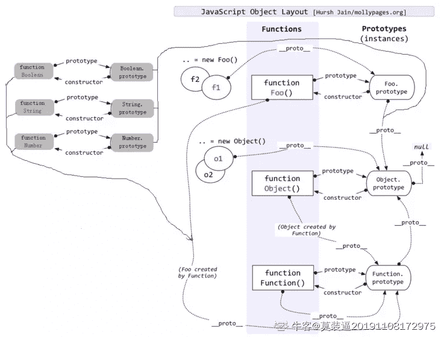
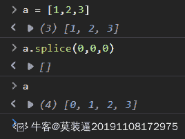

# 【2021】奇安信春招前端方向试卷 2

## 1

以下各项中，不是 IP 数据报操作特点的是

正确答案: B   你的答案: 空 (错误)

```cpp
每个分组自身携带有足够的信息，它的传送是被单独处理的
```

```cpp
使所有分组按顺序到达目的端系统
```

```cpp
在整个传送过程中，不需建立虚电路
```

```cpp
网络节点要为每个分组做出路由选择
```

None

讨论

[封魂](https://www.nowcoder.com/profile/5751524)

数据报是通过网络传输数据的基本单元，包含报头和数据本身，其中报头描述了数据的目的地址及与其他数据 之间的关系。

在数据操作方式中，每个数据报自身携带足够的信息，它的传送时被单独处理的。 整个数据传送过程中，不需要建立虚电路，网络节点为每个数据报作路由选择，各数据报不能保证按顺序到达目的节点，有些还可能丢失

发表于 2022-02-14 00:30:14

* * *

## 2

对于路由表，下列说法中正确的是

正确答案: B   你的答案: 空 (错误)

```cpp
在缺省的情况下，如果一台路由器同时运行了 RIP 和 OSPF 两种动态路由协议，则在路由表中只会显示 RIP 发现的路由，因为 RIP 协议的优先级更高
```

```cpp
在缺省的情况下，如果一台路由器同时运行了 RIP 和 OSPF 两种动态路由协议，则在路由表中只会显示 OSPF 发现的路由，因为 OSPF 协议的优先级更高
```

```cpp
在缺省的情况下，如果一台路由器同时运行了 RIP 和 OSPF 两种动态路由协议，则在路由表中只会显示 RIP 发现的路由，因为 RIP 协议的花费值(metric)更小
```

```cpp
在缺省的情况下，如果一台路由器同时运行了 RIP 和 OSPF 两种动态路由协议，则在路由表中只会显示 OSPF 发现的路由，因为 OSPF 协议的花费值(metric)更小
```

None

讨论

[封魂](https://www.nowcoder.com/profile/5751524)

所有的动态路由协议在 TCP/IP 协议栈中都属于应用层的协议。但是不同的路由协议使用的底层协议不同。

OSPF 将协议报文直接封装在 IP 报文中，协议号 89，由于 IP 协议本身是不可靠传输协议，所以 OSPF 传输的可靠性需要协议本身来保证。

BGP 使用 TCP 作为传输协议，提高了协议的可靠性，TCP 的端口号是 179。

RIP 使用 UDP 作为传输协议，端口号 520。

IS-IS 协议是开放系统互联（OSI）协议中的网络层协议，IS-IS 协议基础是 CLNP（Connectionless Network Protocol，[无连接网络协议](https://baike.baidu.com/item/%E6%97%A0%E8%BF%9E%E6%8E%A5%E7%BD%91%E7%BB%9C%E5%8D%8F%E8%AE%AE/1494257)）。 [1]

发表于 2022-02-14 01:37:04

* * *

## 3

在单处理机计算机系统中，多道程序的执行具有（）的特点。

正确答案: A B C   你的答案: 空 (错误)

```cpp
程序执行宏观上并行
```

```cpp
程序执行微观上串行
```

```cpp
设备和处理机可以并行
```

```cpp
设备和处理机只能串行
```

本题知识点

操作系统

讨论

[dflg](https://www.nowcoder.com/profile/7885255)

C 选项并行可以指，当有 I/O 通道时设备和处理机是并行的

发表于 2018-01-10 17:28:02

* * *

[牛客 650859 号](https://www.nowcoder.com/profile/650859)

1、多道：即计算机内存中同时存放几道相互独立的程序。2、宏观上并行：同时进入 系统的几道程序都处于运行过程中，即它们先后开始了各自的运行，但都未运行完毕。3、微观上串行：从微观上看，内存中的多道程序轮流地或分时地占有[处理机](http://baike.baidu.com/view/2107226.htm)。

发表于 2015-07-15 11:26:37

* * *

[翻红的番茄](https://www.nowcoder.com/profile/809140863)

通道技术可以实现 I/O 设备与 CPU 并行

发表于 2020-06-24 10:21:06

* * *

## 4

在下列进程调度算法中，可能引起进程长时间得不到运行的算法是

正确答案: A   你的答案: 空 (错误)

```cpp
可抢占式静态优先数算法
```

```cpp
不可抢占式动态优先数算法
```

```cpp
时间片轮转算法
```

```cpp
不可抢占式静态优先数算法
```

None

讨论

[牛客 841776330 号](https://www.nowcoder.com/profile/841776330)

AD 因为静态优先算法，不管是可抢占的还是不可抢占的，都会发生饥饿的现象，因为优先级低得进程会长时间得不到运行。为了解决静态优先算法的问题，所谓动态是指：在创建进程时所赋予的优先权，是可以**随进程的推进或随其等待时间的增加而改变的**，以便获得更好的调度性能。

发表于 2022-03-04 23:01:52

* * *

[每天编程一小时](https://www.nowcoder.com/profile/435920378)

答案不是 D 吗？

发表于 2022-02-06 20:21:25

* * *

## 5

在一棵度为 4 的树 T 中，若有 22 个度为 4 的结点，8 个度为 3 的结点，2 个度为 2 的结点，10 个度为 1 的结点，则树中共有多少个节点（）

正确答案: C   你的答案: 空 (错误)

```cpp
122
```

```cpp
125
```

```cpp
127
```

```cpp
128
```

None

讨论

[lqml](https://www.nowcoder.com/profile/900576713)

节点的度：一个节点含有的子树数目。

树的度：最大的节点的度称为树的度。

度 和 节点的关系：

**节点数目=所有节点度数之和+1**

发表于 2022-03-03 16:51:41

* * *

[Water·White](https://www.nowcoder.com/profile/784224503)

设 N 为总的节点数。总长度=22*4+8*3+2*2+10*1=126=N-1 所以总长度 N=126+1=127

发表于 2022-01-20 22:57:41

* * *

## 6

已知关键码序列 6，9，12，19，28，20，16，22，23，30 是最小堆，插入关键码 7，调整后得到的最小堆是（

正确答案: B   你的答案: 空 (错误)

```cpp
6,9,12,7,19,28,20,16,22,23,30
```

```cpp
6,7,12,19,9,20,16,22,23,30,28
```

```cpp
6,9,12,7,19,30,20,16,22,23,28
```

```cpp
6,7,12,19,28,29,9,16,22,23,30
```

None

## 7

已知一个线性序列{25，36，75，66，80，82}，如果采用散列函数 h(key)=key%11 计算散列地址，并散列存储在散列表 A[15]中，若采用线性探查方法解决冲突，则在该散列表上进行等概率成功搜索的平均搜索长度约为（）。

正确答案: C   你的答案: 空 (错误)

```cpp
1.2
```

```cpp
1.4
```

```cpp
1.7
```

```cpp
1.9
```

None

## 8

高度为 8 的 AVL 树最多有（）个结点

正确答案: D   你的答案: 空 (错误)

```cpp
127
```

```cpp
128
```

```cpp
252
```

```cpp
255
```

None

讨论

[零葬](https://www.nowcoder.com/profile/75718849)

满二叉树时结点最多，高为 h 时一共有 2＾h-1 个结点

发表于 2022-01-10 22:53:58

* * *

## 9

中缀表达式 5+4*(x+3)-6 所对应的后缀表达式为（）

正确答案: D   你的答案: 空 (错误)

```cpp
5 4 x 3 + * 6 + -
```

```cpp
5 4 x 6 3 + * + -
```

```cpp
5 4 x 3 6 + * + -
```

```cpp
5 4 x 3 + * + 6 -
```

None

讨论

[零葬](https://www.nowcoder.com/profile/75718849)

把 D 选项按照逆波兰式求值的流程计算一下就知道是在算题干里的中缀表达式

发表于 2022-01-10 22:56:36

* * *

## 10

以下 哪个 type 属性是 input 元素不支持的？

正确答案: C   你的答案: 空 (错误)

```cpp
color
```

```cpp
range
```

```cpp
link
```

```cpp
number
```

None

## 11

最终 item-1 和 item-2 的宽度分别是多少？<div class="box"><div class="item item-1"></div><div class="item item-2"></div></div>.box{  display: flex;  width: 1200px;}.item{  height: 100px;  flex: 0 0 300px;}.item-1{  width: 250px;}.item-2{  max-width: 250px;}

正确答案: B   你的答案: 空 (错误)

```cpp
300px, 300px
```

```cpp
300px, 250px
```

```cpp
250px, 300px
```

```cpp
250px, 250px
```

None

## 12

以下哪个方法可以改变函数 this 指向？

正确答案: A   你的答案: 空 (错误)

```cpp
Function.prototype.bind
```

```cpp
Function.prototype.toString
```

```cpp
Function.prototype.valueOf
```

```cpp
Function.prototype.isPrototypeOf
```

None

## 13

以下哪个 div 高度不会被撑开？

正确答案: C   你的答案: 空 (错误)

```cpp
<div><p></p></div>
```

```cpp
<div><span style="display:inline-block"></span</div>
```

```cpp
<div> <a></a></div>
```

```cpp
<div></div>
```

None

## 14

严格模式‘use strict’的约束不包括

正确答案: C   你的答案: 空 (错误)

```cpp
不允许使用八进制
```

```cpp
禁止局部作用域里的 this 指向全局对象
```

```cpp
不允许使用 eval 语句
```

```cpp
不允许使用 with 语句
```

None

## 15

以下代码执行后，打印对象 obj 的值为？var obj = {a: [1], b: 2}; Object.assign(obj, {}, {a: [2]});

正确答案: C   你的答案: 空 (错误)

```cpp
{a:[1], b: 2}
```

```cpp
{a:[1,2], b:2}
```

```cpp
{a: [2], b: 2}
```

```cpp
{a: [1,2]}
```

None

## 16

最终 whatsThefinalResult 值是？let whatsThefinalResult = 1;if (function f(){}) {  whatsThefinalResult += typeof f;}

正确答案: C   你的答案: 空 (错误)

```cpp
1
```

```cpp
2
```

```cpp
1undefined
```

```cpp
undefined
```

None

## 17

"First paragraph"字体颜色是？<div>   <p id="a">First paragraph</p>   <p>Second paragraph</p></div><style>p#a {  color: green;}div::first-line {  color: blue;}div {  color: red;}p {  color: black;}</style>

正确答案: B   你的答案: 空 (错误)

```cpp
green
```

```cpp
blue
```

```cpp
red
```

```cpp
black
```

None

讨论

[yslaoyi](https://www.nowcoder.com/profile/100854318)

麻了还真是

发表于 2022-03-17 18:42:41

* * *

## 18

以下代码的输出结果是？Object.prototype.a = function () {   console.log('Object')}Function.prototype.a = function () {   console.log('Function')}function F(){}var f = new F();f.a();

正确答案: A   你的答案: 空 (错误)

```cpp
Object
```

```cpp
Function
```

```cpp
undefined
```

```cpp
Uncaught TypeError: f.b is not a function
```

None

讨论

[莫装逼 201911081729754](https://www.nowcoder.com/profile/546030383)



发表于 2022-01-14 14:53:40

* * *

## 19

以下属于稳定排序算法的是

正确答案: A   你的答案: 空 (错误)

```cpp
归并排序
```

```cpp
快速排序
```

```cpp
希尔排序
```

```cpp
选择排序
```

None

讨论

[薛汤圆](https://www.nowcoder.com/profile/268071137)

稳定不稳定就看相同的关键字在排序前后的次序是否发生变化，稳定的有：冒泡排序、插入排序、归并排序；不稳定的有选择排序、快速排序、堆排序和希尔排序。

发表于 2022-03-05 13:25:53

* * *

## 20

下面代码输出结果是？(function () {  var a = { value: 1 };  var b = { value: 2 };  var object = { a, b };  var { a: a1, b: b1 } = object;  var { a: a2, b: b2 } = { ...object };  console.log(a1.value, b1.value);  window.location.reload();})();

正确答案: A   你的答案: 空 (错误)

```cpp
1,2 和 true,true
```

```cpp
1,2 和 false,false
```

```cpp
2,1 和 true,true
```

```cpp
2,1 和 false,false
```

None

## 21

IP 数据报头中用于控制数据报分段和重组字段的是哪些

正确答案: A B D   你的答案: 空 (错误)

```cpp
标识符字段
```

```cpp
标志字段
```

```cpp
生命周期字段
```

```cpp
片偏移字段
```

None

## 22

下面关于编译器与解释器的观点，错误的是？

正确答案: D   你的答案: 空 (错误)

```cpp
解释器不产生目标程序，它直接执行源程序或者源程序的内部形式
```

```cpp
解释程序和编译程序的主要区别在于是否产生目标程序
```

```cpp
编译器对高级语言程序的处理过程划分成词法分析、语法分析、语义分析，中间代码生成、代码优化、目标代码生成几个阶段
```

```cpp
解释器参与运行控制、程序执行的速度快
```

本题知识点

编译和体系结构 腾讯

讨论

[牛客 444334 号](https://www.nowcoder.com/profile/444334)

D

A 正确 解释程序直接  查看全部)

编辑于 2015-02-03 21:23:47

* * *

[昊温柔](https://www.nowcoder.com/profile/658903719)

解释器和编译器第一次执行某一个程序，应该是解释器快，编译器对一整个程序先进行编译，一旦这个过程结束，代码的少修少补会相对于解释器的执行一条解释一条更快一些

发表于 2021-09-28 09:41:12

* * *

[葫芦爷救娃娃](https://www.nowcoder.com/profile/418995681)

java 编译后的 class 文件不是目标代码吗？

发表于 2021-04-12 14:11:32

* * *

## 23

关于堆数据结构，下面描述中正确的有

正确答案: A B C E   你的答案: 空 (错误)

```cpp
可以用堆实现优先队列（priority_queue）
```

```cpp
使用堆可以实现排序算法，复杂度为 N * log N
```

```cpp
从 M 个元素中查找最小的 N 个元素时，使用大顶堆的效率比使用小顶堆更高
```

```cpp
在大顶堆中，第 N 层中的所有元素比第 N+1 层中的所有元素都要大
```

```cpp
堆数据结构可以用数组方式存储，存储的是一棵完全二叉树
```

None

## 24

关二叉树下列说法不正确的是

正确答案: A C D   你的答案: 空 (错误)

```cpp
二叉树的度为 2
```

```cpp
一棵二叉树的度可以小于 2
```

```cpp
二叉树中至少有一个结点的度为 2
```

```cpp
二叉树中任何一个结点的度都为 2
```

None

## 25

以下对 let 理解正确的有？

正确答案: A B C D   你的答案: 空 (错误)

```cpp
let 声明的变量的作用域是块级的
```

```cpp
let 在全局声明的变量无法被 window 调用
```

```cpp
let 不能重复声明已存在的变量
```

```cpp
let 声明的变量不存在变量提升
```

None

## 26

以下哪些是 DOM 树会有，渲染树不会有的节点

正确答案: A B C   你的答案: 空 (错误)

```cpp
html
```

```cpp
head
```

```cpp
template
```

```cpp
footer
```

None

讨论

[牛客 207983241 号](https://www.nowcoder.com/profile/207983241)

html 不会渲染？出题人能不能打开控制台试一下？真是服了，什么东西都能来出个题

发表于 2022-03-16 11:00:53

* * *

## 27

使用哪种 method 发送 http 请求，可以有 body 的 method 有？

正确答案: B C D   你的答案: 空 (错误)

```cpp
get
```

```cpp
post
```

```cpp
delete
```

```cpp
put
```

None

## 28

请你谈谈 Cookie 的弊端?

正确答案: A B D E   你的答案: 空 (错误)

```cpp
每个特定的域名下最多生成的 cookie 个数有限制
```

```cpp
IE 和 Opera 会清理近期最少使用的 cookie，Firefox 会随机清理 cookie
```

```cpp
cookie 的最大大约为 2048 字节，为了兼容性，一般不能超过 2047 字节
```

```cpp
安全性问题。如果 cookie 被人拦截了，那人就可以取得所有的 session 信息
```

```cpp
cookie 需要指定作用域，不可以跨域调用
```

None

讨论

[Ss 想吃火锅](https://www.nowcoder.com/profile/265742195)

cookie 大小为 4k

发表于 2022-03-11 18:51:39

* * *

## 29

以下哪些方法可以往 Array 中添加元素()

正确答案: A D   你的答案: 空 (错误)

```cpp
push
```

```cpp
pop
```

```cpp
splice
```

```cpp
unshift
```

None

讨论

[莫装逼 201911081729754](https://www.nowcoder.com/profile/546030383)

splice 是可以添加元素的啊。

发表于 2022-01-14 13:49:18

* * *

## 30

关于 transition 与 animation 的说法正确的是？

正确答案: A C   你的答案: 空 (错误)

```cpp
transition 让属性变化成为一个持续一段时间的过程，而不是立即生效的；
```

```cpp
transition 不需要触发事件；
```

```cpp
animation 重点是在创建帧，让不同帧在不同时间点发生不同变化；
```

```cpp
一条 transition 规则可以定义多个属性的变化
```

None

讨论

[Ss 想吃火锅](https://www.nowcoder.com/profile/265742195)

*transition 上面添加 all 不是可以定义多个属性的变化吗?比如我添加 tansition：all .3s；再添加向下移动和透明度变化，按理说这两个属性都是变化的*

发表于 2022-03-11 18:54:42

* * *

## 31

一个长方体，长宽高都是质数，已知长宽高之和为 n【n 为[6，10000]范围内的自然数。】，求这个长方体的体积最大值。
输入值：长宽高之和。输出值：体积的最大可能值。 None

讨论

[零葬](https://www.nowcoder.com/profile/75718849)

穷举

求 n 以内的质数，然后枚举所有的三元组(a,b,c)，当 a+b+c=n 时更新最大体积。本题的加速可以从两方面入手：(1)枚举三元组时的剪枝；(2)用数学方法判断质数。

```cpp
import java.util.*;

public class Solution {
    /**
     * 代码中的类名、方法名、参数名已经指定，请勿修改，直接返回方法规定的值即可
     *
     * 得到体积的最大可能值
     * @param n long 长整型 长方形的长宽高之和。长宽高都为质数。
     * @return long 长整型
     */
    public long getMaxVolume (long n) {
        ArrayList<Long> primeTable = new ArrayList<>();
        // 先求 n 以内的质数
        for(long num = 2L; num < n; num++){
            if(isPrime(num)){
                primeTable.add(num);
            }
        }
        int size = primeTable.size();
        long maxVolume = 0;
        for(int i = 0; i < size; i++){
            for(int j = i; j < size; j++){
                for(int k = j; k < size; k++){
                    if(primeTable.get(i) + primeTable.get(j) + primeTable.get(k) == n){
                        maxVolume = Math.max(maxVolume, primeTable.get(i) * primeTable.get(j) * primeTable.get(k));
                    }
                }
                if(i + j >= n){
                    break;
                }
            }
            if(i >= n){
                break;
            }
        }
        return maxVolume;
    }

    private boolean isPrime(long num){
        // 两个较小数另外处理
        if(num == 2 || num == 3){
            return true;
        }
        // 不在 6 的倍数两侧的一定不是质数
        if(num % 6 != 1 && num % 6 != 5){
            return false;
        }
        long temp = (long)Math.sqrt(num);
        // 在 6 的倍数两侧的也可能不是质数
        for(long i = 5; i <= temp; i += 6){
            if(num % i == 0 || num % (i + 2) == 0){
                return false;
            }
        }
        // 排除所有，剩余的是质数
        return true;
    }
}
```

编辑于 2022-01-09 17:45:49

* * *

[送吕蒙](https://www.nowcoder.com/profile/921516302)

//没有按照答案的标准编写，变量都是自己随便定义的
#include<stdio.h>main(){

    int x,max=0,min,i,j=1,z,s[100]={0},a,b,c,t;
    s[0]=2;                         //2 是最小的质数，不判断，直接赋值
    scanf("%d",&x);
    for(z=3;z<x;z++){        //求长宽高之和内的质数
        t=1;
        for(i=2;i<z;i++){
            if(z%i==0){
            t=0;
            break;
            }
        }
        if(t)  s[j++]=z;           //将得到的质数放在数组内

    }
    for(a=0;a<j;a++){
        for(b=0;b<j;b++){
            for(c=0;c<j;c++){
                if(s[a]+s[b]+s[c]==x)  //判断将三个质数相加是否等于长宽高之和
                  min=s[a]*s[b]*s[c];  //求体积
                if(min>max)             //max 存放较大的体积
                  max=min;
            }
        }
    }
    printf("%d",max);

}

编辑于 2022-01-21 21:42:40

* * *

## 32

有 n 辆共享单车，编号依次为 A，B，C，... 。现在要将单车整齐摆放，其中 A 车、B 车属于特殊车型，并且 B 车比 A 车大，现要求 B 车必须摆在 A 车后，例如 A-B-C， A-C-B 等，有多少种摆放方法。备注：至少 3 辆单车。 None

讨论

[零葬](https://www.nowcoder.com/profile/75718849)

憋了很久，本想对 AA…ABB…B 进行插空，但这样好像只能计算出方案数，不容易得到具体的排列。并且在其他类型的车比 AB 的间隔多时会牵涉到某一段的全排列，并没有提高效率。所以懒得憋高超诡谲的技巧了，先用暴力方法试试测试用例，结果 AC 了。其实仔细想想也可以发现，让列出所有排列组合可能性的题，基本都允许使用暴力解。

深度优先搜索

DFS 进行全排列得到所有的方案，在生成方案的过程中检查方案是否满足所有 A 都在 B 之前（只需检查最后一个 A 是不是在第一个 B 之前），同时计数，将满足题意的方案添加进结果字符串。

```cpp
import java.io.BufferedReader;
import java.io.InputStreamReader;
import java.io.IOException;

public class Main {
    static int count = 0;
    static StringBuilder res = new StringBuilder();
    public static void main(String[] args) throws IOException {
        BufferedReader br = new BufferedReader(new InputStreamReader(System.in));
        int n = Integer.parseInt(br.readLine());
        String[] bikes = br.readLine().split(" ");
        permutation(bikes, 0, n - 1);
        res.append(count);
        System.out.println(res);
    }

    private static void permutation(String[] arr, int start, int end) {
        if(start == end){
            if(isValid(arr)) {
                count ++;
                StringBuilder path = new StringBuilder();
                for(int i = 0; i < arr.length; i++){
                    path.append(arr[i]);
                    if(i < arr.length - 1){
                        path.append("-");
                    }else{
                        path.append(" ");
                    }
                }
                res.append(path.toString());
            }
        }else{
            for(int i = start; i <= end; i++){
                swap(arr, start, i);
                permutation(arr, start + 1, end);
                swap(arr, start, i);
            }
        }
    }

    private static boolean isValid(String[] arr) {
        int lastA = 0, firstB = 0;
        boolean flag = true;
        for(int i = 0; i < arr.length; i++){
            if(flag && "B".equals(arr[i])){
                firstB = i;
                flag = false;
            }
            if("A".equals(arr[i])){
                lastA = i;
            }
        }
        return lastA < firstB;
    }

    private static void swap(String[] arr, int i, int j) {
        if(i != j){
            String temp = arr[i];
            arr[i] = arr[j];
            arr[j] = temp;
        }
    }
}
```

不得不说奇安信春招的算法编程题比秋招还是要难的，春招的题多少还有点技巧，秋招卷的编程题都是些水题，所以同学们还是尽量不要拖到春招啊，秋招赶紧上岸~

编辑于 2022-01-13 16:17:51

* * *

[窓](https://www.nowcoder.com/profile/294170949)

```cpp
def printStrABC(strABC):
    for i in strABC[:-1]:
        print(i + '-', end='')
    print(strABC[-1], end=' ')

def fullPrem(strABC, start, end, counter):
    if start == end:
        if strABC.index('A')<strABC.index('B'):
            counter[0] += 1
            printStrABC(strABC)
    for i in range(start, end):
        strABC[start], strABC[i] = strABC[i], strABC[start]
        fullPrem(strABC, start + 1, end, counter)
        strABC[start], strABC[i] = strABC[i], strABC[start]
        i += 1

def main():
    counter = [0]
    num = int(input())
    strABC = input().split(' ')
    fullPrem(strABC, 0, num, counter)
    print(counter[0])

if __name__ == '__main__':
    main()

```

贴个 python 版，思路也是先全排列，然后判断是否符合 A 在 B 前并计数输出

发表于 2022-03-04 21:41:50

* * *