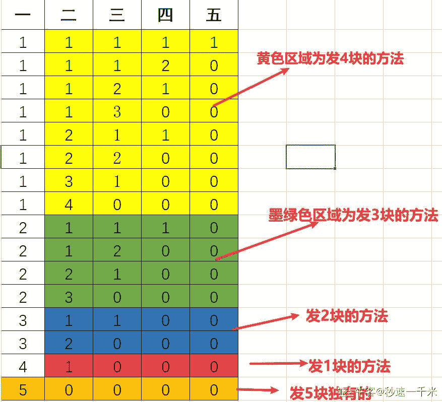

# 【2020】奇安信秋招 IT 工程师试卷 1

## 1

在以太网中，是根据什么地址来区分不同的设备的

正确答案: B   你的答案: 空 (错误)

```cpp
llc 地址
```

```cpp
mac 地址
```

```cpp
ip 地址
```

```cpp
SN
```

None

## 2

DHCP 的含义是

正确答案: C   你的答案: 空 (错误)

```cpp
简单邮件传输协议
```

```cpp
网络间的传输协议
```

```cpp
动态主机配置协议
```

```cpp
域名子系统
```

None

## 3

当一台主机从一个网络移到另一个网络时，以下说法正确的是

正确答案: B   你的答案: 空 (错误)

```cpp
必须改变它的 IP 地址和 MAC 地址
```

```cpp
必须改变它的 IP 地址，但不需改动 MAC 地址
```

```cpp
必须改变它的 MAC 地址，但不需改动 IP 地址
```

```cpp
MAC 地址、IP 地址都不需改动
```

None

## 4

在下面关于 VLAN 的描述中，不正确的是

正确答案: C   你的答案: 空 (错误)

```cpp
VLAN 把交换机划分成多个逻辑上独立的交换机
```

```cpp
主干链路（Trunk）可以提供多个 VLAN 之间通信的公共通道
```

```cpp
由于包含了多个交换机，所以 VLAN 扩大了冲突域
```

```cpp
一个 VLAN 可以跨越交换机
```

None

## 5

查看编辑本地策略,可以在开始/运行中输入

正确答案: B   你的答案: 空 (错误)

```cpp
edit.MSC
```

```cpp
gpedit.msc
```

```cpp
regedit32 
```

```cpp
regedit
```

None

## 6

以下哪一个选项按顺序包括了 OSI 模型的各个层次

正确答案: A   你的答案: 空 (错误)

```cpp
物理层，数据链路层，网络层，运输层，会话层，表示层和应用层
```

```cpp
物理层，数据链路层，网络层，运输层，系统层，表示层和应用层
```

```cpp
物理层，数据链路层，网络层，转换层，会话后，表示层和应用层
```

```cpp
表示层，数据链路层，网络层，运输层，会话层，物理层和应用层
```

None

## 7

在 TCP/IP 网络中，为各种公共服务保留的端口号范围是

正确答案: B   你的答案: 空 (错误)

```cpp
1～255
```

```cpp
1～1023
```

```cpp
1～1024
```

```cpp
1～65535
```

None

## 8

20、某公司申请到一个 C 类 IP 地址，但要连接 6 个子公司，最大的一个子公司有 26 台计算机，每个子公司在一个网段中，则子网掩码应设为

正确答案: D   你的答案: 空 (错误)

```cpp
255.255.255.0
```

```cpp
255.255.255.128
```

```cpp
255.255.255.192
```

```cpp
255.255.255.224
```

None

## 9

测试 DNS 主要使用以下哪个命令

正确答案: C   你的答案: 空 (错误)

```cpp
Ping
```

```cpp
IPcofig
```

```cpp
Nslookup
```

```cpp
Winipcfg
```

None

## 10

以下正确得 Windows 分区格式是

正确答案: B   你的答案: 空 (错误)

```cpp
FAT32、Linux
```

```cpp
FAT32、NTFS
```

```cpp
NTFS、HFS
```

```cpp
Linux、HFS
```

None

## 11

域树中的子域和父域的信任关系是

正确答案: C   你的答案: 空 (错误)

```cpp
双向、不可传递的
```

```cpp
单向、不可传递的
```

```cpp
双向、可传递的
```

```cpp
单向、可传递的
```

None

## 12

SYSVOL 是位于操作系统系统分区%windir%目录中的操作系统文件的一部分，必须位于 NTFS 分区

正确答案: B   你的答案: 空 (错误)

```cpp
FAT32
```

```cpp
NTFS
```

```cpp
FAT16
```

```cpp
REFS
```

None

## 13

活动目录的物理结构的两个重要概念是是什么？

正确答案: A   你的答案: 空 (错误)

```cpp
域控制器和站点
```

```cpp
域控制器和域林
```

```cpp
域控制器和成员服务器
```

```cpp
成员服务器和站点
```

None

## 14

独立服务器上安装了什么就升级为域控制器

正确答案: D   你的答案: 空 (错误)

```cpp
站点
```

```cpp
成员服务器
```

```cpp
AD 管理中心
```

```cpp
活动目录
```

None

## 15

下列（  ）不是域控制器存储所有的域范围内的信息

正确答案: D   你的答案: 空 (错误)

```cpp
安全策略信息
```

```cpp
用户身份验证信息
```

```cpp
账户信息
```

```cpp
工作站分区信息
```

None

## 16

活动目录和（  ）的关系密不可分，使用此服务器；来登记域控制器的 IP、各种资源的定位等

正确答案: A   你的答案: 空 (错误)

```cpp
DNS
```

```cpp
DHCP
```

```cpp
FTP
```

```cpp
HTTP
```

None

## 17

下列（     ）不属于活动目录的逻辑结构。

正确答案: C   你的答案: 空 (错误)

```cpp
域树
```

```cpp
域林
```

```cpp
域控制器
```

```cpp
组织单元
```

None

## 18

活动目录安装后，管理工具里没有增加得菜单是？

正确答案: D   你的答案: 空 (错误)

```cpp
Active Directory 用户和计算机
```

```cpp
Active Directory 域和信任关系
```

```cpp
.Active Directory 域站点和服务器
```

```cpp
Active Directory 管理
```

None

## 19

.你是一台 Windows Server 2008 计算机的系统管理员，你可以使用（  ）工具来管理该计算机中的组账号。

正确答案: C   你的答案: 空 (错误)

```cpp
活动目录用户和计算机
```

```cpp
域用户和计算机
```

```cpp
活动目录用户与用户组
```

```cpp
本地用户和组
```

None

## 20

关于组可以包含组的描述，正确的是

正确答案: C   你的答案: 空 (错误)

```cpp
组在任何时候都可包含组
```

```cpp
组在任何时候都可以加入组
```

```cpp
在工作组模式下，本地组不能包含本地组
```

```cpp
在工作组模式下，本地组可以包含内置组
```

None

## 21

一个用户账户可以加入（  ）个组

正确答案: D   你的答案: 空 (错误)

```cpp
1
```

```cpp
2
```

```cpp
3
```

```cpp
多个
```

None

## 22

办公网络中计算机的逻辑组织形式可以有两种，工作组和域。下列关于工作组的描述中正确的是

正确答案: C   你的答案: 空 (错误)

```cpp
工作组中的每台计算机都在本地存储账户
```

```cpp
本计算机的账户可以登录到其它计算机上
```

```cpp
工作组中的计算机的数量最好不要超过 10 台
```

```cpp
工作组中的操作系统必须一样
```

None

## 23

.公司需要使用域控制器来集中管理域账户，你装域控制器必须具备以下条件

正确答案: B   你的答案: 空 (错误)

```cpp
操作系统版本是 Windowsserver20
```

```cpp
本地磁盘至少有一个 NTFS 分区
```

```cpp
本地磁盘必须全部是 NTFS 分区
```

```cpp
有相应的 DNS 服务器支持
```

None

## 24

在 Windows Server 2008 林中，（  ）和域命名主机是专属于林的主机角色。

正确答案: A   你的答案: 空 (错误)

```cpp
架构主机
```

```cpp
PDC 仿真主机
```

```cpp
RID 主机
```

```cpp
基础结构主机
```

None

## 25

是一台系统为 Windows Server 2008 的计算机的系统管理员，你需要运行（  ）命令在这台计算机上安装活动目录

正确答案: C   你的答案: 空 (错误)

```cpp
installad
```

```cpp
adinstall
```

```cpp
dcpromo
```

```cpp
promodc
```

None

## 26

你是一台 Windows Server 2008 计算机的系统管理员，你可以使用（  )工具来管理该计算机中的组账号

正确答案: C   你的答案: 空 (错误)

```cpp
活动目录用户和计算机
```

```cpp
域用户和计算机
```

```cpp
活动目录用户与用户组
```

```cpp
本地用户和组
```

None

## 27

IP 地址共占用 ________ 多少个二进制位

正确答案: B   你的答案: 空 (错误)

```cpp
16
```

```cpp
32
```

```cpp
64
```

```cpp
128
```

None

## 28

理论上 IP 的范围是？

正确答案: B   你的答案: 空 (错误)

```cpp
0.0.0.0~255.255.255.254
```

```cpp
0.0.0.0~255.255.255.255
```

```cpp
0.0.0.1~255.255.255.255
```

```cpp
0.0.0.1~255.255.255.254
```

None

## 29

请填写 568A 线序

正确答案: B   你的答案: 空 (错误)

```cpp
白橙、橙、白绿、蓝、白蓝、绿、白棕、棕
```

```cpp
白绿、绿、白橙、蓝、白蓝、橙、白棕、棕
```

```cpp
白橙、橙、白绿、白蓝、蓝、绿、白棕、棕
```

```cpp
橙、白橙、白绿、白蓝、蓝、绿、白棕、棕
```

None

## 30

在企业网络中，经常需要对交换机进行 VLAN 划分，这做的好处有？

正确答案: A B C   你的答案: 空 (错误)

```cpp
广播可以得到控制      
```

```cpp
机密数据可以得到保护
```

```cpp
逻辑的界限了用户群  
```

```cpp
解决了 IP 地址的不足  
```

None

## 31

老板一共需要给某个员工发奖金 n 元，可以选择一次发 1 元，也可以选择一次发 2 元，也可以选择一次发 3 元。请问老板给这位员工发放完 n 元奖金共有多少种不同的方法？数据范围：1 <= n <= 10None

讨论

[秒速一千米](https://www.nowcoder.com/profile/444333129)

分析：可以这样想，发 5 元怎么发？1：先发 1 块的情况下，剩下 4 块是不是就和发 4 块的方法一样了？2：先发 2 块的情况下，剩下 3 块是不是就和发 3 块的方法一样了？3：先发 3 块的情况下，剩下 2 块是不是就和发 2 块的方法一样了？4：先发 4 块的情况下，剩下 1 块是不是就和发 1 块的方法一样了？5：5 块一次性发完，唯一方法这很递归嘛~即符合  f(n) = f(n-1) + f(n-2) + ... + f(1) + 1 为便于理解，本人画了张图。代码和运行结果如下

```cpp
public class GiveMoney {
    public static void main(String[] args) {
        Scanner scanner = new Scanner (System.in);
        System.out.print ("输入要发的奖金:");
        int number = scanner.nextInt ();
        System.out.println ("您有" + f (number) + "种方法发完" + number + "元奖金!!");
    }

    /**
     * 获取 发奖金可用的总方法 的方法
     *
     * @param number 要发的钱数
     * @return 总方法数
     */
    public static int f(Integer number) {
        // 设置递归结束条件
        if (number == 1) {
            return 1;
        }
        // 实现 f(n) = f(n-1) + f(n-2) + ... + f(1) + 1
        int count = 0;
        for (int i = number - 1; i >= 1; i--) {
            count = f (i) + count;
        }
        return count + 1;
    }
}
```



发表于 2022-01-22 22:33:34

* * *

[李彤是快递小哥](https://www.nowcoder.com/profile/94626269)

这不就是 青蛙跳吗

发表于 2022-02-23 22:26:19

* * *

[我要逆天当学霸](https://www.nowcoder.com/profile/245035478)

import java.util.*;
public class Solution {
    /**
     * 
     * @param num_money int 整型 奖金的总数,单位为元
     * @return int 整型
     */
    public void main(String [] args){
        Scanner sc = new Scanner(System.in);
        int num_money = sc.nextInt();
        System.out.println(CalulateMethodCount(num_money));
        sc.close();
    }
    public int CalulateMethodCount (int num_money) {
        // write code here
        if (num_money == 1) return 1;
        if (num_money == 2) return 2;
        if (num_money == 3) return 4;
        int[] dp = new int[num_money + 1];
        dp[0] = 0; 
        dp[1] = 1; 
        dp[2] = 2; 
        dp[3] = 4;
        for (int i = 4; i <= num_money; ++i) {
            dp[i] = dp[i - 1] + dp[i - 2] + dp[i - 3];
        }
        return dp[num_money];
    }
}

发表于 2022-01-20 21:32:27

* * *

## 32

撤销/恢复操作具有广泛的用途，比如 word 文档中输入一个单词，可以点撤销，然后可以再恢复。编程实现如下功能：  从标准输入读取到一个字符串，字符串可包含 0 个或多个单词，单词以空格或者 tab 分隔； 如果遇到 "undo" 字符串，表示"撤销"操作，前一个字符串被撤销掉； 如果遇到"redo"字符串，表示恢复刚才撤销掉的字符串.例如:   输入字符串 "hello undo redo world."，  对字符串中的 undo 和 redo 处理后， 最终输出的结果为 "hello world."None

讨论

[零葬](https://www.nowcoder.com/profile/75718849)

先初始化两个栈 stack 和 redo，然后利用双栈求解。遍历词表：

1.  遇到普通词就压入 stack，并清空 redo 栈，因为此时写入了一个新词，再往前的词已经找不回来了；
2.  遇到 undo 就从 stack 中弹栈至 redo；
3.  遇到 redo 就从 redo 中弹栈至 stack。

最终 stack 中的词就是最后保留下来的词

```cpp
commands = input().strip().split(" ")
stack, redo = [], []
for cmd in commands:
    if cmd == "undo":
        if stack:
            redo.append(stack.pop())
    elif cmd == "redo":
        if redo:
            stack.append(redo.pop())
    else:
        redo.clear()
        stack.append(cmd)
print(" ".join(stack))
```

发表于 2022-01-08 20:08:09

* * *

[牛客 442788909 号](https://www.nowcoder.com/profile/442788909)

import java.util.*;
public class Main{
    public static void main(String[] args){
        Scanner sc = new Scanner(System.in);
        List<String> li = new LinkedList(Arrays.asList(sc.nextLine().split(" ")));
        Deque<String> dq = new LinkedList<String>();
        for(int i = 0;i<li.size();i++){
            if(li.get(i).equals("undo")&&i!=0) {
                dq.push(li.get(i-1));
                li.remove(i);
                li.remove(i-1);
                i-=2;
                continue;
            }
            if(li.get(i).equals("redo")) {
                if(!dq.isEmpty()) {
                    li.remove(i);
                    li.add(i,dq.pop());
                }
            }
        }

        System.out.println(String.join(" ", li));
        sc.close();
    }
}

发表于 2022-01-22 21:09:06

* * *

[軸。](https://www.nowcoder.com/profile/542430771)

```cpp
package main
import(
    "os"  
    "bufio"
    "fmt"
    "strings"
)

func RedoUndoStr(str string) string{
    strList := strings.Split(str," ")
    stack := make([]string,0)
    redo := make([]string,0)
    for _,val:=range strList{
        if val=="redo"{
            if len(redo)>0{
                stack=append(stack, redo[len(redo)-1])
                redo=redo[:len(redo)-1]
            }
        }else if val=="undo"{
            if len(stack)>0{
                redo=append(redo, stack[len(stack)-1])
                stack=stack[:len(stack)-1]
            }
        }else{
            redo=redo[:0]
            stack=append(stack, val)
        }
    }
    return strings.Join(stack," ")
}
func main(){
    reader:=bufio.NewReader(os.Stdin)
    str,_:=reader.ReadString('\n')
    fmt.Println(RedoUndoStr(str))
}
```

编辑于 2022-03-22 09:09:09

* * *