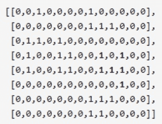

# 【2020】奇安信秋招 IT 工程师试卷 3

## 1

查看编辑本地策略,可以在开始/运行中输入

正确答案: B   你的答案: 空 (错误)

```cpp
edit.MSC
```

```cpp
gpedit.msc
```

```cpp
regedit32 
```

```cpp
regedit
```

None

## 2

以下哪一个选项按顺序包括了 OSI 模型的各个层次

正确答案: A   你的答案: 空 (错误)

```cpp
物理层，数据链路层，网络层，运输层，会话层，表示层和应用层
```

```cpp
物理层，数据链路层，网络层，运输层，系统层，表示层和应用层
```

```cpp
物理层，数据链路层，网络层，转换层，会话后，表示层和应用层
```

```cpp
表示层，数据链路层，网络层，运输层，会话层，物理层和应用层
```

None

## 3

在 TCP/IP 网络中，为各种公共服务保留的端口号范围是

正确答案: B   你的答案: 空 (错误)

```cpp
1～255
```

```cpp
1～1023
```

```cpp
1～1024
```

```cpp
1～65535
```

None

## 4

20、某公司申请到一个 C 类 IP 地址，但要连接 6 个子公司，最大的一个子公司有 26 台计算机，每个子公司在一个网段中，则子网掩码应设为

正确答案: D   你的答案: 空 (错误)

```cpp
255.255.255.0
```

```cpp
255.255.255.128
```

```cpp
255.255.255.192
```

```cpp
255.255.255.224
```

None

## 5

测试 DNS 主要使用以下哪个命令

正确答案: C   你的答案: 空 (错误)

```cpp
Ping
```

```cpp
IPcofig
```

```cpp
Nslookup
```

```cpp
Winipcfg
```

None

## 6

以下正确得 Windows 分区格式是

正确答案: B   你的答案: 空 (错误)

```cpp
FAT32、Linux
```

```cpp
FAT32、NTFS
```

```cpp
NTFS、HFS
```

```cpp
Linux、HFS
```

None

## 7

域树中的子域和父域的信任关系是

正确答案: C   你的答案: 空 (错误)

```cpp
双向、不可传递的
```

```cpp
单向、不可传递的
```

```cpp
双向、可传递的
```

```cpp
单向、可传递的
```

None

## 8

SYSVOL 是位于操作系统系统分区%windir%目录中的操作系统文件的一部分，必须位于 NTFS 分区

正确答案: B   你的答案: 空 (错误)

```cpp
FAT32
```

```cpp
NTFS
```

```cpp
FAT16
```

```cpp
REFS
```

None

## 9

活动目录的物理结构的两个重要概念是是什么？

正确答案: A   你的答案: 空 (错误)

```cpp
域控制器和站点
```

```cpp
域控制器和域林
```

```cpp
域控制器和成员服务器
```

```cpp
成员服务器和站点
```

None

## 10

独立服务器上安装了什么就升级为域控制器

正确答案: D   你的答案: 空 (错误)

```cpp
站点
```

```cpp
成员服务器
```

```cpp
AD 管理中心
```

```cpp
活动目录
```

None

## 11

下列（  ）不是域控制器存储所有的域范围内的信息

正确答案: D   你的答案: 空 (错误)

```cpp
安全策略信息
```

```cpp
用户身份验证信息
```

```cpp
账户信息
```

```cpp
工作站分区信息
```

None

## 12

活动目录和（  ）的关系密不可分，使用此服务器；来登记域控制器的 IP、各种资源的定位等

正确答案: A   你的答案: 空 (错误)

```cpp
DNS
```

```cpp
DHCP
```

```cpp
FTP
```

```cpp
HTTP
```

None

## 13

下列（     ）不属于活动目录的逻辑结构。

正确答案: C   你的答案: 空 (错误)

```cpp
域树
```

```cpp
域林
```

```cpp
域控制器
```

```cpp
组织单元
```

None

## 14

活动目录安装后，管理工具里没有增加得菜单是？

正确答案: D   你的答案: 空 (错误)

```cpp
Active Directory 用户和计算机
```

```cpp
Active Directory 域和信任关系
```

```cpp
.Active Directory 域站点和服务器
```

```cpp
Active Directory 管理
```

None

## 15

.你是一台 Windows Server 2008 计算机的系统管理员，你可以使用（  ）工具来管理该计算机中的组账号。

正确答案: C   你的答案: 空 (错误)

```cpp
活动目录用户和计算机
```

```cpp
域用户和计算机
```

```cpp
活动目录用户与用户组
```

```cpp
本地用户和组
```

None

## 16

关于组可以包含组的描述，正确的是

正确答案: C   你的答案: 空 (错误)

```cpp
组在任何时候都可包含组
```

```cpp
组在任何时候都可以加入组
```

```cpp
在工作组模式下，本地组不能包含本地组
```

```cpp
在工作组模式下，本地组可以包含内置组
```

None

## 17

一个用户账户可以加入（  ）个组

正确答案: D   你的答案: 空 (错误)

```cpp
1
```

```cpp
2
```

```cpp
3
```

```cpp
多个
```

None

## 18

办公网络中计算机的逻辑组织形式可以有两种，工作组和域。下列关于工作组的描述中正确的是

正确答案: C   你的答案: 空 (错误)

```cpp
工作组中的每台计算机都在本地存储账户
```

```cpp
本计算机的账户可以登录到其它计算机上
```

```cpp
工作组中的计算机的数量最好不要超过 10 台
```

```cpp
工作组中的操作系统必须一样
```

None

## 19

.公司需要使用域控制器来集中管理域账户，你装域控制器必须具备以下条件

正确答案: B   你的答案: 空 (错误)

```cpp
操作系统版本是 Windowsserver20
```

```cpp
本地磁盘至少有一个 NTFS 分区
```

```cpp
本地磁盘必须全部是 NTFS 分区
```

```cpp
有相应的 DNS 服务器支持
```

None

## 20

在 Windows Server 2008 林中，（  ）和域命名主机是专属于林的主机角色。

正确答案: A   你的答案: 空 (错误)

```cpp
架构主机
```

```cpp
PDC 仿真主机
```

```cpp
RID 主机
```

```cpp
基础结构主机
```

None

## 21

是一台系统为 Windows Server 2008 的计算机的系统管理员，你需要运行（  ）命令在这台计算机上安装活动目录

正确答案: C   你的答案: 空 (错误)

```cpp
installad
```

```cpp
adinstall
```

```cpp
dcpromo
```

```cpp
promodc
```

None

## 22

你是一台 Windows Server 2008 计算机的系统管理员，你可以使用（  )工具来管理该计算机中的组账号

正确答案: C   你的答案: 空 (错误)

```cpp
活动目录用户和计算机
```

```cpp
域用户和计算机
```

```cpp
活动目录用户与用户组
```

```cpp
本地用户和组
```

None

## 23

IP 地址共占用 ________ 多少个二进制位

正确答案: B   你的答案: 空 (错误)

```cpp
16
```

```cpp
32
```

```cpp
64
```

```cpp
128
```

None

## 24

理论上 IP 的范围是？

正确答案: B   你的答案: 空 (错误)

```cpp
0.0.0.0~255.255.255.254
```

```cpp
0.0.0.0~255.255.255.255
```

```cpp
0.0.0.1~255.255.255.255
```

```cpp
0.0.0.1~255.255.255.254
```

None

## 25

请填写 568A 线序

正确答案: B   你的答案: 空 (错误)

```cpp
白橙、橙、白绿、蓝、白蓝、绿、白棕、棕
```

```cpp
白绿、绿、白橙、蓝、白蓝、橙、白棕、棕
```

```cpp
白橙、橙、白绿、白蓝、蓝、绿、白棕、棕
```

```cpp
橙、白橙、白绿、白蓝、蓝、绿、白棕、棕
```

None

## 26

在企业网络中，经常需要对交换机进行 VLAN 划分，这做的好处有？

正确答案: A B C   你的答案: 空 (错误)

```cpp
广播可以得到控制      
```

```cpp
机密数据可以得到保护
```

```cpp
逻辑的界限了用户群  
```

```cpp
解决了 IP 地址的不足  
```

None

## 27

TCP/IP 参考模型中没有

正确答案: C D   你的答案: 空 (错误)

```cpp
网络层
```

```cpp
传输层
```

```cpp
会话层
```

```cpp
表示层
```

None

## 28

NTFS 较之 FAT32 格式的主要有哪些优点

正确答案: B C D   你的答案: 空 (错误)

```cpp
有一定防病毒能力  
```

```cpp
能够存放大于 4G 以上的文件
```

```cpp
用配额功能配合 FTP 分配磁盘空间使用
```

```cpp
安全设置更加复杂化  
```

None

## 29

系统启动时蓝屏通常会有以下几种情况造

正确答案: A B C D   你的答案: 空 (错误)

```cpp
内存条故障
```

```cpp
硬盘线接触不良 
```

```cpp
硬盘工作模式设置不当 
```

```cpp
某些声卡驱动安装错误  
```

None

## 30

以下能够用作显示输出接口的有

正确答案: A B C D   你的答案: 空 (错误)

```cpp
VGA   
```

```cpp
HDM
```

```cpp
DVI   
```

```cpp
DP
```

None

## 31

有一个大型仓库使用拣货机器人从不同的货架间取货。已知：1、货架呈二维网格排列，网格中的每个货架只会放置一种商品。2、受这代设备的技术水平所限，**机器人只能沿上下左右四个方向移动**，还不能沿斜线移动，请理解。仓库当前使用的拣货算法是这样：1、一张订单会包含 X 种商品，分布在 X 个货架上 2、结合将这 X 种商品的所在位置，将地图上的商品分解为 Y 个“商品堆”，然后同时派出 Y 个机器人，并发取货，每个机器人只负责一个“商品堆”。3、“商品堆”的定义是上下左右彼此相邻的一组商品。在订单被分析后，给你一个由 '1'（该货架有待取货物）和 '0'（该货架没有待取货物）组成的的二维网格表示货架地图，请计算需要派出的机器人的数量。比如，下面的这张货物地图：
在这个例子中，一共有 6“堆”商品，共需要同时派出 6 个机器人。None

讨论

[零葬](https://www.nowcoder.com/profile/75718849)

很简单，就是岛问题换了个业务说法，直接深度优先遍历进行感染

```cpp
import java.util.*;

public class Solution {
    /**
     * 代码中的类名、方法名、参数名已经指定，请勿修改，直接返回方法规定的值即可
     * 
     * @param grid char 字符型二维数组 
     * @return int 整型
     */
    public int numIslands (char[][] grid) {
        // write code here
        int count = 0;
        for(int i = 0; i < grid.length; i++){
            for(int j = 0; j < grid[0].length; j++){
                if(grid[i][j] == '1'){
                    dfs(grid, i, j);
                    count ++;
                }
            }
        }
        return count;
    }

    private void dfs(char[][] grid, int x, int y) {
        if(x < 0 || x >= grid.length || y < 0 || y >= grid[0].length || grid[x][y] == '0'){
            return;
        }
        grid[x][y] = '0';     // 遍历过的位置感染成 0，避免重复经过
        dfs(grid, x + 1, y);
        dfs(grid, x - 1, y);
        dfs(grid, x, y - 1);
        dfs(grid, x, y + 1);
    }
}
```

发表于 2022-01-08 19:27:43

* * *

[牛客 100178796 号](https://www.nowcoder.com/profile/100178796)

这题够坑的给的数据明明是 int 型，判断却用的是 str 型。麻烦以后给样例数据的时候，给准确一点## 代码中的类名、方法名、参数名已经指定，请勿修改，直接返回方法规定的值即可
# 
# @param grid char 字符型二维数组 
# @return int 整型
#
class Solution:
    def numIslands(self , grid ):
        # write code here
        ls=[(-1,0),(1,0),(0,-1),(0,1)]
        n=len(grid)
        m=len(grid[0])
        nums=0
        def dfs(i,j):
            grid[i][j]=0
            for k in ls:
                new_i=k[0]+i
                new_j=k[1]+j
                if 0<=new_i<n and 0<=new_j<m and grid[new_i][new_j]=="1":
                    dfs(new_i,new_j)
        for i in range(n):
            for j in range(m):
                if grid[i][j]=="1":
                    nums+=1
                    dfs(i,j)
        return nums

发表于 2022-03-05 09:57:54

* * *

[牛客 471114419 号](https://www.nowcoder.com/profile/471114419)

力扣岛问题

```cpp
import java.util.*;

public class Solution {

    int[] tmpX = {0,1,0,-1};
    int[] tmpY = {1,0,-1,0};
    int col=0,row=0;
    public int numIslands (char[][] grid) {
        col=grid[0].length;
        row=grid.length;
        int ans = 0 ;
        for(int x=0;x<col;x++){
            for(int y=0;y<row;y++){
                if( grid[y][x] == '1'){
                    ans++;
                    dfs(grid,x,y);
                }
            }
        }
        return ans;
    }

    public void dfs(char[][] grid , int x ,int y){
        grid[y][x]='0';
        for(int i=0;i<4;i++){
            int x1=tmpX[i]+x;
            int y1=tmpY[i]+y;
            if( x1 >= 0 && y1 >= 0 && x1 < col && y1 < row && grid[y1][x1] == '1'){
                dfs(grid,x1,y1);
            }
        }
    }
}
```

发表于 2022-02-28 15:32:34

* * *

## 32

在某厂，产品经理同学的工作职责除了给开发同学提需求，还有一件极其重要的事：对产品运营数据做归因分析。某天，该产品经理同学接到老板要求：根据在过去一段时间内产品的“每日活跃用户数”，统计出最长的增长总天数，也就是把保持增长势头（**可以不连续**）的天数抽出来，你可能会得到多个新序列，计算最长的那个序列的总天数。我们把该产品自上线以来“每日的活跃用户数”，都按照顺序放入一个数组，比如：[1,5,122,34,45,232,342,34]，以这组数据为例，把其中所有的增长子序列罗列出来：形成了第一个子序列： [1,5,122]第二个子序列：[34,45,232,342]第三个子序列：[1,5,122,232,342]第四个子序列：[1,5,34,45,232,342]这四个序列，其中最长的是第四个，所以这个例子中，最长的增长总天数是：6 因为该产品上线时间有十几年了，产品同学数了 1 个小时，眼都数花了，最后只好放弃，她决定用请开发同学吃饭，来解决这个问题，你能帮帮她吗？None

讨论

[零葬](https://www.nowcoder.com/profile/75718849)

就是给最长递增子序列套了个业务背景，我们可以将时间复杂度为 O(n²)的经典动态规划方法优化成 O(nlogn)的算法

```cpp
import java.util.*;

public class Solution {
    /**
     * 代码中的类名、方法名、参数名已经指定，请勿修改，直接返回方法规定的值即可
     * 
     * @param nums int 整型一维数组 
     * @return int 整型
     */
    public int lengthOfLIS (int[] nums) {
        // write code here
        int n = nums.length;
        int[] ends = new int[n];    // ends[i]表示长度为 i+1 的递增子序列中的最小结尾
        ends[0] = nums[0];
        int tail = 0, maxLen = 1;
        for(int i = 1; i < n; i++){
            int index = lowerBound(ends, 0, tail, nums[i]);
            ends[index] = nums[i];
            if(index > tail){
                tail ++;
            }
            maxLen = Math.max(maxLen, index + 1);
        }
        return maxLen;
    }

    private int lowerBound(int[] nums, int L, int R, int target) {
        int left = L, right = R, index = R + 1;
        while(left <= right){
            int mid = left + ((right - left) >> 1);
            if(nums[mid] < target){
                left = mid + 1;
            }else{
                index = mid;
                right = mid - 1;
            }
        }
        return index;
    }
}
```

编辑于 2022-01-08 19:30:32

* * *

[今夜早睡](https://www.nowcoder.com/profile/875349080)

```cpp
/*
    因为只需要求最长上升子序列的值，所以只需要 O(n)复杂度即可
*/
class Solution {
public:
    /**
     * 代码中的类名、方法名、参数名已经指定，请勿修改，直接返回方法规定的值即可
     *
     * @param nums int 整型 vector
     * @return int 整型
     */
    int lengthOfLIS(vector<int>& nums) {
        // write code here
        int num = 0;
        int ans = 0;
        for(int i = 0;i < nums.size();i++){
            if(num < nums[i]) ans++;
            num = nums[i];
        }
        return ans;
    }
};
```

发表于 2022-03-10 19:50:52

* * *

[牛客 100178796 号](https://www.nowcoder.com/profile/100178796)

#
# 代码中的类名、方法名、参数名已经指定，请勿修改，直接返回方法规定的值即可
# 
# @param nums int 整型一维数组 
# @return int 整型
#
class Solution:
    def lengthOfLIS(self , nums ):
        # write code here
        dp=[1 for i in range(len(nums))]

        for i in range(1,len(nums)):
            for j in range(i):
                if nums[i]>nums[j]:
                    dp[i]=max(dp[i],dp[j]+1)
        return max(dp)

发表于 2022-03-03 21:10:02

* * *