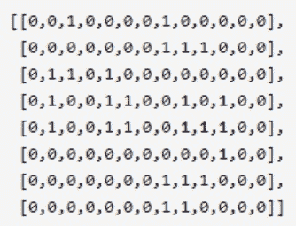

# 【2020】奇安信秋招测试方向试卷 3

## 1

下列类型中，不是 java 语言基本数据类型的是

正确答案: C   你的答案: 空 (错误)

```cpp
long
```

```cpp
double
```

```cpp
String
```

```cpp
float
```

本题知识点

大数据开发工程师 奇安信 2020

讨论

[-13579](https://www.nowcoder.com/profile/654584696)

string 是引用类型

发表于 2021-04-06 13:17:36

* * *

## 2

在调用方法时，若要使方法改变实参的值，可以:

正确答案: B   你的答案: 空 (错误)

```cpp
用基本数据类型作为参数
```

```cpp
用对象作为参数
```

```cpp
“用基本数据类型作为参数”和“用对象作为参数”都对
```

```cpp
“用基本数据类型作为参数”和“用对象作为参数”都不对
```

本题知识点

测试开发工程师 测试工程师 奇安信 2020 大数据开发工程师

讨论

[常平 wudi](https://www.nowcoder.com/profile/5045524)

如果做错请复习数据类型和引用数据类型的区别**传递基本数据类型，栈里新开辟空间复制一个副本 age。修改的 age 是副本，不会修改主函数里栈的 age 的值。**
**修改引用数据类型，修改的是堆里的数据，而主函数里栈和副本里的 arr 都是指针，都指向堆里同一个数据域，副本改完了，主函数里的数也会变。**特别注意的是 String 中的底层实现是 char[],所以针对 String 的操作体现了部分基本数据类型的特点。

发表于 2021-09-14 10:44:06

* * *

## 3

调制解调器是用于哪两种信号之间的转换（）

正确答案: D   你的答案: 空 (错误)

```cpp
电子信号和模拟信号
```

```cpp
模拟信号和网络信号
```

```cpp
网络信号和数字信号
```

```cpp
数字信号和模拟信号
```

None

## 4

以下不属于立即寻址特点的是（）

正确答案: C   你的答案: 空 (错误)

```cpp
该类型指令在执行阶段不需要访问内存
```

```cpp
取回指令既同时取回操作数
```

```cpp
指令中的形式地址就是操作数的真实地址
```

```cpp
操作数的范围受指令长度限制
```

None

讨论

[吴烫烫](https://www.nowcoder.com/profile/553121938)

因为操作数就在指令中，所以执行时不需要访问内存，但是取址时需要访存。指令中的形式地址就是操作数本身。

发表于 2022-01-27 09:05:17

* * *

## 5

Java 中

正确答案: C   你的答案: 空 (错误)

```cpp
一个子类可以有多个父类，一个父类也可以有多个子类
```

```cpp
一个子类可以有多个父类，但一个父类只可以有一个子类
```

```cpp
一个子类可以有一个父类，但一个父类可以有多个子类
```

```cpp
其余说法都不对
```

None

讨论

[牛客 399972673 号](https://www.nowcoder.com/profile/399972673)

C，一个爸爸，多个儿子

发表于 2022-02-16 15:57:11

* * *

[牛客 49209232 号](https://www.nowcoder.com/profile/49209232)

c

发表于 2022-02-23 23:17:45

* * *

## 6

以下关于 Python 函数对变量的作用，错误的是？

正确答案: C   你的答案: 空 (错误)

```cpp
简单数据类型在函数内部用 global 保留字声明后，函数退出后该变量保留
```

```cpp
全局变量指在函数之外定义的变量，在程序执行全过程有效
```

```cpp
对于组合数据类型的全局变量，如果在函数内部没有被真实创建的同名变量，则函数内部不可以直接使用并修改全局变量的值
```

```cpp
简单数据类型变量仅在函数内部创建和使用，函数退出后变量被释放
```

None

讨论

[吴烫烫](https://www.nowcoder.com/profile/553121938)

（1）简单数据类型变量无论是否与全局变量重名，仅在函数内部创建和使用，函数退出后变量被释放，如有全局同名变量，其值不变。

（2）简单数据类型变量在用 global 保留字声明后，作为全局变量使用，函数退出后该变量保留且值被函数改变。

（3）对于组合数据类型的全局变量，如果在函数内部没有被真实创建的同名变量，则函数内部可以直接使用并修改全局变量的值。

（4）如果函数内部真实创建了组合数据类型变量，无论是否有同名全局变量，函数仅对局部变量进行操作，函数退出后局部变量被释放，全局变量值不变。

发表于 2022-01-27 10:15:02

* * *

## 7

以下语句错误的是？

正确答案: B   你的答案: 空 (错误)

```cpp
char *s = "abcd";
```

```cpp
char s[10]; s = "abcd";
```

```cpp
char s[10] = "abcd";
```

```cpp
char s[10] = {'a','b','c','d'};
```

None

讨论

[爱好儿科](https://www.nowcoder.com/profile/924267471)

s 是个地址

发表于 2022-02-14 17:02:06

* * *

## 8

如下代码，printf 的结果是#include <stdio.h>#include <string.h>int main(int argc, char *argv[]){    char acNew[20] = "\\0\0";    printf("%d\n", strlen(acNew));    return 0;}

正确答案: B   你的答案: 空 (错误)

```cpp
1
```

```cpp
2
```

```cpp
3
```

```cpp
5
```

None

讨论

[冰红茶不加冰](https://www.nowcoder.com/profile/554258982)

转义字符\,其后面的值不再是原来的意思，而 strlen 计算字符串 **str** 的长度，直到空结束字符，但不包括空结束字符。

发表于 2022-02-12 17:05:05

* * *

[进取•谨行](https://www.nowcoder.com/profile/133311182)


发表于 2022-03-06 16:54:25

* * *

## 9

fopen 打开一个 png 文件（不存在则创建）进行编辑时，打开方式应为

正确答案: D   你的答案: 空 (错误)

```cpp
w
```

```cpp
w+
```

```cpp
a+
```

```cpp
wb+
```

None

讨论

[吴烫烫](https://www.nowcoder.com/profile/553121938)

wb+ 读写打开或建立一个二进制文件，允许读和写。w+ 打开可读写文件，若文件存在则文件长度清为零，即该文件内容会消失。若文件不存在则建立该文件。 png 是一种采用无损压缩算法的位图格式。 

发表于 2022-01-27 10:25:29

* * *

## 10

有一个有序表为{ 1，3，9，12，32，41，45，64，77，88，92，100}，用折半查找法，若要找 63，要经过几次次查询？

正确答案: D   你的答案: 空 (错误)

```cpp
12
```

```cpp
3
```

```cpp
5
```

```cpp
4
```

None

讨论

[2Y100](https://www.nowcoder.com/profile/709449688)

nums[mid] 四次的值分别为 41 77 45  64

发表于 2022-02-20 15:14:38

* * *

## 11

以下代码输出结果是？int main(int argc, char *argv[]){    int x = 10;    int y = 10, i;    for (i = 0; x > 8; y = i++) {        printf("%d,%d,", x--, y);    }    return 0;}

正确答案: A   你的答案: 空 (错误)

```cpp
10,10,9,0
```

```cpp
10,0,9,1
```

```cpp
9,10,8,0
```

```cpp
10,1,9,2
```

None

讨论

[吴烫烫](https://www.nowcoder.com/profile/553121938)

第一次循环执行完后才执行表达式 3

发表于 2022-01-27 10:28:17

* * *

## 12

以下哪条中的措施均为常用文件的保密措施？

正确答案: D   你的答案: 空 (错误)

```cpp
隐蔽文件目录、采用定时转储、设置口令
```

```cpp
隐蔽文件目录、使用密码、文件使用权限
```

```cpp
隐蔽文件目录、设置口令、使用密码
```

```cpp
设置口令、使用密码、文件使用权限
```

None

## 13

交换机的入口和出口均配置为 TRUNK，允许 vlan1238 通过，发送带 VLANtag1238 的报文到入口时被交换机丢弃，可能的原因是？

正确答案: C   你的答案: 空 (错误)

```cpp
交换机未学习到 MAC 地址
```

```cpp
交换机未学习到 ARP
```

```cpp
交换机上未配置 VLAN1238
```

```cpp
交换机上未配置 VLAN1238 三层接口
```

None

讨论

[冰红茶不加冰](https://www.nowcoder.com/profile/554258982)

trunk 端口：接收处理：判断是否有 VLAN 信息：如果没有则打上端口的 PVID，并进行交换转发，如果有判断该 trunk 端口是否允许该 VLAN 的数据进入：如果可以则转发，否则丢弃。所以可能是 c

发表于 2022-02-12 17:10:26

* * *

## 14

在 SQL 查询语句中，与这个表达式“age Between 30 and 40”,效果一样的是？

正确答案: A   你的答案: 空 (错误)

```cpp
age>=30 and age<=40
```

```cpp
age>=30 or age<=40
```

```cpp
age>30 and age<40
```

```cpp
age>30 or age<40
```

None

## 15

以下选项中不是 Python 对文件的写操作方法的是？

正确答案: D   你的答案: 空 (错误)

```cpp
writelines
```

```cpp
write
```

```cpp
write 和 seek
```

```cpp
writetext
```

None

## 16

路由器在配置 NAPT 转换后，接收到不同源地址相同源端口号访问外网服务时，如何处理？

正确答案: D   你的答案: 空 (错误)

```cpp
不转换丢弃
```

```cpp
转换后使用相同地址和端口号转发
```

```cpp
转换后使用相同地址不同端口号转发
```

```cpp
不转换直接转发
```

None

## 17

ARP 协议的功能是？

正确答案: A   你的答案: 空 (错误)

```cpp
根据 IP 地址找到 MAC 地址
```

```cpp
根据 MAC 地址找到 IP 地址
```

```cpp
传输 ICMP 消息
```

```cpp
传输 UDP 报文段
```

None

## 18

以下哪一项不是稳定的排序算法？

正确答案: D   你的答案: 空 (错误)

```cpp
冒泡排序
```

```cpp
归并排序
```

```cpp
基数排序
```

```cpp
堆排序
```

None

## 19

以下哪一项协议使用 UDP 协议？

正确答案: C   你的答案: 空 (错误)

```cpp
SMTP
```

```cpp
Telnet
```

```cpp
SNMP
```

```cpp
POP3
```

None

## 20

在视图上不能完成的操作是？

正确答案: C   你的答案: 空 (错误)

```cpp
更新视图
```

```cpp
查询
```

```cpp
在视图上定义新的表
```

```cpp
在视图上定义新的视图
```

None

讨论

[2Y100](https://www.nowcoder.com/profile/709449688)

视图是从一个或几个基本表(或其他视图) 导出的表，它与基本表不同，是一个虚表。数据库中只存放视图的定义，而不存放视图对应的数据，这些数据仍存放在原来的基本表中。基本表中的数据发生变化，从视图中查询得出的数据也随之改变。视图一经定义，就可以和基本表一样被查询、删除，也可以在一个视图之上再定义新的视图，但对视图的修改(插入、删除、更新) 操作则有一定的限制。所以不能在视图上定义基本表。

发表于 2022-02-20 15:38:26

* * *

## 21

以下哪一项可以查看 linux 系统磁盘 IO 情况？

正确答案: A   你的答案: 空 (错误)

```cpp
iostat
```

```cpp
netstat
```

```cpp
free
```

```cpp
sar
```

None

## 22

查找表结构需要使用下面哪个命令？

正确答案: D   你的答案: 空 (错误)

```cpp
FIND
```

```cpp
SELETE
```

```cpp
ALTER
```

```cpp
DESC
```

None

## 23

有关线程的哪些叙述是错误的是？

正确答案: C   你的答案: 空 (错误)

```cpp
一个线程被创建，不会立即开始运行。
```

```cpp
使用 start()方法可以使一个线程成为可运行的，但是它不一定立即开始运行。
```

```cpp
当一个线程因为抢先机制而停止运行时，它被放在可运行队列的前面
```

```cpp
一个线程可能因为不同的原因停止并进入就绪状态。
```

None

讨论

[吴烫烫](https://www.nowcoder.com/profile/553121938)

当一个线程因为抢先机制而停止运行，它被放在可运行队列的后面；一个线程被创建后，获取ＣＰＵ才可以执行

发表于 2022-01-28 09:53:38

* * *

## 24

以下选项中，对文件的描述错误的是？

正确答案: C   你的答案: 空 (错误)

```cpp
文件中可以包含任何数据内容
```

```cpp
文本文件和二进制文件都是文件
```

```cpp
文本文件不能用二进制文件方式读入
```

```cpp
文件是一个存储在辅助存储器上的数据序列
```

None

讨论

[吴烫烫](https://www.nowcoder.com/profile/553121938)

文本文件默认且只能存储 char 类型的变量。
二进制可以存储 char/int/...各种变量，甚至自定义的变量。但是如果写入 char 类型变量，就会按照 char 类型进行读写，这样就和文本文件的读写实际是一样。
所以，文本文件可以看做是一种特殊的二进制文件。

发表于 2022-01-28 10:10:57

* * *

## 25

redis 在的有序集合中在数据量极少的情况下使用的一下那种结构存储方案？

正确答案: A   你的答案: 空 (错误)

```cpp
压缩表
```

```cpp
跳跃表
```

```cpp
散列表
```

```cpp
双向链表
```

None

## 26

先进先出页面置换算法中以下描述正确的是？

正确答案: B   你的答案: 空 (错误)

```cpp
频繁访问的页面不会被淘汰
```

```cpp
最先进来页面最先淘汰出去
```

```cpp
最近未使用的页面先被淘汰出去
```

```cpp
访问次数很少的优先淘汰
```

None

## 27

下述几种排序方法中，要求内存最大的是？

正确答案: A   你的答案: 空 (错误)

```cpp
归并排序
```

```cpp
选择排序
```

```cpp
快速排序
```

```cpp
堆排序
```

None

## 28

以下哪几种协议报文使用组播地址？

正确答案: B C   你的答案: 空 (错误)

```cpp
RIPV1
```

```cpp
OSPF
```

```cpp
VRRP
```

```cpp
BGP
```

None

讨论

[吴烫烫](https://www.nowcoder.com/profile/553121938)

RIP 距离向量协议 OSPF 开放式最短路径优先，组播 VRRP 容错协议，master 路由器和 Backup 路由器 BGP 边界网关协议，实现自治系统 AS（Autonomous System）之间的路由可达

发表于 2022-01-28 15:29:32

* * *

## 29

以下哪几种情况可使用表锁？

正确答案: A B D   你的答案: 空 (错误)

```cpp
UPDATE tbl_name SET column=value WHERE unique_key_col=key_value
```

```cpp
DELETE FROM tbl_name WHERE unique_key_col=key_value
```

```cpp
当在许多线程中访问不同的行时只存在少量锁定冲突
```

```cpp
ELECT 和 INSERT 语句并发的执行，但是只有很少的 UPDATE 和 DELETE 语句
```

None

## 30

下列哪项属于进程通信的方式？

正确答案: A C D   你的答案: 空 (错误)

```cpp
共享内存
```

```cpp
DMA 通信
```

```cpp
消息机制
```

```cpp
管道通信
```

None

## 31

下面语句正确的是？

正确答案: A B C D   你的答案: 空 (错误)

```cpp
alter table user drop column sex
```

```cpp
alter table user add sex varchar(20)
```

```cpp
alter table user drop sex
```

```cpp
alter table user modify id int primary key
```

None

## 32

文件系统是操作系统用于明确存储设备或分区上的文件的方法和数据结构。常见的文件系统有？

正确答案: A C D   你的答案: 空 (错误)

```cpp
NTFS
```

```cpp
Windows
```

```cpp
Ext
```

```cpp
HPFS
```

None

## 33

下列关于进程调度以及死锁的描述正确的是？

正确答案: A B C   你的答案: 空 (错误)

```cpp
使用抢占式的调度方式时可以避免死锁的情况发生
```

```cpp
访问非临界资源的时候不会产生死锁
```

```cpp
操作系统将正在运行的进程强行暂停，由调度程序将 CPU 分配给其他就绪进程的调度方式叫做抢占式调度
```

```cpp
在分时操作系统中,进程调度经常采用轮转调度算法，当其时间片太大时则会退化到优先权调度的算法
```

None

## 34

按照传统的数据模型分类,数据库系统可分为三种类型是？

正确答案: B   你的答案: 空 (错误)

```cpp
大型
```

```cpp
层次
```

```cpp
数据
```

```cpp
媒体
```

None

## 35

测试结束的标准？

正确答案: B C D   你的答案: 空 (错误)

```cpp
用例全部通过
```

```cpp
需求覆盖率达到标准
```

```cpp
缺陷修复率达到标准
```

```cpp
其它指标达到质量标准
```

None

## 36

以下对静态测试和动态测试说法正确的是？

正确答案: A B D   你的答案: 空 (错误)

```cpp
动态测试是指实际运行程序，通过运行的结果来发现程序中的错误
```

```cpp
静态测试是指不运行实际程序，通过检查和阅读等手段来发现程序中的错误
```

```cpp
白盒测试是静态测试，黑盒测试是动态测试
```

```cpp
动态测试包括黑盒测试和白盒测试
```

None

## 37

一个网络中，一台主机的 IP 地址为 223.112.15.116，子网掩码为 255.255.255.224，在这个网段中，下列地址不能分配给主机的是？

正确答案: B   你的答案: 空 (错误)

```cpp
223.112.15.159
```

```cpp
223.112.15.127
```

```cpp
223.112.15.128
```

```cpp
223.112.15.95
```

None

讨论

[Sinner_lilo](https://www.nowcoder.com/profile/916554885)

这题咋做哇

发表于 2022-02-22 20:11:01

* * *

## 38

有一个大型仓库使用拣货机器人从不同的货架间取货。已知：1、货架呈二维网格排列，网格中的每个货架只会放置一种商品。2、受这代设备的技术水平所限，**机器人只能沿上下左右四个方向移动**，还不能沿斜线移动，请理解。仓库当前使用的拣货算法是这样：1、一张订单会包含 X 种商品，分布在 X 个货架上 2、结合将这 X 种商品的所在位置，将地图上的商品分解为 Y 个“商品堆”，然后同时派出 Y 个机器人，并发取货，每个机器人只负责一个“商品堆”。3、“商品堆”的定义是上下左右彼此相邻的一组商品。在订单被分析后，给你一个由 '1'（该货架有待取货物）和 '0'（该货架没有待取货物）组成的的二维网格表示货架地图，请计算需要派出的机器人的数量。比如，下面的这张货物地图：
在这个例子中，一共有 6“堆”商品，共需要同时派出 6 个机器人。None

讨论

[零葬](https://www.nowcoder.com/profile/75718849)

很简单，就是岛问题换了个业务说法，直接深度优先遍历进行感染

```cpp
import java.util.*;

public class Solution {
    /**
     * 代码中的类名、方法名、参数名已经指定，请勿修改，直接返回方法规定的值即可
     * 
     * @param grid char 字符型二维数组 
     * @return int 整型
     */
    public int numIslands (char[][] grid) {
        // write code here
        int count = 0;
        for(int i = 0; i < grid.length; i++){
            for(int j = 0; j < grid[0].length; j++){
                if(grid[i][j] == '1'){
                    dfs(grid, i, j);
                    count ++;
                }
            }
        }
        return count;
    }

    private void dfs(char[][] grid, int x, int y) {
        if(x < 0 || x >= grid.length || y < 0 || y >= grid[0].length || grid[x][y] == '0'){
            return;
        }
        grid[x][y] = '0';     // 遍历过的位置感染成 0，避免重复经过
        dfs(grid, x + 1, y);
        dfs(grid, x - 1, y);
        dfs(grid, x, y - 1);
        dfs(grid, x, y + 1);
    }
}
```

发表于 2022-01-08 19:27:43

* * *

[牛客 100178796 号](https://www.nowcoder.com/profile/100178796)

这题够坑的给的数据明明是 int 型，判断却用的是 str 型。麻烦以后给样例数据的时候，给准确一点## 代码中的类名、方法名、参数名已经指定，请勿修改，直接返回方法规定的值即可
# 
# @param grid char 字符型二维数组 
# @return int 整型
#
class Solution:
    def numIslands(self , grid ):
        # write code here
        ls=[(-1,0),(1,0),(0,-1),(0,1)]
        n=len(grid)
        m=len(grid[0])
        nums=0
        def dfs(i,j):
            grid[i][j]=0
            for k in ls:
                new_i=k[0]+i
                new_j=k[1]+j
                if 0<=new_i<n and 0<=new_j<m and grid[new_i][new_j]=="1":
                    dfs(new_i,new_j)
        for i in range(n):
            for j in range(m):
                if grid[i][j]=="1":
                    nums+=1
                    dfs(i,j)
        return nums

发表于 2022-03-05 09:57:54

* * *

[牛客 471114419 号](https://www.nowcoder.com/profile/471114419)

力扣岛问题

```cpp
import java.util.*;

public class Solution {

    int[] tmpX = {0,1,0,-1};
    int[] tmpY = {1,0,-1,0};
    int col=0,row=0;
    public int numIslands (char[][] grid) {
        col=grid[0].length;
        row=grid.length;
        int ans = 0 ;
        for(int x=0;x<col;x++){
            for(int y=0;y<row;y++){
                if( grid[y][x] == '1'){
                    ans++;
                    dfs(grid,x,y);
                }
            }
        }
        return ans;
    }

    public void dfs(char[][] grid , int x ,int y){
        grid[y][x]='0';
        for(int i=0;i<4;i++){
            int x1=tmpX[i]+x;
            int y1=tmpY[i]+y;
            if( x1 >= 0 && y1 >= 0 && x1 < col && y1 < row && grid[y1][x1] == '1'){
                dfs(grid,x1,y1);
            }
        }
    }
}
```

发表于 2022-02-28 15:32:34

* * *

## 39

在某厂，产品经理同学的工作职责除了给开发同学提需求，还有一件极其重要的事：对产品运营数据做归因分析。某天，该产品经理同学接到老板要求：根据在过去一段时间内产品的“每日活跃用户数”，统计出最长的增长总天数，也就是把保持增长势头（**可以不连续**）的天数抽出来，你可能会得到多个新序列，计算最长的那个序列的总天数。我们把该产品自上线以来“每日的活跃用户数”，都按照顺序放入一个数组，比如：[1,5,122,34,45,232,342,34]，以这组数据为例，把其中所有的增长子序列罗列出来：形成了第一个子序列： [1,5,122]第二个子序列：[34,45,232,342]第三个子序列：[1,5,122,232,342]第四个子序列：[1,5,34,45,232,342]这四个序列，其中最长的是第四个，所以这个例子中，最长的增长总天数是：6 因为该产品上线时间有十几年了，产品同学数了 1 个小时，眼都数花了，最后只好放弃，她决定用请开发同学吃饭，来解决这个问题，你能帮帮她吗？None

讨论

[零葬](https://www.nowcoder.com/profile/75718849)

就是给最长递增子序列套了个业务背景，我们可以将时间复杂度为 O(n²)的经典动态规划方法优化成 O(nlogn)的算法

```cpp
import java.util.*;

public class Solution {
    /**
     * 代码中的类名、方法名、参数名已经指定，请勿修改，直接返回方法规定的值即可
     * 
     * @param nums int 整型一维数组 
     * @return int 整型
     */
    public int lengthOfLIS (int[] nums) {
        // write code here
        int n = nums.length;
        int[] ends = new int[n];    // ends[i]表示长度为 i+1 的递增子序列中的最小结尾
        ends[0] = nums[0];
        int tail = 0, maxLen = 1;
        for(int i = 1; i < n; i++){
            int index = lowerBound(ends, 0, tail, nums[i]);
            ends[index] = nums[i];
            if(index > tail){
                tail ++;
            }
            maxLen = Math.max(maxLen, index + 1);
        }
        return maxLen;
    }

    private int lowerBound(int[] nums, int L, int R, int target) {
        int left = L, right = R, index = R + 1;
        while(left <= right){
            int mid = left + ((right - left) >> 1);
            if(nums[mid] < target){
                left = mid + 1;
            }else{
                index = mid;
                right = mid - 1;
            }
        }
        return index;
    }
}
```

编辑于 2022-01-08 19:30:32

* * *

[今夜早睡](https://www.nowcoder.com/profile/875349080)

```cpp
/*
    因为只需要求最长上升子序列的值，所以只需要 O(n)复杂度即可
*/
class Solution {
public:
    /**
     * 代码中的类名、方法名、参数名已经指定，请勿修改，直接返回方法规定的值即可
     *
     * @param nums int 整型 vector
     * @return int 整型
     */
    int lengthOfLIS(vector<int>& nums) {
        // write code here
        int num = 0;
        int ans = 0;
        for(int i = 0;i < nums.size();i++){
            if(num < nums[i]) ans++;
            num = nums[i];
        }
        return ans;
    }
};
```

发表于 2022-03-10 19:50:52

* * *

[牛客 100178796 号](https://www.nowcoder.com/profile/100178796)

#
# 代码中的类名、方法名、参数名已经指定，请勿修改，直接返回方法规定的值即可
# 
# @param nums int 整型一维数组 
# @return int 整型
#
class Solution:
    def lengthOfLIS(self , nums ):
        # write code here
        dp=[1 for i in range(len(nums))]

        for i in range(1,len(nums)):
            for j in range(i):
                if nums[i]>nums[j]:
                    dp[i]=max(dp[i],dp[j]+1)
        return max(dp)

发表于 2022-03-03 21:10:02

* * *