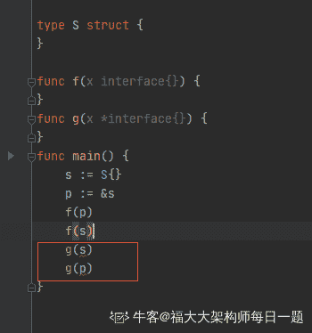

# 【2020】奇安信秋招 Golang 方向试卷 2

## 1

关于 Http 状态码，下面说法正确的是？

正确答案: A   你的答案: 空 (错误)

```cpp
2XX 表示成功
```

```cpp
3XX 表示客户端采取进一步的操作才能完成请求
```

```cpp
4XX 表示服务端错误
```

```cpp
5XX 表示客户端错误
```

本题知识点

Java 工程师 C++工程师 PHP 工程师 golang 工程师 奇安信 2020 运维工程师 安卓工程师 iOS 工程师

讨论

[folkman](https://www.nowcoder.com/profile/1152252)

A2XX 表示请求成功 3XX 表示服务器端重定向请求资源以完成请求 4XX 表示客户端错误，或者请求的服务端资源不存在 5XX 表示服务端错误

发表于 2021-08-08 11:37:37

* * *

[to_sia](https://www.nowcoder.com/profile/649988010)

| 1** | 信息，服务器收到请求，需要请求者继续执行操作 |
| 2** | 成功，操作被成功接收并处理 |
| 3** | 重定向，需要进一步的操作以完成请求 |
| 4** | 客户端错误，请求包含语法错误或无法完成请求 |
| 5** | 服务器错误，服务器在处理请求的过程中发生了错误 |

发表于 2021-08-06 16:55:56

* * *

## 2

视图可用于(    )

正确答案: B   你的答案: 空 (错误)

```cpp
保存存储在一个单独表中的数据的额外副本
```

```cpp
限制对表中特定行或列中的数据的访问
```

```cpp
在从基础表中删除历史数据前将其保存
```

None

## 3

以下哪个数据结构可用来抽象在电影院售票厅排队买票的场景？

正确答案: C   你的答案: 空 (错误)

```cpp
栈
```

```cpp
堆
```

```cpp
队列
```

```cpp
二叉树
```

None

## 4

skiplist 的查询时间复杂度和以下哪种数据结构不相同？

正确答案: C   你的答案: 空 (错误)

```cpp
红黑树
```

```cpp
AVL 树
```

```cpp
有序的单链表
```

```cpp
有序数组
```

None

讨论

[secrul](https://www.nowcoder.com/profile/7812219)

有序数组可以二分查找

发表于 2022-02-28 14:28:23

* * *

## 5

在一个空目录下执行 umask 333; touch hello;命令后，hello 文件的权限为？

正确答案: A   你的答案: 空 (错误)

```cpp
r--r--r--
```

```cpp
rw-rw-rw
```

```cpp
-wx-wx-wx
```

```cpp
rwxrwxrw-
```

None

讨论

[sallai-1](https://www.nowcoder.com/profile/479196296)

r w x4 2 1      777 代表 rwx rwx rwxumask 333        777                         333
                         444    --r --r --r

发表于 2022-03-10 09:54:13

* * *

[牛客 211442889 号](https://www.nowcoder.com/profile/211442889)


发表于 2022-02-21 23:29:49

* * *

[张达麟](https://www.nowcoder.com/profile/952512414)

[`www.cnblogs.com/liujiacai/p/8319923.html`](https://www.cnblogs.com/liujiacai/p/8319923.html)

发表于 2022-01-21 20:10:17

* * *

## 6

在 DNS 系统测试时，假设 named 进程号是 53，如何通知进程重读配置文件

正确答案: D   你的答案: 空 (错误)

```cpp
kill -USR2 53
```

```cpp
kill -USR1 53
```

```cpp
kill -INT 53
```

```cpp
kill -HUP 53
```

None

讨论

[洋白菜 7319](https://www.nowcoder.com/profile/2240405)

使用 kill -l 命令列出所有可用信号。

最常用的信号是：

*   1 (HUP)：重新加载进程。
*   9 (KILL)：杀死一个进程。

*   15 (TERM)：正常停止一个进程。

以上内容来自菜鸟教程：[Linux kill 命令 | 菜鸟教程 (runoob.com)](https://www.runoob.com/linux/linux-comm-kill.html)

发表于 2022-03-11 07:49:02

* * *

[sallai-1](https://www.nowcoder.com/profile/479196296)

终端输入 kill -L --table 可查看信号列表以下摘自 [`t.zoukankan.com/WindrunnerMax-p-14405575.html`](http://t.zoukankan.com/WindrunnerMax-p-14405575.html)，对错请自行验证

*   SIGHUP: SIGHUP 信号用于断开进程与父进程的连接，这也可以用于重新启动进程，这对于内存泄漏的守护程序很有用。
*   SIGINT: 该信号与按 Ctrl+C 相同，在某些系统上 delete + break 会向进程发送相同的信号，该进程被中断并停止，但是该进程自身可以忽略此信号。
*   SIGQUIT: 这类似于 SIGINT，但由于 QUIT 字符通常是由 Ctrl+来控制，进程在收到 SIGQUIT 退出时会产生 core 文件, 在这个意义上类似于一个程序错误信号。
*   SIGILL: 当一个进程执行一个错误的、禁止的或未知的功能时，系统向该进程发送 SIGILL 信号，这是代表非法操作的信号。
*   SIGTRAP: 此信号用于调试目的，当某个进程执行了某个操作或满足了调试器正在等待的条件时，此信号将被发送到该进程。
*   SIGABRT: 该终止信号是中止信号,通常进程会在自身上发出此终止信号。
*   SIGBUS: 当一个进程被发送 SIGBUS 信号时，是因为该进程导致了一个总线错误，通常这些总线错误是由于进程试图使用假物理地址或进程的内存对齐设置不正确造成的。
*   SIGFPE: 被零除的进程使用 SIGFPE 终止。
*   SIGKILL: SIGKILL 信号强制进程立即停止执行，程序不能忽略该信号，此过程也无法清除。
*   SIGUSR1: 这表示用户定义的条件，用户可以通过在 sigusr1.c 中编程命令来设置此信号。
*   SIGSEGV: 当应用程序有分段冲突时，这个信号被发送到进程。
*   SIGUSR2: 这表示用户定义的条件。
*   SIGPIPE: 当进程尝试写入缺少与读取器连接的一端的管道时，此信号将发送到进程，读取器是在管道末端读取数据的过程。
*   SIGALRM: 当实时或时钟计时器到期时，将发送 SIGALRM。
*   SIGTERM: 该信号请求进程停止运行，该信号可以被程序自身忽略，该过程有时间正常关闭，当程序正常关闭时，这意味着它有时间保存进度并释放资源，换句话说即它不被迫停止。
*   SIGCHLD: 当父进程丢失其子进程时，将向父进程发送 SIGCHLD 信号，这将清理子进程使用的资源，子进程指的是由另一个称为父进程的进程启动的进程。
*   SIGCONT: 要使进程在被 SIGTSTP 或 SIGSTOP 信号暂停后继续执行，需要将 SIGCONT 信号发送到已暂停的进程，这是 CONTiNUE SIGNAL，该信号对 Unix 作业控制执行后台任务很有帮助。
*   SIGSTOP: 该信号使操作系统暂停进程的执行，进程自身不能忽略该信号。
*   SIGTSTP: 这个信号类似于按下 Ctrl+Z，它向包含进程的终端发出请求，请求进程暂时停止，进程自身可以忽略该信号。
*   SIGTTIN: 当进程试图从 tty 终端读取数据时，进程接收到这个信号。
*   SIGTTOU: 当某个进程尝试向 tty 终端进行写操作时，该进程将收到此信号。
*   SIGURG: 当进程中有紧急数据要读取或数据非常大时，SIGURG 信号将发送到该进程。
*   SIGXCPU: 当某个进程在分配的时间之后使用 CPU 时，系统将向该进程发送该信号，SIGXCPU 的行为就像一个警告，该进程有时间保存进度(如果可能)并在系统使用 SIGKILL 终止该进程之前将其关闭。
*   SIGXFSZ: 文件系统对文件的大小有限制，当程序尝试违反此限制时，系统将发送该过程 SIGXFSZ 信号。
*   SIGVTALRM: SIGVTALRM 在进程使用的 CPU 时间结束时发送。
*   SIGPROF: 当进程以及由系统代表进程使用的 CPU 时间过去时，将发送 SIGPROF 信号。
*   SIGWINCH: 当进程在更改其大小的终端中时，该进程将接收此信号。
*   SIGIO: SIGPOLL 的别名或至少表现得很像 SIGPOLL。
*   SIGPWR: 电源故障将导致系统将该信号发送到进程，如果系统仍在运行。
*   SIGSYS: 为系统调用提供无效参数的进程将接收此信号。
*   SIGRTMIN*: 这是一组在系统之间变化的信号，它们被标记为 SIGRTMIN + 1、SIGRTMIN + 2、SIGRTMIN + 3、...，通常最多 15 个，这些是用户定义的信号，它们必须在 Linux 内核的源代码中进行编程。
*   SIGRTMAX*: 这是一组在系统之间变化的信号，它们被标记为 SIGRTMAX-1、SIGRTMAX-2、SIGRTMAX-3、...，通常最多 14 个，这些是用户定义的信号，它们必须在 Linux 内核的源代码中进行编程。
*   SIGEMT: 指示一个实现定义的硬件故障。
*   SIGINFO: 终端有时可能会向进程发送状态请求，发生这种情况时，进程也将收到此信号。
*   SIGLOST: 试图访问锁定文件的进程将收到此信号。
*   SIGPOLL: 当进程引起异步 I/O 事件时，会向该进程发送 SIGPOLL 信号。

编辑于 2022-03-10 10:06:47

* * *

## 7

视图可用于

正确答案: B   你的答案: 空 (错误)

```cpp
保存存储在一个单独表中的数据的额外副本
```

```cpp
限制对表中特定行或列中的数据的访问
```

```cpp
在从基础表中删除历史数据前将其保存
```

None

讨论

[江予碎](https://www.nowcoder.com/profile/163518698)

https://blog.csdn.net/weixin_43319713/article/details/104398559?utm_source=appapp_version=5.0.0

发表于 2022-02-14 16:54:19

* * *

## 8

您需要从您的数据库中删除名为 EmployeeView 的视图。应使用哪条语句

正确答案: D   你的答案: 空 (错误)

```cpp
DELETE EmployeeView
```

```cpp
DELETE VIEW EmployeeView
```

```cpp
DROP EmployeeView
```

```cpp
DROP VIEW EmployeeView
```

None

讨论

[初级炼丹师 Yiky](https://www.nowcoder.com/profile/342467844)

MySQL 删除一个视图命令：drop view viewName

发表于 2022-02-27 09:18:52

* * *

## 9

关于 NAT 说法不正确的是？

正确答案: C   你的答案: 空 (错误)

```cpp
可实现地址转换
```

```cpp
可实现端口转换
```

```cpp
IPv6 根本不需要 NAT
```

```cpp
可同时实现地址和端口转换
```

None

讨论

[谢谢你送花给我](https://www.nowcoder.com/profile/283584638)

网络地址转换(NAT)是一种路由器。

发表于 2022-01-18 23:48:51

* * *

[专薪](https://www.nowcoder.com/profile/436046680)

NAT 是用来解决 IP 地址不足的问题的，虽然 IPv6 地址现在多, 但未来怎样不好说, 说根本不需要就太绝对了

发表于 2022-01-16 10:59:54

* * *

## 10

下列哪个是错误的 type s struct {}func f(x interface{}) {}func g(x *interface{}) {}func main() {    s := S{}    p := &s}

正确答案: B   你的答案: 空 (错误)

```cpp
f(p)
```

```cpp
f(s)
```

```cpp
g(s)
```

```cpp
g(p)
```

None

讨论

[福大大架构师每日一题](https://www.nowcoder.com/profile/956035576)

cd 错误

编辑于 2022-01-26 21:48:43

* * *

[Enzo666](https://www.nowcoder.com/profile/506996)

这题有问题。选 C 吧

发表于 2022-01-26 15:28:46

* * *

[牛客 2022319 号玛卡巴卡](https://www.nowcoder.com/profile/452521292)

f（x）接口不是可以接受任意类型输入吧

发表于 2022-01-08 15:16:03

* * *

## 11

redis 在的有序集合中在数据量极少的情况下使用的一下那种结构存储方案

正确答案: A   你的答案: 空 (错误)

```cpp
压缩表
```

```cpp
跳跃表
```

```cpp
散列表
```

```cpp
双向链表
```

None

讨论

[可心 9](https://www.nowcoder.com/profile/2993729)

redis 的数据类型都是通过多种数据结构来实现，主要是**出于时间和空间的考虑**，当数据量小的时候通过数组下标访问最快，占用内存最小【压缩列表是数组的变种，允许存储的数据大小不同】；

```cpp
可以用来存储字符串,哈希结构,链表,集合,因此,常用来提供数据结构服务
```

**String,Hash,Set,List,SortedSet,pub/sub,Transaction**

发表于 2022-01-26 02:50:34

* * *

## 12

先进先出页面置换算法中以下描述正确的是

正确答案: B   你的答案: 空 (错误)

```cpp
频繁访问的页面不会被淘汰
```

```cpp
最先进来页面最先淘汰出去
```

```cpp
最近未使用的页面先被淘汰出去
```

```cpp
访问次数很少的优先淘汰
```

None

讨论

[谢谢你送花给我](https://www.nowcoder.com/profile/283584638)

**1****.****最佳置换算法（OPT）**（理想置换算法）：从主存中移出永远不再需要的页面；如无这样的页面存在，则选择最长时间不需要访问的页面。于所选择的被淘汰页面将是以后永不使用的，或者是在最长时间内不再被访问的页面，这样可以保证获得最低的缺页率。 

最佳置换算法可以用来评价其他算法。假定系统为某进程分配了三个物理块，并考虑有以下页面号引用串：
    7, 0, 1, 2, 0, 3, 0, 4, 2, 3, 0, 3, 2, 1, 2, 0, 1, 7, 0, 1
进程运行时，先将 7, 0, 1 三个页面依次装入内存。进程要访问页面 2 时，产生缺页中断，根据最佳置换算法，选择第 18 次访问才需调入的页面 7 予以淘汰。然后，访问页面 0 时，因为已在内存中所以不必产生缺页中断。访问页面 3 时又会根据最佳置换算法将页面 1 淘汰

**2.****先进先出置换算法（FIFO）**：是最简单的页面置换算法。这种算法的基本思想是：当需要淘汰一个页面时，总是选择驻留主存时间最长的页面进行淘汰，即先进入主存的页面先淘汰。其理由是：最早调入主存的页面不再被使用的可能性最大。

**3．最近最久未使用（LRU）算法：**这种算法的基本思想是：利用局部性原理，根据一个作业在执行过程中过去的页面访问历史来推测未来的行为。它认为过去一段时间里不曾被访问过的页面，在最近的将来可能也不会再被访问。所以，这种算法的实质是：当需要淘汰一个页面时，总是选择在最近一段时间内最久不用的页面予以淘汰。再对上面的实例釆用 LRU 算法进行页面置换，如图 3-29 所示。进程第一次对页面 2 访问时，将最近最久未被访问的页面 7 置换出去。然后访问页面 3 时，将最近最久未使用的页面 1 换出。

发表于 2022-01-19 13:24:28

* * *

[专薪](https://www.nowcoder.com/profile/436046680)

先进先出算法英文叫[FIFO](https://so.csdn.net/so/search?q=FIFO&spm=1001.2101.3001.7020)算法, 是最早出现的置换算法。该算法总是淘汰最先进入内存的页面

发表于 2022-01-16 11:04:01

* * *

## 13

HashMap 与 HashTable 相关以下描述不正确的是

正确答案: A   你的答案: 空 (错误)

```cpp
HashMap 不能进行数组扩容
```

```cpp
二者都可以进行数组扩容
```

```cpp
二者都是以链表来作为解决冲突方案
```

```cpp
二者都是以散列表数据结构存储数据
```

None

讨论

[牛客 569713048 号](https://www.nowcoder.com/profile/569713048)

HashMap 初始容量为 16，加载因子 0.75，当容量达到 12 的时候进行扩容

发表于 2022-03-07 00:43:51

* * *

## 14

dns 查询，一般使用服务器端口是?

正确答案: C   你的答案: 空 (错误)

```cpp
80
```

```cpp
443
```

```cpp
53
```

```cpp
21
```

None

## 15

下面这段代码输出什么? package mainimport (    "fmt")func f(num ...int) {    num[0] = 18}func main() {    i := []int{6, 8, 8, 5, 6, 1}    f(i...)    fmt.Println(i[0])}

正确答案: A   你的答案: 空 (错误)

```cpp
18
```

```cpp
6
```

```cpp
Compilation error
```

```cpp
runtime panic
```

None

## 16

下面这段代码输出什么? package mainimport (    "fmt")func p(i int) {    fmt.Println(i)}func main() {    i := 6    defer func() {        fmt.Println(i)    }()    defer p(i)    i++}

正确答案: C   你的答案: 空 (错误)

```cpp
6 6
```

```cpp
7 7
```

```cpp
6 7
```

```cpp
7 6
```

None

## 17

避免死锁的一个著名算法是？

正确答案: D   你的答案: 空 (错误)

```cpp
萨默尔算法
```

```cpp
完全公平算法
```

```cpp
旅行商算法
```

```cpp
银行家算法
```

None

## 17

避免死锁的一个著名算法是？

正确答案: D   你的答案: 空 (错误)

```cpp
萨默尔算法
```

```cpp
完全公平算法
```

```cpp
旅行商算法
```

```cpp
银行家算法
```

None

## 19

在选取存储结构时，一般不考虑？

正确答案: A   你的答案: 空 (错误)

```cpp
各结点值如何
```

```cpp
结点个数
```

```cpp
对数据有哪些运算
```

```cpp
编程语言
```

None

## 20

OSPF 的 hello 报文的作用描述不正确的是?

正确答案: D   你的答案: 空 (错误)

```cpp
用于发现邻居路由
```

```cpp
邻居路由直接充当 keepalive 的角色
```

```cpp
确保了路由器之间双向通信
```

```cpp
发布路由信息到链路上
```

None

## 21

以下代码写法有错误的是？

正确答案: B D   你的答案: 空 (错误)

```cpp
  func test() []string {    var a []string    a = append(a, "a")    return a   } 
```

```cpp
  func test() {    var m map[string]string    m["a"] = "a"   } 
```

```cpp
  func test() (b string) {    var a []byte    b = string(a)    return b   } 
```

```cpp
  func test() string {    x := "text"    x[0] = 'T'    return x   } 
```

None

## 22

以下哪个指令可用于查看文件内容(    )

正确答案: A B C   你的答案: 空 (错误)

```cpp
cat
```

```cpp
less
```

```cpp
more
```

```cpp
tee
```

None

## 23

以下哪些是守护进程初始化需要进行的工作(    )

正确答案: A B C D   你的答案: 空 (错误)

```cpp
调用 umask 将文件模式创建屏蔽字设置为 0
```

```cpp
调用 fork， 然后使父进程退出
```

```cpp
调用 setsid 以创建一个新会话
```

```cpp
关闭不再使用的文件描述符
```

None

## 24

下列属于 Linux 开机启动过程的是?

正确答案: A B C D   你的答案: 空 (错误)

```cpp
运行第一个进程 init（进程号永远为 1）
```

```cpp
读取 MBR 的引导文件（grub，lilo）
```

```cpp
引导 linux 内核
```

```cpp
进入相应的运行级别
```

None

## 25

下列关于 inode 说法正确的是?

正确答案: A B   你的答案: 空 (错误)

```cpp
每一个文件都有对应的 inode，里面包含了与该文件有关的一些信息
```

```cpp
特殊文件(比如乱码文件名)可以通过 inode 的方式删除
```

```cpp
inode 节点是一个 128 字节长度的表
```

```cpp
通过 inode 只能文件读取节点号，获取不到文件相关信息
```

None

讨论

[初级炼丹师 Yiky](https://www.nowcoder.com/profile/342467844)

inode512 字节

发表于 2022-02-27 09:30:56

* * *

[OFFER/OFFER](https://www.nowcoder.com/profile/203895943)

```cpp
inode 节点的大小，一般是 128 字节或 256 字节
```

发表于 2022-03-17 20:14:28

* * *

## 26

关于 DELETE 和 TRUNCATE TABLE 的说法正确的是

正确答案: B D   你的答案: 空 (错误)

```cpp
两者都可以删除指定条目的记录
```

```cpp
前者可以删除指定条目的记录，后者不能
```

```cpp
删除整张表的数据， delete 比 truncate 更高效
```

```cpp
删除整张表的数据， truncate 比 delete 更高效
```

None

## 27

以下说法错误的是？

正确答案: A B C D   你的答案: 空 (错误)

```cpp
  func test() {    total := 0    for i := 0; i <= 5; i++ {     go func(i int) {      total += i     }(i)    }   }   total 计算结果为 15 
```

```cpp
  func test() {    wg := sync.WaitGroup{}    total := 0    for i := 0; i <= 5; i++ {     wg.Add(i)     go func(i int) {      total += i      wg.Done()     }(i)    }    wg.Wait()   }   total 计算结果一定是期望的 15 
```

```cpp
  func test() {    data := 10    go func() {     time.Sleep(2 * time.Second)     fmt.Println(data)    }()   }   test 执行完成，data 被释放，打印的 data 为空。 
```

```cpp
  func test() {   DO:    data := 10    go func() {     time.Sleep(2 * time.Second)     goto DO     data = 9    }()   }   可以在 goutine 中通过 goto 跳出 goutine 
```

None

讨论

[超级大菠萝](https://www.nowcoder.com/profile/275988783)

A 没有 time.Sleep,不严谨，B 里的 wg.Add(i)根本就是错的

发表于 2022-03-02 21:25:55

* * *

## 28

以下可以实现复制表(只复制结构,源表名：a 新表名：b)功能的语句是？

正确答案: A C   你的答案: 空 (错误)

```cpp
select * into b from a where 1<>1
```

```cpp
select * from b into a where 1<>1
```

```cpp
select top 0 * into b from a
```

```cpp
select top 0 * into a from b
```

None

## 29

下面哪些是抓包工具?

正确答案: A B C   你的答案: 空 (错误)

```cpp
wireshark
```

```cpp
tshark
```

```cpp
tcpdump
```

```cpp
nmap
```

None

## 30

下面属于传输层协议的是?

正确答案: B D   你的答案: 空 (错误)

```cpp
IP 协议
```

```cpp
TCP 协议
```

```cpp
ARP 协议
```

```cpp
UDP 协议
```

None

## 31

有一个大型仓库使用拣货机器人从不同的货架间取货。已知：1、货架呈二维网格排列，网格中的每个货架只会放置一种商品。2、受这代设备的技术水平所限，**机器人只能沿上下左右四个方向移动**，还不能沿斜线移动，请理解。仓库当前使用的拣货算法是这样：1、一张订单会包含 X 种商品，分布在 X 个货架上 2、结合将这 X 种商品的所在位置，将地图上的商品分解为 Y 个“商品堆”，然后同时派出 Y 个机器人，并发取货，每个机器人只负责一个“商品堆”。3、“商品堆”的定义是上下左右彼此相邻的一组商品。在订单被分析后，给你一个由 '1'（该货架有待取货物）和 '0'（该货架没有待取货物）组成的的二维网格表示货架地图，请计算需要派出的机器人的数量。比如，下面的这张货物地图：
在这个例子中，一共有 6“堆”商品，共需要同时派出 6 个机器人。None

讨论

[零葬](https://www.nowcoder.com/profile/75718849)

很简单，就是岛问题换了个业务说法，直接深度优先遍历进行感染

```cpp
import java.util.*;

public class Solution {
    /**
     * 代码中的类名、方法名、参数名已经指定，请勿修改，直接返回方法规定的值即可
     * 
     * @param grid char 字符型二维数组 
     * @return int 整型
     */
    public int numIslands (char[][] grid) {
        // write code here
        int count = 0;
        for(int i = 0; i < grid.length; i++){
            for(int j = 0; j < grid[0].length; j++){
                if(grid[i][j] == '1'){
                    dfs(grid, i, j);
                    count ++;
                }
            }
        }
        return count;
    }

    private void dfs(char[][] grid, int x, int y) {
        if(x < 0 || x >= grid.length || y < 0 || y >= grid[0].length || grid[x][y] == '0'){
            return;
        }
        grid[x][y] = '0';     // 遍历过的位置感染成 0，避免重复经过
        dfs(grid, x + 1, y);
        dfs(grid, x - 1, y);
        dfs(grid, x, y - 1);
        dfs(grid, x, y + 1);
    }
}
```

发表于 2022-01-08 19:27:43

* * *

[牛客 100178796 号](https://www.nowcoder.com/profile/100178796)

这题够坑的给的数据明明是 int 型，判断却用的是 str 型。麻烦以后给样例数据的时候，给准确一点## 代码中的类名、方法名、参数名已经指定，请勿修改，直接返回方法规定的值即可
# 
# @param grid char 字符型二维数组 
# @return int 整型
#
class Solution:
    def numIslands(self , grid ):
        # write code here
        ls=[(-1,0),(1,0),(0,-1),(0,1)]
        n=len(grid)
        m=len(grid[0])
        nums=0
        def dfs(i,j):
            grid[i][j]=0
            for k in ls:
                new_i=k[0]+i
                new_j=k[1]+j
                if 0<=new_i<n and 0<=new_j<m and grid[new_i][new_j]=="1":
                    dfs(new_i,new_j)
        for i in range(n):
            for j in range(m):
                if grid[i][j]=="1":
                    nums+=1
                    dfs(i,j)
        return nums

发表于 2022-03-05 09:57:54

* * *

[牛客 471114419 号](https://www.nowcoder.com/profile/471114419)

力扣岛问题

```cpp
import java.util.*;

public class Solution {

    int[] tmpX = {0,1,0,-1};
    int[] tmpY = {1,0,-1,0};
    int col=0,row=0;
    public int numIslands (char[][] grid) {
        col=grid[0].length;
        row=grid.length;
        int ans = 0 ;
        for(int x=0;x<col;x++){
            for(int y=0;y<row;y++){
                if( grid[y][x] == '1'){
                    ans++;
                    dfs(grid,x,y);
                }
            }
        }
        return ans;
    }

    public void dfs(char[][] grid , int x ,int y){
        grid[y][x]='0';
        for(int i=0;i<4;i++){
            int x1=tmpX[i]+x;
            int y1=tmpY[i]+y;
            if( x1 >= 0 && y1 >= 0 && x1 < col && y1 < row && grid[y1][x1] == '1'){
                dfs(grid,x1,y1);
            }
        }
    }
}
```

发表于 2022-02-28 15:32:34

* * *

## 32

在某厂，产品经理同学的工作职责除了给开发同学提需求，还有一件极其重要的事：对产品运营数据做归因分析。某天，该产品经理同学接到老板要求：根据在过去一段时间内产品的“每日活跃用户数”，统计出最长的增长总天数，也就是把保持增长势头（**可以不连续**）的天数抽出来，你可能会得到多个新序列，计算最长的那个序列的总天数。我们把该产品自上线以来“每日的活跃用户数”，都按照顺序放入一个数组，比如：[1,5,122,34,45,232,342,34]，以这组数据为例，把其中所有的增长子序列罗列出来：形成了第一个子序列： [1,5,122]第二个子序列：[34,45,232,342]第三个子序列：[1,5,122,232,342]第四个子序列：[1,5,34,45,232,342]这四个序列，其中最长的是第四个，所以这个例子中，最长的增长总天数是：6 因为该产品上线时间有十几年了，产品同学数了 1 个小时，眼都数花了，最后只好放弃，她决定用请开发同学吃饭，来解决这个问题，你能帮帮她吗？None

讨论

[零葬](https://www.nowcoder.com/profile/75718849)

就是给最长递增子序列套了个业务背景，我们可以将时间复杂度为 O(n²)的经典动态规划方法优化成 O(nlogn)的算法

```cpp
import java.util.*;

public class Solution {
    /**
     * 代码中的类名、方法名、参数名已经指定，请勿修改，直接返回方法规定的值即可
     * 
     * @param nums int 整型一维数组 
     * @return int 整型
     */
    public int lengthOfLIS (int[] nums) {
        // write code here
        int n = nums.length;
        int[] ends = new int[n];    // ends[i]表示长度为 i+1 的递增子序列中的最小结尾
        ends[0] = nums[0];
        int tail = 0, maxLen = 1;
        for(int i = 1; i < n; i++){
            int index = lowerBound(ends, 0, tail, nums[i]);
            ends[index] = nums[i];
            if(index > tail){
                tail ++;
            }
            maxLen = Math.max(maxLen, index + 1);
        }
        return maxLen;
    }

    private int lowerBound(int[] nums, int L, int R, int target) {
        int left = L, right = R, index = R + 1;
        while(left <= right){
            int mid = left + ((right - left) >> 1);
            if(nums[mid] < target){
                left = mid + 1;
            }else{
                index = mid;
                right = mid - 1;
            }
        }
        return index;
    }
}
```

编辑于 2022-01-08 19:30:32

* * *

[今夜早睡](https://www.nowcoder.com/profile/875349080)

```cpp
/*
    因为只需要求最长上升子序列的值，所以只需要 O(n)复杂度即可
*/
class Solution {
public:
    /**
     * 代码中的类名、方法名、参数名已经指定，请勿修改，直接返回方法规定的值即可
     *
     * @param nums int 整型 vector
     * @return int 整型
     */
    int lengthOfLIS(vector<int>& nums) {
        // write code here
        int num = 0;
        int ans = 0;
        for(int i = 0;i < nums.size();i++){
            if(num < nums[i]) ans++;
            num = nums[i];
        }
        return ans;
    }
};
```

发表于 2022-03-10 19:50:52

* * *

[牛客 100178796 号](https://www.nowcoder.com/profile/100178796)

#
# 代码中的类名、方法名、参数名已经指定，请勿修改，直接返回方法规定的值即可
# 
# @param nums int 整型一维数组 
# @return int 整型
#
class Solution:
    def lengthOfLIS(self , nums ):
        # write code here
        dp=[1 for i in range(len(nums))]

        for i in range(1,len(nums)):
            for j in range(i):
                if nums[i]>nums[j]:
                    dp[i]=max(dp[i],dp[j]+1)
        return max(dp)

发表于 2022-03-03 21:10:02

* * *