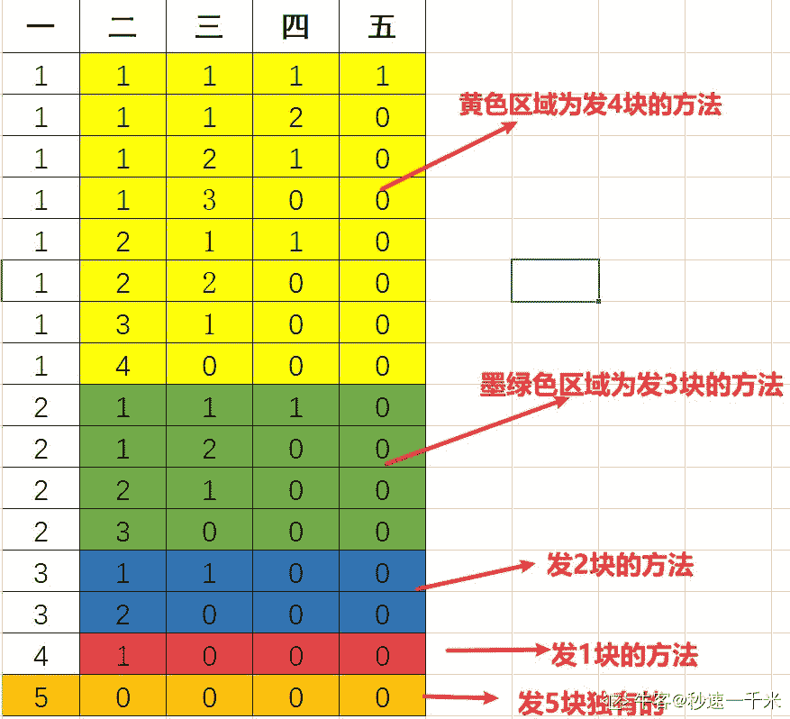

# 【2020】奇安信秋招 C/C++方向试卷 3

## 1

对一个文件的访问，常由（   ）共同限制

正确答案: A   你的答案: 空 (错误)

```cpp
用户访问权限和文件属性
```

```cpp
用户访问权限和文件优先级
```

```cpp
优先级和文件属性
```

```cpp
文件属性和口令
```

None

讨论

[牛客 568626334 号](https://www.nowcoder.com/profile/568626334)

对一个文件的访问，常由用户文件权限和文件属性共同限制

发表于 2022-02-23 19:40:35

* * *

[嘻哈王](https://www.nowcoder.com/profile/813178743)

文件保护的概念对文件访问，一般用用户访问权限和文件属性来限制

发表于 2022-02-13 16:43:07

* * *

## 2

下列关于 TCP 和 UDP 的描述正确的是(   )。

正确答案: B   你的答案: 空 (错误)

```cpp
TCP 和 UDP 都是无连接的
```

```cpp
TCP 是面向连接的，UDP 是面向无连接的
```

```cpp
TCP 适用于可靠性较差的广域网，UDP 适用于可靠性较高的局域网
```

```cpp
TCP 适用于可靠性较高的局域网，UDP 适用于可靠性较差的广域网
```

None

讨论

[快乐怿站](https://www.nowcoder.com/profile/428310779)

TCP 比 UDP 更适合局域网，UDP 更适合广域网，要是都需要三次握手，广域网性能就跟不上

发表于 2022-01-17 09:18:47

* * *

[牛客 602509448 号](https://www.nowcoder.com/profile/602509448)

CD 是为什么都错呢，我网上查的是 C 也对，知道的大佬可以回复或私信我吗

发表于 2022-01-14 15:58:06

* * *

[牛客 808001002 号](https://www.nowcoder.com/profile/808001002)

不会

发表于 2022-01-13 11:35:50

* * *

## 3

存在若干个字符串，若要查找具有相同前缀的字符串，以下哪种数据结构比较适合

正确答案: C   你的答案: 空 (错误)

```cpp
红黑树
```

```cpp
哈希表
```

```cpp
Trie 树
```

```cpp
栈
```

None

讨论

[牛客 481813467 号](https://www.nowcoder.com/profile/481813467)

Trie 树是一种树形结构，是一种哈希树的变种。典型应用是用于统计，排序和保存大量的字符串（但不仅限于字符串），所以经常被搜索引擎系统用于文本词频统计。它的优点是：利用字符串的公共前缀来减少查询时间，最大限度地减少无谓的字符串比较，查询效率比哈希树高。

发表于 2022-02-11 09:09:56

* * *

## 4

以下哪个算法是用于求解两个正整数的最大公约数的算法？

正确答案: B   你的答案: 空 (错误)

```cpp
Dijkstra 算法
```

```cpp
辗转相除法
```

```cpp
Floyd 算法
```

```cpp
其他
```

None

讨论

[牛客 254413985 号](https://www.nowcoder.com/profile/254413985)

卧槽，没解释？

发表于 2022-03-22 08:10:38

* * *

## 5

以下哪个数据结构可用来抽象在电影院售票厅排队买票的场景？

正确答案: C   你的答案: 空 (错误)

```cpp
栈
```

```cpp
堆
```

```cpp
队列
```

```cpp
二叉树
```

None

## 6

skiplist 的查询时间复杂度和以下哪种数据结构不相同？

正确答案: C   你的答案: 空 (错误)

```cpp
红黑树
```

```cpp
AVL 树
```

```cpp
有序的单链表
```

```cpp
有序数组
```

None

讨论

[secrul](https://www.nowcoder.com/profile/7812219)

有序数组可以二分查找

发表于 2022-02-28 14:28:23

* * *

## 7

一个台阶总共有 10 级，一次可以向上走 1 级，也可以向上走 2 级，请问一共有多少种走法？

正确答案: B   你的答案: 空 (错误)

```cpp
88
```

```cpp
89
```

```cpp
90
```

```cpp
91
```

None

讨论

[弥钵](https://www.nowcoder.com/profile/673343000)

基础动态规划题，其实就是斐波那契数列

发表于 2022-02-23 00:19:20

* * *

## 8

mysql 的数据库索引使用的是下面那种数据结构

正确答案: D   你的答案: 空 (错误)

```cpp
skiplist
```

```cpp
红黑树
```

```cpp
AVL 树
```

```cpp
B+树
```

None

讨论

[zxcv0112358](https://www.nowcoder.com/profile/473856205)

直接从《高性能 mysql》的 5.1.1 索引的类型 搬运了
**当人们谈论索引的时候，如果没有特别指明类型，那多半说的是 B-Tree 索引**

B 树索引 大多数 MySQL 引擎都支持这种索引。

**不过，底层的存储引擎也可能使用不同的存储结构，比如。NDB 集群存储引擎内部实际上使用了 T 树结构存储这种索引，即使其名字是 BTREE；InnoDB 则使用的是 B+Tree**

MyISAM 引擎的 B 树索引的底层数据结构？？？我查到的是 B+Tree 选择最合理的，所以选择 D

发表于 2022-02-20 11:53:24

* * *

[AlexGump](https://www.nowcoder.com/profile/184739658)

D

我们平常所说的索引，如果没有特别指明，都是指 B 树(多路搜索树，并不一定是二叉的)结构组织的索引。其中聚集索引，次要索引，覆盖索引，

复合索引，前缀索引，唯一索引默认都是使用 B+树索引，统称索引。当然，除了 B+树这种类型的索引之外，还有哈希索引(hash index)等。

发表于 2022-02-22 21:38:27

* * *

[牛客 811582976 号](https://www.nowcoder.com/profile/811582976)

b

发表于 2022-02-14 15:31:54

* * *

## 9

下面说法正确的是?

正确答案: A   你的答案: 空 (错误)

```cpp
epoll ET 模式必须配合 non-blocking IO 使用
```

```cpp
epoll LT 模式必须配合 non-blocking IO 使用
```

```cpp
epoll ET 可以配合 blocking IO 使用
```

None

讨论

[初级炼丹师 Yiky](https://www.nowcoder.com/profile/342467844)

epoll 的两种模式，EL 边缘模式和 TL 水平模式。epoll 默认使用 TL，TL 支持非阻塞 IO

发表于 2022-02-27 09:15:24

* * *

## 10

在一个空目录下执行 umask 333; touch hello;命令后，hello 文件的权限为？

正确答案: A   你的答案: 空 (错误)

```cpp
r--r--r--
```

```cpp
rw-rw-rw
```

```cpp
-wx-wx-wx
```

```cpp
rwxrwxrw-
```

None

讨论

[sallai-1](https://www.nowcoder.com/profile/479196296)

r w x4 2 1      777 代表 rwx rwx rwxumask 333        777                         333
                         444    --r --r --r

发表于 2022-03-10 09:54:13

* * *

[牛客 211442889 号](https://www.nowcoder.com/profile/211442889)


发表于 2022-02-21 23:29:49

* * *

[张达麟](https://www.nowcoder.com/profile/952512414)

[`www.cnblogs.com/liujiacai/p/8319923.html`](https://www.cnblogs.com/liujiacai/p/8319923.html)

发表于 2022-01-21 20:10:17

* * *

## 11

在 DNS 系统测试时，假设 named 进程号是 53，如何通知进程重读配置文件

正确答案: D   你的答案: 空 (错误)

```cpp
kill -USR2 53
```

```cpp
kill -USR1 53
```

```cpp
kill -INT 53
```

```cpp
kill -HUP 53
```

None

讨论

[洋白菜 7319](https://www.nowcoder.com/profile/2240405)

使用 kill -l 命令列出所有可用信号。

最常用的信号是：

*   1 (HUP)：重新加载进程。
*   9 (KILL)：杀死一个进程。

*   15 (TERM)：正常停止一个进程。

以上内容来自菜鸟教程：[Linux kill 命令 | 菜鸟教程 (runoob.com)](https://www.runoob.com/linux/linux-comm-kill.html)

发表于 2022-03-11 07:49:02

* * *

[sallai-1](https://www.nowcoder.com/profile/479196296)

终端输入 kill -L --table 可查看信号列表以下摘自 [`t.zoukankan.com/WindrunnerMax-p-14405575.html`](http://t.zoukankan.com/WindrunnerMax-p-14405575.html)，对错请自行验证

*   SIGHUP: SIGHUP 信号用于断开进程与父进程的连接，这也可以用于重新启动进程，这对于内存泄漏的守护程序很有用。
*   SIGINT: 该信号与按 Ctrl+C 相同，在某些系统上 delete + break 会向进程发送相同的信号，该进程被中断并停止，但是该进程自身可以忽略此信号。
*   SIGQUIT: 这类似于 SIGINT，但由于 QUIT 字符通常是由 Ctrl+来控制，进程在收到 SIGQUIT 退出时会产生 core 文件, 在这个意义上类似于一个程序错误信号。
*   SIGILL: 当一个进程执行一个错误的、禁止的或未知的功能时，系统向该进程发送 SIGILL 信号，这是代表非法操作的信号。
*   SIGTRAP: 此信号用于调试目的，当某个进程执行了某个操作或满足了调试器正在等待的条件时，此信号将被发送到该进程。
*   SIGABRT: 该终止信号是中止信号,通常进程会在自身上发出此终止信号。
*   SIGBUS: 当一个进程被发送 SIGBUS 信号时，是因为该进程导致了一个总线错误，通常这些总线错误是由于进程试图使用假物理地址或进程的内存对齐设置不正确造成的。
*   SIGFPE: 被零除的进程使用 SIGFPE 终止。
*   SIGKILL: SIGKILL 信号强制进程立即停止执行，程序不能忽略该信号，此过程也无法清除。
*   SIGUSR1: 这表示用户定义的条件，用户可以通过在 sigusr1.c 中编程命令来设置此信号。
*   SIGSEGV: 当应用程序有分段冲突时，这个信号被发送到进程。
*   SIGUSR2: 这表示用户定义的条件。
*   SIGPIPE: 当进程尝试写入缺少与读取器连接的一端的管道时，此信号将发送到进程，读取器是在管道末端读取数据的过程。
*   SIGALRM: 当实时或时钟计时器到期时，将发送 SIGALRM。
*   SIGTERM: 该信号请求进程停止运行，该信号可以被程序自身忽略，该过程有时间正常关闭，当程序正常关闭时，这意味着它有时间保存进度并释放资源，换句话说即它不被迫停止。
*   SIGCHLD: 当父进程丢失其子进程时，将向父进程发送 SIGCHLD 信号，这将清理子进程使用的资源，子进程指的是由另一个称为父进程的进程启动的进程。
*   SIGCONT: 要使进程在被 SIGTSTP 或 SIGSTOP 信号暂停后继续执行，需要将 SIGCONT 信号发送到已暂停的进程，这是 CONTiNUE SIGNAL，该信号对 Unix 作业控制执行后台任务很有帮助。
*   SIGSTOP: 该信号使操作系统暂停进程的执行，进程自身不能忽略该信号。
*   SIGTSTP: 这个信号类似于按下 Ctrl+Z，它向包含进程的终端发出请求，请求进程暂时停止，进程自身可以忽略该信号。
*   SIGTTIN: 当进程试图从 tty 终端读取数据时，进程接收到这个信号。
*   SIGTTOU: 当某个进程尝试向 tty 终端进行写操作时，该进程将收到此信号。
*   SIGURG: 当进程中有紧急数据要读取或数据非常大时，SIGURG 信号将发送到该进程。
*   SIGXCPU: 当某个进程在分配的时间之后使用 CPU 时，系统将向该进程发送该信号，SIGXCPU 的行为就像一个警告，该进程有时间保存进度(如果可能)并在系统使用 SIGKILL 终止该进程之前将其关闭。
*   SIGXFSZ: 文件系统对文件的大小有限制，当程序尝试违反此限制时，系统将发送该过程 SIGXFSZ 信号。
*   SIGVTALRM: SIGVTALRM 在进程使用的 CPU 时间结束时发送。
*   SIGPROF: 当进程以及由系统代表进程使用的 CPU 时间过去时，将发送 SIGPROF 信号。
*   SIGWINCH: 当进程在更改其大小的终端中时，该进程将接收此信号。
*   SIGIO: SIGPOLL 的别名或至少表现得很像 SIGPOLL。
*   SIGPWR: 电源故障将导致系统将该信号发送到进程，如果系统仍在运行。
*   SIGSYS: 为系统调用提供无效参数的进程将接收此信号。
*   SIGRTMIN*: 这是一组在系统之间变化的信号，它们被标记为 SIGRTMIN + 1、SIGRTMIN + 2、SIGRTMIN + 3、...，通常最多 15 个，这些是用户定义的信号，它们必须在 Linux 内核的源代码中进行编程。
*   SIGRTMAX*: 这是一组在系统之间变化的信号，它们被标记为 SIGRTMAX-1、SIGRTMAX-2、SIGRTMAX-3、...，通常最多 14 个，这些是用户定义的信号，它们必须在 Linux 内核的源代码中进行编程。
*   SIGEMT: 指示一个实现定义的硬件故障。
*   SIGINFO: 终端有时可能会向进程发送状态请求，发生这种情况时，进程也将收到此信号。
*   SIGLOST: 试图访问锁定文件的进程将收到此信号。
*   SIGPOLL: 当进程引起异步 I/O 事件时，会向该进程发送 SIGPOLL 信号。

编辑于 2022-03-10 10:06:47

* * *

## 12

视图可用于

正确答案: B   你的答案: 空 (错误)

```cpp
保存存储在一个单独表中的数据的额外副本
```

```cpp
限制对表中特定行或列中的数据的访问
```

```cpp
在从基础表中删除历史数据前将其保存
```

None

讨论

[江予碎](https://www.nowcoder.com/profile/163518698)

https://blog.csdn.net/weixin_43319713/article/details/104398559?utm_source=appapp_version=5.0.0

发表于 2022-02-14 16:54:19

* * *

## 13

要添加索引的一个理由是

正确答案: D   你的答案: 空 (错误)

```cpp
减少存储空间
```

```cpp
提高数据库安全性
```

```cpp
提高 INSERT 语句的性能
```

```cpp
提高 SELECT 语句的性能
```

None

## 14

您需要从您的数据库中删除名为 EmployeeView 的视图。应使用哪条语句

正确答案: D   你的答案: 空 (错误)

```cpp
DELETE EmployeeView
```

```cpp
DELETE VIEW EmployeeView
```

```cpp
DROP EmployeeView
```

```cpp
DROP VIEW EmployeeView
```

None

讨论

[初级炼丹师 Yiky](https://www.nowcoder.com/profile/342467844)

MySQL 删除一个视图命令：drop view viewName

发表于 2022-02-27 09:18:52

* * *

## 15

关于 NAT 说法不正确的是？

正确答案: C   你的答案: 空 (错误)

```cpp
可实现地址转换
```

```cpp
可实现端口转换
```

```cpp
IPv6 根本不需要 NAT
```

```cpp
可同时实现地址和端口转换
```

None

讨论

[谢谢你送花给我](https://www.nowcoder.com/profile/283584638)

网络地址转换(NAT)是一种路由器。

发表于 2022-01-18 23:48:51

* * *

[专薪](https://www.nowcoder.com/profile/436046680)

NAT 是用来解决 IP 地址不足的问题的，虽然 IPv6 地址现在多, 但未来怎样不好说, 说根本不需要就太绝对了

发表于 2022-01-16 10:59:54

* * *

## 16

下列哪些不是 IPv6 过渡技术

正确答案: D   你的答案: 空 (错误)

```cpp
隧道技术
```

```cpp
地址翻译技术
```

```cpp
双栈技术
```

```cpp
应用识别技术
```

None

讨论

[初级炼丹师 Yiky](https://www.nowcoder.com/profile/342467844)

双栈技术隧道技术协议转换技术

发表于 2022-02-27 09:20:35

* * *

## 17

下面不属于 OSI 七层模型的是?

正确答案: B   你的答案: 空 (错误)

```cpp
物理层
```

```cpp
聚合层
```

```cpp
传输层
```

```cpp
应用层
```

None

讨论

[牛客 766779728 号](https://www.nowcoder.com/profile/766779728)

OSI 七层模型：物理层、数据链路层、网络层、传输层、会话层、表示层、应用层    

发表于 2022-01-18 13:43:13

* * *

## 18

int a[4][5]; 则 a[1]+3 表示

正确答案: A   你的答案: 空 (错误)

```cpp
a 数组行下标为 1、列下标为 3 的元素的地址
```

```cpp
a 数组行下标为 1、列下标为 3 的元素的值
```

```cpp
a 数组第 1 行的首地址
```

```cpp
a 数组第 3 行的首地址
```

None

讨论

[2117-20217051-王美森](https://www.nowcoder.com/profile/257954170)

a

发表于 2022-01-16 22:13:24

* * *

[阿坚 123](https://www.nowcoder.com/profile/312799985)

a[1]+3 = &a[1][0]+3 ,也就是&a[1][3]类似于 int a[3]; a+2 的时候 a 退化为 a[0]的地址

发表于 2022-01-16 18:08:25

* * *

## 19

typedef union{     char mark[3];     struct{         unsigned short rsv:7,               type:5,               log:1,               log_begin:1,               log_end:1;     }flags;     unsigned short value;}options;int main(int argc, char *argv[]){    options  a;    a.value = 1000;    printf("%d, %d\n", sizeof(a), a.flags.type);    return 0;} 请问输出结果是什么？

正确答案: D   你的答案: 空 (错误)

```cpp
4,29
```

```cpp
3,7
```

```cpp
8,29
```

```cpp
4,7
```

None

讨论

[OFFER/OFFER](https://www.nowcoder.com/profile/203895943)

```cpp
struct{
         unsigned short rsv:7,
               type:5,
               log:1,
               log_begin:1,
               log_end:1;
     }flags;
flags 大小 2 字节，char mark[3];为三字节。按照字节对其规则，a 的大小为 4 字节，
```

 flags 大小为 2 字节，char mar[3] 为三字节，按照字节对其规则，a 的大小为 4 字节。a.flags.type 的计算：结构体中的冒号表示位域，flags 的 type 占据 5 个位，当 a=1000 时，flags 的二进制为 0000 0011 1110 1000，rsv 占七位 ，所以 type 为 011 1 为 7

发表于 2022-03-18 09:53:04

* * *

## 20

以下程序在 little-endian 架构处理器下的输出是：int i;char *pc = &i;pc[0] = 1;printf("%d\n", i);

正确答案: A   你的答案: 空 (错误)

```cpp
1
```

```cpp
16777216
```

```cpp
0
```

```cpp
Segmentation Fault
```

None

讨论

[小白巨白](https://www.nowcoder.com/profile/280037898)

注意地址和相关的关系

发表于 2022-02-12 11:23:08

* * *

[昨日友人在](https://www.nowcoder.com/profile/678522556)

这里说的是小端存储存储数据从低位开始存储所以就是 1 吧如果是高位存储应该就是 1 后面 31 个 0

发表于 2022-03-16 15:04:41

* * *

[BinWatson](https://www.nowcoder.com/profile/839234895)

i 都没有进行初始化。。怎么知道能确定值是多少。

发表于 2022-03-06 23:02:44

* * *

## 21

下面哪一个命令可以关机，而不重启?

正确答案: C D   你的答案: 空 (错误)

```cpp
reboot
```

```cpp
shutdown -r
```

```cpp
halt
```

```cpp
netstat
```

None

讨论

[zxcv0112358](https://www.nowcoder.com/profile/473856205)

这题有问题吧。。。

发表于 2022-01-13 21:25:52

* * *

[江予碎](https://www.nowcoder.com/profile/163518698)

Reboot 是重启，shutdown-s 是关机，shutdown-r 是重启，netstat 是显示网络状态，half 关机

发表于 2022-02-14 17:11:32

* * *

[极寒之语](https://www.nowcoder.com/profile/732989589)

我只知道关机是 halt / shutdown -h now 重启是 reboot / shutdown -r nownetstat 不是查看网络的吗

发表于 2022-03-17 16:25:30

* * *

## 22

下列属于 Linux 开机启动过程的是?

正确答案: A B C D   你的答案: 空 (错误)

```cpp
运行第一个进程 init（进程号永远为 1）
```

```cpp
读取 MBR 的引导文件（grub，lilo）
```

```cpp
引导 linux 内核
```

```cpp
进入相应的运行级别
```

None

## 23

下列关于 inode 说法正确的是?

正确答案: A B   你的答案: 空 (错误)

```cpp
每一个文件都有对应的 inode，里面包含了与该文件有关的一些信息
```

```cpp
特殊文件(比如乱码文件名)可以通过 inode 的方式删除
```

```cpp
inode 节点是一个 128 字节长度的表
```

```cpp
通过 inode 只能文件读取节点号，获取不到文件相关信息
```

None

讨论

[初级炼丹师 Yiky](https://www.nowcoder.com/profile/342467844)

inode512 字节

发表于 2022-02-27 09:30:56

* * *

[OFFER/OFFER](https://www.nowcoder.com/profile/203895943)

```cpp
inode 节点的大小，一般是 128 字节或 256 字节
```

发表于 2022-03-17 20:14:28

* * *

## 24

关于 bash 中以下符号的说明哪些是正确的

正确答案: A B C   你的答案: 空 (错误)

```cpp
$0 代表脚本的名称
```

```cpp
$@代表所有位置参数
```

```cpp
$# 代表位置参数的数量
```

```cpp
$11 代表第 11 个位置参数的值
```

None

讨论

[OFFER/OFFER](https://www.nowcoder.com/profile/203895943)

$$
Shell 本身的 PID（ProcessID）
$!
Shell 最后运行的后台 Process 的 PID
$?
最后运行的命令的结束代码（返回值）
$-
使用 Set 命令设定的 Flag 一览
$*
所有参数列表。如"$*"用「"」括起来的情况、以"$1 $2 … $n"的形式输出所有参数。
$@
所有参数列表。如"$@"用「"」括起来的情况、以"$1" "$2" … "$n" 的形式输出所有参数。
$#
添加到 Shell 的参数个数
$0
Shell 本身的文件名
$1～$n
添加到 Shell 的各参数值。$1 是第 1 参数、$2 是第 2 参数…。

发表于 2022-03-17 19:49:08

* * *

[秋叶原の黑猫](https://www.nowcoder.com/profile/132125268)

```cpp
D 应该是${11}
```

发表于 2022-03-12 16:49:57

* * *

[励码万言](https://www.nowcoder.com/profile/287577281)

D 是对的吧

发表于 2022-02-05 12:19:04

* * *

## 25

关于 DELETE 和 TRUNCATE TABLE 的说法正确的是

正确答案: B D   你的答案: 空 (错误)

```cpp
两者都可以删除指定条目的记录
```

```cpp
前者可以删除指定条目的记录，后者不能
```

```cpp
删除整张表的数据， delete 比 truncate 更高效
```

```cpp
删除整张表的数据， truncate 比 delete 更高效
```

None

## 26

下面语句中表示过滤条件的是 vend id=1002 或 vend id=1003 的是

正确答案: A B   你的答案: 空 (错误)

```cpp
select * from products where vend_id=1002 or vend_ id=1003
```

```cpp
select * from products where vend id in（1002， 1003）
```

```cpp
select * from products where vend id not in（1004， 1005）
```

```cpp
select * from products where vend id=1002 and vend id=1003
```

None

## 27

以下哪些是 TCP 协议运行时阶段

正确答案: A B D   你的答案: 空 (错误)

```cpp
连接创建
```

```cpp
数据传送
```

```cpp
数据校验
```

```cpp
连接终止
```

None

讨论

[CJCWB](https://www.nowcoder.com/profile/585530108)

TCP 协议的运行可划分为三个阶段：连接创建(connection establishment)、数据传送（data transfer）和连接终止（connection termination）。

发表于 2022-02-06 13:49:18

* * *

## 28

以下关于超文本传输安全协议说法中正确的说法有

正确答案: C   你的答案: 空 (错误)

```cpp
使用非对称加密算法进行数据传输
```

```cpp
使用对称加密算法进行数据传输
```

```cpp
非对称加密和对称加密都使用了
```

```cpp
其他
```

None

讨论

[专薪](https://www.nowcoder.com/profile/436046680)

你们公司招人男前端吗?不招招女前端吗?不招你们公司招前端吗?招???

发表于 2022-01-16 13:04:11

* * *

[小白牛.](https://www.nowcoder.com/profile/300218217)

C. 钝角

发表于 2022-02-16 11:38:24

* * *

[施勇 _ 上海](https://www.nowcoder.com/profile/228323617)

HTTPS 是在 HTTP 的基础上增加了 SSL 层，服务器和客户端传输数据前先采用非对称加密算法生产一个秘钥，再用这个秘钥使用对称加密算法加密要传输的数据，这样做即保证了秘钥的安全，有提高了数据加密效率。

发表于 2022-02-13 18:19:20

* * *

## 29

以下关于 typedef 的叙述正确的是

正确答案: A C D   你的答案: 空 (错误)

```cpp
用 typedef 可以定义各种类型名,但不能用来定义变量
```

```cpp
用 typedef 可以增加新类型
```

```cpp
用 typedef 只是将已存在的类型用一个新的名字来代表
```

```cpp
使用 typedef 便于程序的通用
```

None

## 30

void alloc_memory(char *var, const int size){    var = malloc(size);}int main(){    char *s;    alloc_memory(s, 10);    strcpy(s, "abc");    free(s);    return 0;}

正确答案: A B C   你的答案: 空 (错误)

```cpp
s 未初始化
```

```cpp
内存泄漏
```

```cpp
segmentation fault
```

```cpp
bus error.
```

None

讨论

[OFFER/OFFER](https://www.nowcoder.com/profile/203895943)

选项 B，函数应该传入二重指针，这样才能赋值，不然到函数哪里作为形参，会进行复制依次指针，指向的地址不是 main 中的地址了。

发表于 2022-03-17 18:36:27

* * *

[昨日友人在](https://www.nowcoder.com/profile/678522556)

main 函数里的 s 指向的地址未知 strcpy 拷贝数据时会段错误而且 alloc_memory 函数里申请的空间没有释放因为 main 函数指针 s 和 alloc_memory 里 var 指向的地方根本不是同一个所以 free 了个寂寞

发表于 2022-03-16 15:20:11

* * *

## 31

老板一共需要给某个员工发奖金 n 元，可以选择一次发 1 元，也可以选择一次发 2 元，也可以选择一次发 3 元。请问老板给这位员工发放完 n 元奖金共有多少种不同的方法？数据范围：1 <= n <= 10None

讨论

[秒速一千米](https://www.nowcoder.com/profile/444333129)

分析：可以这样想，发 5 元怎么发？1：先发 1 块的情况下，剩下 4 块是不是就和发 4 块的方法一样了？2：先发 2 块的情况下，剩下 3 块是不是就和发 3 块的方法一样了？3：先发 3 块的情况下，剩下 2 块是不是就和发 2 块的方法一样了？4：先发 4 块的情况下，剩下 1 块是不是就和发 1 块的方法一样了？5：5 块一次性发完，唯一方法这很递归嘛~即符合  f(n) = f(n-1) + f(n-2) + ... + f(1) + 1 为便于理解，本人画了张图。代码和运行结果如下

```cpp
public class GiveMoney {
    public static void main(String[] args) {
        Scanner scanner = new Scanner (System.in);
        System.out.print ("输入要发的奖金:");
        int number = scanner.nextInt ();
        System.out.println ("您有" + f (number) + "种方法发完" + number + "元奖金!!");
    }

    /**
     * 获取 发奖金可用的总方法 的方法
     *
     * @param number 要发的钱数
     * @return 总方法数
     */
    public static int f(Integer number) {
        // 设置递归结束条件
        if (number == 1) {
            return 1;
        }
        // 实现 f(n) = f(n-1) + f(n-2) + ... + f(1) + 1
        int count = 0;
        for (int i = number - 1; i >= 1; i--) {
            count = f (i) + count;
        }
        return count + 1;
    }
}
```



发表于 2022-01-22 22:33:34

* * *

[李彤是快递小哥](https://www.nowcoder.com/profile/94626269)

这不就是 青蛙跳吗

发表于 2022-02-23 22:26:19

* * *

[我要逆天当学霸](https://www.nowcoder.com/profile/245035478)

import java.util.*;
public class Solution {
    /**
     * 
     * @param num_money int 整型 奖金的总数,单位为元
     * @return int 整型
     */
    public void main(String [] args){
        Scanner sc = new Scanner(System.in);
        int num_money = sc.nextInt();
        System.out.println(CalulateMethodCount(num_money));
        sc.close();
    }
    public int CalulateMethodCount (int num_money) {
        // write code here
        if (num_money == 1) return 1;
        if (num_money == 2) return 2;
        if (num_money == 3) return 4;
        int[] dp = new int[num_money + 1];
        dp[0] = 0; 
        dp[1] = 1; 
        dp[2] = 2; 
        dp[3] = 4;
        for (int i = 4; i <= num_money; ++i) {
            dp[i] = dp[i - 1] + dp[i - 2] + dp[i - 3];
        }
        return dp[num_money];
    }
}

发表于 2022-01-20 21:32:27

* * *

## 32

撤销/恢复操作具有广泛的用途，比如 word 文档中输入一个单词，可以点撤销，然后可以再恢复。编程实现如下功能：  从标准输入读取到一个字符串，字符串可包含 0 个或多个单词，单词以空格或者 tab 分隔； 如果遇到 "undo" 字符串，表示"撤销"操作，前一个字符串被撤销掉； 如果遇到"redo"字符串，表示恢复刚才撤销掉的字符串.例如:   输入字符串 "hello undo redo world."，  对字符串中的 undo 和 redo 处理后， 最终输出的结果为 "hello world."None

讨论

[零葬](https://www.nowcoder.com/profile/75718849)

先初始化两个栈 stack 和 redo，然后利用双栈求解。遍历词表：

1.  遇到普通词就压入 stack，并清空 redo 栈，因为此时写入了一个新词，再往前的词已经找不回来了；
2.  遇到 undo 就从 stack 中弹栈至 redo；
3.  遇到 redo 就从 redo 中弹栈至 stack。

最终 stack 中的词就是最后保留下来的词

```cpp
commands = input().strip().split(" ")
stack, redo = [], []
for cmd in commands:
    if cmd == "undo":
        if stack:
            redo.append(stack.pop())
    elif cmd == "redo":
        if redo:
            stack.append(redo.pop())
    else:
        redo.clear()
        stack.append(cmd)
print(" ".join(stack))
```

发表于 2022-01-08 20:08:09

* * *

[牛客 442788909 号](https://www.nowcoder.com/profile/442788909)

import java.util.*;
public class Main{
    public static void main(String[] args){
        Scanner sc = new Scanner(System.in);
        List<String> li = new LinkedList(Arrays.asList(sc.nextLine().split(" ")));
        Deque<String> dq = new LinkedList<String>();
        for(int i = 0;i<li.size();i++){
            if(li.get(i).equals("undo")&&i!=0) {
                dq.push(li.get(i-1));
                li.remove(i);
                li.remove(i-1);
                i-=2;
                continue;
            }
            if(li.get(i).equals("redo")) {
                if(!dq.isEmpty()) {
                    li.remove(i);
                    li.add(i,dq.pop());
                }
            }
        }

        System.out.println(String.join(" ", li));
        sc.close();
    }
}

发表于 2022-01-22 21:09:06

* * *

[軸。](https://www.nowcoder.com/profile/542430771)

```cpp
package main
import(
    "os"  
    "bufio"
    "fmt"
    "strings"
)

func RedoUndoStr(str string) string{
    strList := strings.Split(str," ")
    stack := make([]string,0)
    redo := make([]string,0)
    for _,val:=range strList{
        if val=="redo"{
            if len(redo)>0{
                stack=append(stack, redo[len(redo)-1])
                redo=redo[:len(redo)-1]
            }
        }else if val=="undo"{
            if len(stack)>0{
                redo=append(redo, stack[len(stack)-1])
                stack=stack[:len(stack)-1]
            }
        }else{
            redo=redo[:0]
            stack=append(stack, val)
        }
    }
    return strings.Join(stack," ")
}
func main(){
    reader:=bufio.NewReader(os.Stdin)
    str,_:=reader.ReadString('\n')
    fmt.Println(RedoUndoStr(str))
}
```

编辑于 2022-03-22 09:09:09

* * *