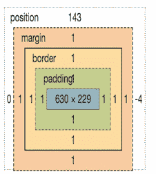
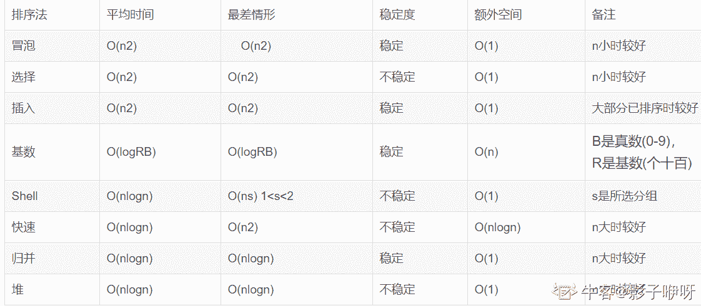

# 【2020】奇安信秋招前端方向试卷 1

## 1

对一个文件的访问，常由（   ）共同限制

正确答案: A   你的答案: 空 (错误)

```cpp
用户访问权限和文件属性
```

```cpp
用户访问权限和文件优先级
```

```cpp
优先级和文件属性
```

```cpp
文件属性和口令
```

None

讨论

[牛客 568626334 号](https://www.nowcoder.com/profile/568626334)

对一个文件的访问，常由用户文件权限和文件属性共同限制

发表于 2022-02-23 19:40:35

* * *

[嘻哈王](https://www.nowcoder.com/profile/813178743)

文件保护的概念对文件访问，一般用用户访问权限和文件属性来限制

发表于 2022-02-13 16:43:07

* * *

## 2

下列关于 TCP 和 UDP 的描述正确的是(   )。

正确答案: B   你的答案: 空 (错误)

```cpp
TCP 和 UDP 都是无连接的
```

```cpp
TCP 是面向连接的，UDP 是面向无连接的
```

```cpp
TCP 适用于可靠性较差的广域网，UDP 适用于可靠性较高的局域网
```

```cpp
TCP 适用于可靠性较高的局域网，UDP 适用于可靠性较差的广域网
```

None

讨论

[快乐怿站](https://www.nowcoder.com/profile/428310779)

TCP 比 UDP 更适合局域网，UDP 更适合广域网，要是都需要三次握手，广域网性能就跟不上

发表于 2022-01-17 09:18:47

* * *

[牛客 602509448 号](https://www.nowcoder.com/profile/602509448)

CD 是为什么都错呢，我网上查的是 C 也对，知道的大佬可以回复或私信我吗

发表于 2022-01-14 15:58:06

* * *

[牛客 808001002 号](https://www.nowcoder.com/profile/808001002)

不会

发表于 2022-01-13 11:35:50

* * *

## 3

在什么情况下，新插入链表的节点既是首节点也是尾节点

正确答案: A   你的答案: 空 (错误)

```cpp
链表为空时
```

```cpp
链表内含有一个节点
```

```cpp
链表内含有两个节点
```

```cpp
链表内含有三个节点
```

None

讨论

[嘻哈王](https://www.nowcoder.com/profile/813178743)

不会

发表于 2022-02-13 16:43:56

* * *

## 4

一个有向无环图是否存在拓扑排序？

正确答案: B   你的答案: 空 (错误)

```cpp
不存在
```

```cpp
存在
```

```cpp
不确定
```

```cpp
其他
```

None

## 5

以下关于哈希表的描述哪个是正确的？

正确答案: D   你的答案: 空 (错误)

```cpp
哈希表中的 key 的存放是有序的
```

```cpp
哈希表只适合存储数字
```

```cpp
哈希表适于做优先级队列
```

```cpp
哈希表查询的时间复杂度是 O(1)
```

None

讨论

[miku722](https://www.nowcoder.com/profile/374769356)

1.哈希表不保存插入顺序，不可以按照下标读取元素；2.哈希表的查询时间是，hashmap.get(key)，常数级的查询时间；

发表于 2022-01-22 21:27:37

* * *

## 6

存在一个数字组成的序列[a1,a2,...,aN]，若要统计所有数字出现的次数，用以下哪种数据结构比较适合？

正确答案: A   你的答案: 空 (错误)

```cpp
哈希表
```

```cpp
数组
```

```cpp
单链表
```

```cpp
双链表
```

None

## 7

存在若干个字符串，若要查找具有相同前缀的字符串，以下哪种数据结构比较适合

正确答案: C   你的答案: 空 (错误)

```cpp
红黑树
```

```cpp
哈希表
```

```cpp
Trie 树
```

```cpp
栈
```

None

讨论

[牛客 481813467 号](https://www.nowcoder.com/profile/481813467)

Trie 树是一种树形结构，是一种哈希树的变种。典型应用是用于统计，排序和保存大量的字符串（但不仅限于字符串），所以经常被搜索引擎系统用于文本词频统计。它的优点是：利用字符串的公共前缀来减少查询时间，最大限度地减少无谓的字符串比较，查询效率比哈希树高。

发表于 2022-02-11 09:09:56

* * *

## 8

以下哪个算法是用于求解两个正整数的最大公约数的算法？

正确答案: B   你的答案: 空 (错误)

```cpp
Dijkstra 算法
```

```cpp
辗转相除法
```

```cpp
Floyd 算法
```

```cpp
其他
```

None

讨论

[牛客 254413985 号](https://www.nowcoder.com/profile/254413985)

卧槽，没解释？

发表于 2022-03-22 08:10:38

* * *

## 9

下列哪些不是 IPv6 过渡技术

正确答案: D   你的答案: 空 (错误)

```cpp
隧道技术
```

```cpp
地址翻译技术
```

```cpp
双栈技术
```

```cpp
应用识别技术
```

None

讨论

[初级炼丹师 Yiky](https://www.nowcoder.com/profile/342467844)

双栈技术隧道技术协议转换技术

发表于 2022-02-27 09:20:35

* * *

## 10

下面不属于 OSI 七层模型的是?

正确答案: B   你的答案: 空 (错误)

```cpp
物理层
```

```cpp
聚合层
```

```cpp
传输层
```

```cpp
应用层
```

None

讨论

[牛客 766779728 号](https://www.nowcoder.com/profile/766779728)

OSI 七层模型：物理层、数据链路层、网络层、传输层、会话层、表示层、应用层    

发表于 2022-01-18 13:43:13

* * *

## 11

元素在常规文档流时，CSS position 属性的默认取值是（   ）

正确答案: D   你的答案: 空 (错误)

```cpp
absolute
```

```cpp
relative
```

```cpp
normal
```

```cpp
static
```

None

## 12

以下哪项设置会触发 GPU 加速（    ）

正确答案: A   你的答案: 空 (错误)

```cpp
transform: translateZ(0)
```

```cpp
float:left
```

```cpp
display: flex
```

```cpp
position:fixed
```

None

## 13

关于 px、em、vw/wh、rem，以下说法错误的是？

正确答案: B   你的答案: 空 (错误)

```cpp
设置为 px 单位的字体，无法用浏览器字体放大功能
```

```cpp
将字号单位设置为 em，字号将保持不变
```

```cpp
vw/vh 长度单位，和父元素设置无关
```

```cpp
rem 只依赖于根节点（html）的 font-size
```

None

讨论

[Ss 想吃火锅](https://www.nowcoder.com/profile/265742195)

rem 不是依赖于父盒子的 font-size 吗？

发表于 2022-03-16 20:08:40

* * *

## 14

下面打印的值是什么？const p1 = new Promise((resolve, reject) => {  resolve(1)})const p2 = new Promise((resolve, reject) => {  resolve(2)})p1.then(res => {  console.log(res)  p2}).then(res => {  console.log(res)})

正确答案: C   你的答案: 空 (错误)

```cpp
1   2
```

```cpp
undefined 2
```

```cpp
1 undefined
```

```cpp
undefined undefined
```

None

讨论

[影子咿呀](https://www.nowcoder.com/profile/67500756)

题中的 then 函数都是加在 p1 上的，故只能传递 p1 里面的 resolve 值。当 then 函数加在 p2 上才能打印出 p2 里面的 resolve(2)里面的 2。

发表于 2022-02-28 21:17:37

* * *

[Simonscat](https://www.nowcoder.com/profile/98292793)

p1 第一次 then 时没有 resolve 返回值，所以第二次 then 的参数 res 是 undifine

发表于 2022-02-23 20:08:34

* * *

## 15

用谷歌浏览器设置断点逐步调试，是在控制台的哪个 Tab 下。

正确答案: C   你的答案: 空 (错误)

```cpp
Elements
```

```cpp
Console
```

```cpp
Sources
```

```cpp
Network
```

None

## 16

下列代码的输出 if ([] == false) {console.log(1);}if ({} == false) {console.log(1);}if ([]) {console.log(1);}if ([1] == [1]) {console.log(1);}

正确答案: C   你的答案: 空 (错误)

```cpp
1,无,无,无
```

```cpp
1, 1, 1, 无
```

```cpp
1,无,1,无
```

```cpp
其他
```

None

讨论

[掌心月](https://www.nowcoder.com/profile/6381642)

初始化后，即使数组 arr 中没有元素，也是一个 object。既然是 object，用于判断条件时就会被转化为 true,任意值与布尔值比较，都会将两边的值转化为 Number。如 arr 与 false 比较，false 转化为 0，而 arr 为空数组，也转化为 0

发表于 2022-02-11 20:02:56

* * *

## 17

以下代码在控制台运行后数字输出顺序是什么？(async function () {  return new Promise((resolve, reject) => {    setTimeout(() => {      console.log('1');    }, 0);  });})();setTimeout(function () {  console.log('2');}, 0);Promise.resolve(null).then(() => {  console.log('3');}).then(() => {  console.log('4');  return Promise.reject();}).catch(() => {  console.log('5');});console.log('6');

正确答案: A   你的答案: 空 (错误)

```cpp
634512
```

```cpp
632145
```

```cpp
631245
```

```cpp
634521
```

```cpp
345621
```

None

讨论

[Simonscat](https://www.nowcoder.com/profile/98292793)

```cpp
(async function () {
    return new Promise((resolve, reject) => {
        console.log('11');
        setTimeout(() => {
            console.log('1');
        }, 0);
    });
})();

setTimeout(function () {
    console.log('2');
}, 0);

Promise.resolve(null).then(() => {
    console.log('33');
}).then(() => {
    console.log('44');
    return Promise.reject();
}).catch(() => {
    console.log('55');
});

Promise.resolve(null).then(() => {
    console.log('3');
}).then(() => {
    console.log('4');
    return Promise.reject();
}).catch(() => {
    console.log('5');
});

console.log('6');

```

感兴趣的话可以考虑下稍复杂的情况答案可以 F12 跑一下

发表于 2022-02-23 22:34:03

* * *

## 18

现代浏览器下，获取如图盒模型元素的 clientWidth 值是多少？

正确答案: B   你的答案: 空 (错误)

```cpp
630
```

```cpp
632
```

```cpp
634
```

```cpp
636
```

None

讨论

[TA 很酷](https://www.nowcoder.com/profile/432898274)

该属性包括 padding，但不包括 border margin

发表于 2022-03-05 16:33:43

* * *

[影子咿呀](https://www.nowcoder.com/profile/67500756)

我感觉答案是 630，因为浏览器的默认盒模型是 W3C 标准盒模型，width=content。

发表于 2022-02-28 21:21:37

* * *

## 19

以下和 https://qianxin.com/ 不存在跨域的是？

正确答案: A   你的答案: 空 (错误)

```cpp
https://qianxin.com/atsfe
```

```cpp
http://qianxin.com/
```

```cpp
https//atsfe.qianxin.com/
```

```cpp
https//qianxin.com:8443/
```

None

## 20

关于 HTML 语义化，以下哪个说法是正确的？

正确答案: D   你的答案: 空 (错误)

```cpp
语义化的 HTML 有利于机器的阅读，如 PDA 手持设备、搜索引擎爬虫；但不利于人的阅读
```

```cpp
Table 属于过时的标签，遇到数据列表时，需尽量使用 div 来模拟表格
```

```cpp
语义化是 HTML5 带来的新概念，此前版本的 HTML 无法做到语义化
```

```cpp
Header、article、address 都属于语义化明确的标签
```

None

## 21

有 5 个元素，A, B, C, D, E, 依次按顺序进栈，进栈过程中允许出栈，以下序列中可能是该序列的出栈顺序的有

正确答案: A C D   你的答案: 空 (错误)

```cpp
CDBAE
```

```cpp
ADBCE
```

```cpp
ABCDE
```

```cpp
CDBEA
```

None

## 22

下述排序算法中，平均时间复杂度为 nlogn 且不稳定的是（   ）

正确答案: A D   你的答案: 空 (错误)

```cpp
堆排序
```

```cpp
归并排序
```

```cpp
直接选择排序
```

```cpp
快速排序
```

None

讨论

[影子咿呀](https://www.nowcoder.com/profile/67500756)



发表于 2022-02-28 21:23:42

* * *

## 23

下列表述中，正确的是（   ）

正确答案: B C   你的答案: 空 (错误)

```cpp
快速排序算法是稳定的
```

```cpp
二叉树中节点的数目，等于边数 + 1
```

```cpp
红黑树进行插入操作的时间复杂度为 O(log n)
```

```cpp
哈夫曼树中的节点可以有一个孩子节点
```

None

## 24

以下哪些是 TCP 协议运行时阶段

正确答案: A B D   你的答案: 空 (错误)

```cpp
连接创建
```

```cpp
数据传送
```

```cpp
数据校验
```

```cpp
连接终止
```

None

讨论

[CJCWB](https://www.nowcoder.com/profile/585530108)

TCP 协议的运行可划分为三个阶段：连接创建(connection establishment)、数据传送（data transfer）和连接终止（connection termination）。

发表于 2022-02-06 13:49:18

* * *

## 25

以下 css 选择器优先级表述正确的有

正确答案: B D   你的答案: 空 (错误)

```cpp
[type="radio"] < .class
```

```cpp
:hover > ::before
```

```cpp
#orange < :not(.orange)
```

```cpp
:click > h1
```

None

## 26

下列数组操作中，结果错误的有

正确答案: A B D   你的答案: 空 (错误)

```cpp
  let a = [1,2,3,4];   a.slice(0, 1);   // a: [1] 
```

```cpp
  let a = [1,2,3,4];   a.map(item => {    return item + 1   })   // a: [2,3,4,5] 
```

```cpp
  let a = [1,2,3,4];   a.splice(0, 1);   // a: [2,3,4] 
```

```cpp
  let a = [1,2,3];   let b = [4,5,6];   a.concat(b);   // a: [1,2,3,4,5,6] b:[4,5,6] 
```

None

讨论

[果冻我要喜之郎](https://www.nowcoder.com/profile/582821983)

A:slice 不会改变原数组 B:map 也不会改变原数组 C:splice(0,1)表示在删除数组的第 0 位删除一个元素 D:concat 不会改变数组 a 还是那个 a😁

发表于 2022-03-21 21:25:50

* * *

## 27

选择下列执行结果为 [0, 1，2，3，4] 的选项

正确答案: C D   你的答案: 空 (错误)

```cpp
  (function() {     var result = new Array();     for (var i = 0; i < 5; i++) {       result[i] = function () {         return i;       };     }     return result;   })() 
```

```cpp
  (function() {     var result = new Array();     for (var i = 0; i < 5; i++) {       result[i] = function (num) {         return function () {           return num;         };       }(i);     }     return result;   })() 
```

```cpp
  (function () {     var result = new Array();     for (let i = 0; i < 5; i++) {       result[i] = function () {         return i       }(i)     }     return result;   })() 
```

```cpp
  (function () {     var result = new Array();     for (var i = 0; i < 5; i++) {       result[i] = function () {         return i       }(i)     }     return result;   })() 
```

None

讨论

[小居 _ 阿憨](https://www.nowcoder.com/profile/966880634)

A:   [function,function,function,function]  因为函数没有立即执行，所以每一项但是 functionB:   [function,function,function,function]  因为函数立即执行，但是里面有嵌套了一层函数，所以还是个函数，所以每一项但是 functionD:   [0,1,2,3,4]   let 有块级作用域，所以写起来比较方便 D:   [0,1,2,3,4]   因为 var 没有块级作用域，所以写法必须是 (...)(i)   才能保证每一次都是拿到对应的 i

发表于 2022-03-02 21:38:27

* * *

## 28

选出下列打印值为“test”的项

正确答案: B C   你的答案: 空 (错误)

```cpp
  var a = "window";   var test = {     a: "test",     getAFunc: function () {       return function () {         return this.a;       };     }   };   console.log(test.getAFunc()()); 
```

```cpp
  var a = "window";   var test = {     a: "test",     getAFunc: function () {       var self = this       return function () {         return self.a;       };     }   };   console.log(test.getAFunc()()); 
```

```cpp
  var a = "window";   var test = {     a: "test",     getAFunc: function () {       return () => {         return this.a;       };     }   };   console.log(test.getAFunc()()); 
```

```cpp
  var a = "window";   var test = {     a: "test",     getAFunc: () => {       return () => {         return this.a;       };     }   };   console.log(test.getAFunc()()); 
```

None

## 29

function sum(x, y ,z) {   return x+y+z}以下哪几个选项的不能返回 6

正确答案: A B C   你的答案: 空 (错误)

```cpp
sum([...1,2,3])
```

```cpp
sum([...[1,2,3]])
```

```cpp
sum([1,2,3])
```

```cpp
sum(...[1,2,3])
```

None

## 30

下列选型中，无法通过在网页上点击链接打开客户端邮件工具发送邮件的是

正确答案: A B C   你的答案: 空 (错误)

```cpp
<A HREF="telnet:zhangming@qianxin.com">发送反馈信息</A>
```

```cpp
<A HREF="mail:zhangming@qianxin.com">发送反馈信息</A>
```

```cpp
<A HREF="email:zhangming@qianxin.com">发送反馈信息</A>
```

```cpp
<A HREF="mailto:zhangming@qianxin.com">发送反馈信息</A>
```

None

## 31

老板一共需要给某个员工发奖金 n 元，可以选择一次发 1 元，也可以选择一次发 2 元，也可以选择一次发 3 元。请问老板给这位员工发放完 n 元奖金共有多少种不同的方法？数据范围：1 <= n <= 10None

讨论

[秒速一千米](https://www.nowcoder.com/profile/444333129)

分析：可以这样想，发 5 元怎么发？1：先发 1 块的情况下，剩下 4 块是不是就和发 4 块的方法一样了？2：先发 2 块的情况下，剩下 3 块是不是就和发 3 块的方法一样了？3：先发 3 块的情况下，剩下 2 块是不是就和发 2 块的方法一样了？4：先发 4 块的情况下，剩下 1 块是不是就和发 1 块的方法一样了？5：5 块一次性发完，唯一方法这很递归嘛~即符合  f(n) = f(n-1) + f(n-2) + ... + f(1) + 1 为便于理解，本人画了张图。代码和运行结果如下

```cpp
public class GiveMoney {
    public static void main(String[] args) {
        Scanner scanner = new Scanner (System.in);
        System.out.print ("输入要发的奖金:");
        int number = scanner.nextInt ();
        System.out.println ("您有" + f (number) + "种方法发完" + number + "元奖金!!");
    }

    /**
     * 获取 发奖金可用的总方法 的方法
     *
     * @param number 要发的钱数
     * @return 总方法数
     */
    public static int f(Integer number) {
        // 设置递归结束条件
        if (number == 1) {
            return 1;
        }
        // 实现 f(n) = f(n-1) + f(n-2) + ... + f(1) + 1
        int count = 0;
        for (int i = number - 1; i >= 1; i--) {
            count = f (i) + count;
        }
        return count + 1;
    }
}
```


发表于 2022-01-22 22:33:34

* * *

[李彤是快递小哥](https://www.nowcoder.com/profile/94626269)

这不就是 青蛙跳吗

发表于 2022-02-23 22:26:19

* * *

[我要逆天当学霸](https://www.nowcoder.com/profile/245035478)

import java.util.*;
public class Solution {
    /**
     * 
     * @param num_money int 整型 奖金的总数,单位为元
     * @return int 整型
     */
    public void main(String [] args){
        Scanner sc = new Scanner(System.in);
        int num_money = sc.nextInt();
        System.out.println(CalulateMethodCount(num_money));
        sc.close();
    }
    public int CalulateMethodCount (int num_money) {
        // write code here
        if (num_money == 1) return 1;
        if (num_money == 2) return 2;
        if (num_money == 3) return 4;
        int[] dp = new int[num_money + 1];
        dp[0] = 0; 
        dp[1] = 1; 
        dp[2] = 2; 
        dp[3] = 4;
        for (int i = 4; i <= num_money; ++i) {
            dp[i] = dp[i - 1] + dp[i - 2] + dp[i - 3];
        }
        return dp[num_money];
    }
}

发表于 2022-01-20 21:32:27

* * *

## 32

撤销/恢复操作具有广泛的用途，比如 word 文档中输入一个单词，可以点撤销，然后可以再恢复。编程实现如下功能：  从标准输入读取到一个字符串，字符串可包含 0 个或多个单词，单词以空格或者 tab 分隔； 如果遇到 "undo" 字符串，表示"撤销"操作，前一个字符串被撤销掉； 如果遇到"redo"字符串，表示恢复刚才撤销掉的字符串.例如:   输入字符串 "hello undo redo world."，  对字符串中的 undo 和 redo 处理后， 最终输出的结果为 "hello world."None

讨论

[零葬](https://www.nowcoder.com/profile/75718849)

先初始化两个栈 stack 和 redo，然后利用双栈求解。遍历词表：

1.  遇到普通词就压入 stack，并清空 redo 栈，因为此时写入了一个新词，再往前的词已经找不回来了；
2.  遇到 undo 就从 stack 中弹栈至 redo；
3.  遇到 redo 就从 redo 中弹栈至 stack。

最终 stack 中的词就是最后保留下来的词

```cpp
commands = input().strip().split(" ")
stack, redo = [], []
for cmd in commands:
    if cmd == "undo":
        if stack:
            redo.append(stack.pop())
    elif cmd == "redo":
        if redo:
            stack.append(redo.pop())
    else:
        redo.clear()
        stack.append(cmd)
print(" ".join(stack))
```

发表于 2022-01-08 20:08:09

* * *

[牛客 442788909 号](https://www.nowcoder.com/profile/442788909)

import java.util.*;
public class Main{
    public static void main(String[] args){
        Scanner sc = new Scanner(System.in);
        List<String> li = new LinkedList(Arrays.asList(sc.nextLine().split(" ")));
        Deque<String> dq = new LinkedList<String>();
        for(int i = 0;i<li.size();i++){
            if(li.get(i).equals("undo")&&i!=0) {
                dq.push(li.get(i-1));
                li.remove(i);
                li.remove(i-1);
                i-=2;
                continue;
            }
            if(li.get(i).equals("redo")) {
                if(!dq.isEmpty()) {
                    li.remove(i);
                    li.add(i,dq.pop());
                }
            }
        }

        System.out.println(String.join(" ", li));
        sc.close();
    }
}

发表于 2022-01-22 21:09:06

* * *

[軸。](https://www.nowcoder.com/profile/542430771)

```cpp
package main
import(
    "os"  
    "bufio"
    "fmt"
    "strings"
)

func RedoUndoStr(str string) string{
    strList := strings.Split(str," ")
    stack := make([]string,0)
    redo := make([]string,0)
    for _,val:=range strList{
        if val=="redo"{
            if len(redo)>0{
                stack=append(stack, redo[len(redo)-1])
                redo=redo[:len(redo)-1]
            }
        }else if val=="undo"{
            if len(stack)>0{
                redo=append(redo, stack[len(stack)-1])
                stack=stack[:len(stack)-1]
            }
        }else{
            redo=redo[:0]
            stack=append(stack, val)
        }
    }
    return strings.Join(stack," ")
}
func main(){
    reader:=bufio.NewReader(os.Stdin)
    str,_:=reader.ReadString('\n')
    fmt.Println(RedoUndoStr(str))
}
```

编辑于 2022-03-22 09:09:09

* * *