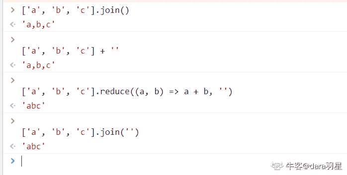
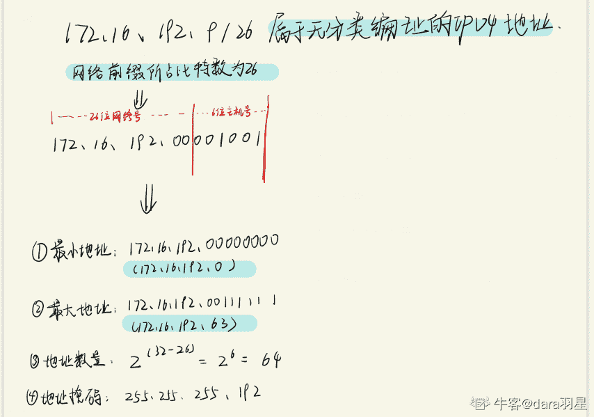
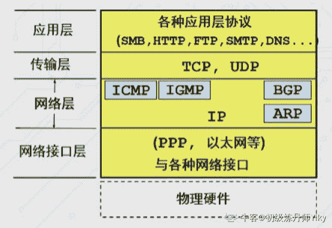

# 【2020】奇安信秋招前端方向试卷 2

## 1

下列关于 CSS 选择器的权重描述正确的是？

正确答案: A   你的答案: 空 (错误)

```cpp
内联样式>ID 选择器>类选择器>伪类选择器
```

```cpp
内联样式>类选择器>ID 选择器>伪类选择器
```

```cpp
内联样式>ID 选择器>伪类选择器>类选择器
```

```cpp
内联样式>伪类选择器>ID 选择器>类选择器
```

None

## 2

以下 CSS 选择器中，属于伪元素选择器是的？

正确答案: C   你的答案: 空 (错误)

```cpp
:hover
```

```cpp
:link
```

```cpp
:before
```

```cpp
:visited
```

None

## 3

以下哪个不是 animation-timing-function 合法值？

正确答案: C   你的答案: 空 (错误)

```cpp
linear
```

```cpp
jump-both
```

```cpp
fade-in
```

```cpp
steps
```

```cpp
ease-in
```

None

讨论

[dara 羽星](https://www.nowcoder.com/profile/75122348)

记忆法：linear，ease，jump，step

编辑于 2022-01-31 10:21:53

* * *

## 4

cellIndex 是哪个标签的属性？

正确答案: D   你的答案: 空 (错误)

```cpp
ul
```

```cpp
li
```

```cpp
tr
```

```cpp
td
```

None

讨论

[愉快的机灵鬼](https://www.nowcoder.com/profile/419707148)

cellIndex 属性可返回一行的单元格集合中单元格的位置。

发表于 2022-03-10 10:52:29

* * *

## 5

以下代码，运行结果是"abc"的有？

正确答案: B   你的答案: 空 (错误)

```cpp
['a','b','c'].join()
```

```cpp
['a','b','c']+''
```

```cpp
['a','b','c'].reduce((a,b)=>a+b,'')
```

```cpp
['a','b','c'].join('')
```

None

讨论

[dara 羽星](https://www.nowcoder.com/profile/75122348)

为啥选这个啊，答案难道不是 cd 吗

发表于 2022-01-30 12:41:22

* * *

[云做梦](https://www.nowcoder.com/profile/6003206)

服了，是我浏览器不一样吗？

发表于 2022-01-27 09:50:49

* * *

## 6

下面逻辑判断哪个条件为 false      let a = new Number(3);      let b = Number(3);      let c = +'3';

正确答案: A   你的答案: 空 (错误)

```cpp
a === b
```

```cpp
b === c
```

```cpp
a == b
```

```cpp
a ==c
```

None

讨论

[dara 羽星](https://www.nowcoder.com/profile/75122348)

使用 Number 构造函数的话，创造出来的 a 是属于 Object 类型

发表于 2022-01-30 12:42:39

* * *

## 7

下边代码输出的结果是:var name = 'World!';(function () {    if (typeof name === 'undefined') {        var name = 'Han Meimei';        console.log('Welcome ' + name);    } else {        console.log('Hello ' + name);    }})(); 

正确答案: A   你的答案: 空 (错误)

```cpp
Welcome Han Meimei
```

```cpp
Hello World
```

```cpp
Hello undefined
```

```cpp
Hello Han Meimei
```

None

讨论

[哩哩仨](https://www.nowcoder.com/profile/750938886)

我的理解是，name 在块内也被 var 声明了，因此 var 声明提前，块内声明覆盖外部声明。但在 if 判断时，name 只是声明，并没有定义，因此进入“undefined”分支。

发表于 2022-03-03 17:45:07

* * *

## 8

有如下代码 async function foo() {  console.log(2);  console.log(await Promise.resolve(8));  console.log(9);   console.log(await Promise.resolve(18));  console.log(19);}async function bar() {  console.log(4);  console.log(await 6);  console.log(7);}console.log(1);foo();console.log(3);bar();console.log(5);请问控制台输入顺序为以下哪个选项：

正确答案: D   你的答案: 空 (错误)

```cpp
1234567891819
```

```cpp
1289181934675
```

```cpp
1234589181967
```

```cpp
1234589671819
```

None

讨论

[yslaoyi](https://www.nowcoder.com/profile/100854318)

很多人以为 await 会一直等待之后的表达式执行完之后才会继续执行后面的代码，**实际上 await 是一个让出线程的标志**。await 后面的表达式会先执行一遍，将 await 后面的代码加入到 microtask 中，然后就会跳出整个 async 函数来执行后面的代码。

由于因为 async await 本身就是 promise+generator 的语法糖。所以 await 后面的代码是 microtask（微任务）

[`cloud.tencent.com/developer/article/1745948`](https://cloud.tencent.com/developer/article/1745948)

发表于 2022-03-17 15:07:11

* * *

## 9

以下代码，运行结果是什么？var myObject = {    foo: "1",    func: function() {        var foo = "2";        var self = this;        console.log(this.foo);          console.log(self.foo);          return function() {            console.log(this.foo);              console.log(self.foo);          };    }};(myObject.func())();

正确答案: D   你的答案: 空 (错误)

```cpp
1 1 1 1
```

```cpp
1 1 2 1
```

```cpp
1 2 1 1
```

```cpp
1 1 undefined 1
```

None

讨论

[哩哩仨](https://www.nowcoder.com/profile/750938886)

个人理解，有错误还请麻烦指出。this 指向调用 func 的对象，myObject 调用 func，因此前两个输出中 this==myObject==self，myObject.foo=1\.返回的函数是由 window 对象调用的，window 中没有 foo，因此第三个输出 undefined，self 依旧是 myObject，因此输出 1\.

发表于 2022-03-04 10:33:10

* * *

## 10

以下输出 var foo = {  bar(){    (function(){console.log(this)})()  }}foo.bar()

正确答案: B   你的答案: 空 (错误)

```cpp
foo
```

```cpp
window
```

```cpp
bar
```

```cpp
undefined
```

None

讨论

[液晶电视电视剧](https://www.nowcoder.com/profile/199213099)

bar 函数中为立即执行函数，没有被其他对象显示调用，指向 window

发表于 2022-01-13 09:28:17

* * *

[草苺奶昔](https://www.nowcoder.com/profile/276695079)

如果题目指明 use strict 则为 undefined 否则为 global

编辑于 2022-01-25 13:56:18

* * *

## 11

缓冲技术主要用于？

正确答案: A   你的答案: 空 (错误)

```cpp
提高主机和设备交换信息的速度
```

```cpp
提高主、辅存接口
```

```cpp
提高设备利用率
```

```cpp
扩充相对地址空间
```

None

## 12

一个进程释放一种资源将有可能导致一个或多个进程？

正确答案: B   你的答案: 空 (错误)

```cpp
由运行变阻塞
```

```cpp
由阻塞变就绪
```

```cpp
由运行变就绪
```

```cpp
由就绪变运行
```

None

## 13

单链表中删除某一指定结点，必须找到该结点的？

正确答案: B   你的答案: 空 (错误)

```cpp
数据类型
```

```cpp
前驱结点
```

```cpp
长度
```

```cpp
存储方式
```

None

## 14

下列哪个不是业界流行的分布式一致性协议？

正确答案: C   你的答案: 空 (错误)

```cpp
PAXOS
```

```cpp
RAFT
```

```cpp
RESP
```

```cpp
ZAB
```

None

## 15

redis 在的有序集合中在数据量极少的情况下使用的一下那种结构存储方案？

正确答案: A   你的答案: 空 (错误)

```cpp
压缩表
```

```cpp
跳跃表
```

```cpp
散列表
```

```cpp
双向链表
```

None

## 16

先进先出页面置换算法中以下描述正确的是？

正确答案: B   你的答案: 空 (错误)

```cpp
频繁访问的页面不会被淘汰
```

```cpp
最先进来页面最先淘汰出去
```

```cpp
最近未使用的页面先被淘汰出去
```

```cpp
访问次数很少的优先淘汰
```

None

## 17

栈和队列，ABCDEF 分别入栈，且出栈后及入队列。出队的顺序是 BDCFEA，问栈的容量至少为？

正确答案: C   你的答案: 空 (错误)

```cpp
1
```

```cpp
2
```

```cpp
3
```

```cpp
4
```

None

## 18

关于算法的描述正确的是？

正确答案: A   你的答案: 空 (错误)

```cpp
问题求解步骤的描述 
```

```cpp
算法是程序
```

```cpp
解决问题的计算方法
```

```cpp
要满足五个基本属性 
```

None

## 19

172.16.192.9/26 的计算出的 IP 地址范围是?

正确答案: A   你的答案: 空 (错误)

```cpp
172.16.192.0-172.16.192.63
```

```cpp
172.16.192.9-172.16.192.63
```

```cpp
172.16.192.8-172.16.192.63
```

```cpp
172.16.192.9-172.16.192.64
```

None

讨论

[dara 羽星](https://www.nowcoder.com/profile/75122348)



发表于 2022-02-12 17:29:27

* * *

## 20

下面不属于应用层的协议是?

正确答案: D   你的答案: 空 (错误)

```cpp
HTTP
```

```cpp
DNS
```

```cpp
SMTP
```

```cpp
ICMP
```

None

讨论

[初级炼丹师 Yiky](https://www.nowcoder.com/profile/342467844)



发表于 2022-02-24 13:01:13

* * *

[会飞的企鹅是天使](https://www.nowcoder.com/profile/1040713)

答案错了吧

发表于 2022-02-12 20:59:08

* * *

[草苺奶昔](https://www.nowcoder.com/profile/276695079)

DNS 是传输层协议

发表于 2022-01-25 13:59:24

* * *

## 21

下列对 CSS 属性 overflow 描述正确的是？

正确答案: A B C D   你的答案: 空 (错误)

```cpp
值为 scroll 时，会一直出现滚动条。
```

```cpp
值是 auto 时，子元素内容大于父元素时出现滚动条。
```

```cpp
值是 visible 时，溢出的内容出现在父元素外显示。
```

```cpp
值是 hidden 时候，溢出的内容将被隐藏。
```

None

## 22

一个 FORM 的 elements 集合里，可能会有哪些元素？

正确答案: A D   你的答案: 空 (错误)

```cpp
input
```

```cpp
option
```

```cpp
label
```

```cpp
select
```

None

## 23

如何判断变量 a 是否为数组?

正确答案: A C D   你的答案: 空 (错误)

```cpp
Array.isArray(a)
```

```cpp
typeof a==="array"
```

```cpp
a instanceof Array
```

```cpp
Object.prototype.toString.call(a)==="[object Array]"
```

None

讨论

[牛客 395887114 号](https://www.nowcoder.com/profile/395887114)

```cpp
typeof a==="array" // typeof [] ===  object
```

发表于 2022-02-07 11:14:15

* * *

## 24

var s='ab1cd22ef3g'; 以下哪些表达式的值为 4？

正确答案: B C D   你的答案: 空 (错误)

```cpp
s.split(/\d/g).length
```

```cpp
s.split(/\d+/g).length
```

```cpp
s.match(/\D+/g).length
```

```cpp
s.match(/[a-z]+/g).length
```

None

## 25

以下代码，运行结果是 4 的有？

正确答案: A B D   你的答案: 空 (错误)

```cpp
20/5
```

```cpp
19%5
```

```cpp
13/3
```

```cpp
12&7
```

None

讨论

[PUKARS](https://www.nowcoder.com/profile/59356662)

12：1100 7：0111→  0 100→4

发表于 2022-03-02 17:16:36

* * *

[液晶电视电视剧](https://www.nowcoder.com/profile/199213099)

13/3    // 4.333333333333333

发表于 2022-01-13 09:31:32

* * *

## 26

在以下哪些事件里设用 window.open('[`qianxin.com`](https://qianxin.com)')容易失败？

正确答案: A C D   你的答案: 空 (错误)

```cpp
mousedown
```

```cpp
click
```

```cpp
mouseover
```

```cpp
wheel
```

None

## 27

Linux 文件权限一共 10 位长度，例如“drwxr-xr-x”，分成四部分，第三部分的 xr 表示的内容是？

正确答案: C D   你的答案: 空 (错误)

```cpp
文件所有者有读权限
```

```cpp
文件所有者有执行权限
```

```cpp
文件所有者所在组的有读权限
```

```cpp
文件所有者所在组的执行权限
```

None

## 28

下面的数据结构里，哪些属于线性数据结构

正确答案: A B D   你的答案: 空 (错误)

```cpp
线性表
```

```cpp
栈
```

```cpp
二维数组
```

```cpp
队列
```

None

## 29

算法具有的特性包括？

正确答案: A B C   你的答案: 空 (错误)

```cpp
有穷性
```

```cpp
确定性
```

```cpp
可行性
```

```cpp
收敛性
```

None

## 30

如下哪些协议属于 IPv6 隧道过渡技术？

正确答案: B C   你的答案: 空 (错误)

```cpp
NAT64
```

```cpp
DS-Lite
```

```cpp
6RD
```

```cpp
IVI
```

None

## 31

编写一段程序，用于计算 200 以内正整数的阶乘要求：  不允许使用任何第三方库。None

讨论

[零葬](https://www.nowcoder.com/profile/75718849)

数据量很小，直接 O(n)的暴力方法就能计算，用 python 避免考虑溢出

```cpp
n = int(input())
if 1 <= n <= 200:
    res = 1
    for num in range(1, n + 1):
        res *= num
    print(res)
else:
    print("Error")
```

发表于 2022-01-08 20:12:32

* * *

[hiahia#](https://www.nowcoder.com/profile/909053558)

GO 手写大整数乘法和打印，用 int slice 分段存储

```cpp
package main
import "fmt"

func main(){
    var n int
    fmt.Scanf("%d",&n)
    if n>200 || n<1{
        fmt.Println("Error")
        return
    }
    result := []int{1}
    for i:=2;i<=n;i++{
        result = times(result,i)
    }
    // fmt.Println(result)
    printNum(result)

}
const MAXTIMES = 100000000
func printNum(num []int){
    // 打印最高段
    fmt.Print(num[len(num)-1]);
    for i:=len(num)-2;i>-1;i--{
        fmt.Printf("%08d",num[i])
    }

}
func times(num []int,n int ) ( []int){
    carry :=0
    for i:=0;i<len(num);i++{
        num[i] *=n
        num[i]+=carry
        carry = num[i]/MAXTIMES
        num[i]%=MAXTIMES
    }
    if carry!=0{
        num = append(num,carry)
    }
    return num
}
```

发表于 2022-03-18 20:38:16

* * *

[GhostGuest](https://www.nowcoder.com/profile/105855121)

动态规划思想：

状态转移方程：

```cpp
import java.util.Scanner;
import java.math.BigInteger;
public class Main {
    public static void main(String[] args) {
        Scanner sc = new Scanner(System.in);
        int n = sc.nextInt();
        if (n>=1 && n<=200){
            BigInteger[] dp = new BigInteger[n];
            dp[0] = BigInteger.valueOf(1);
            dp[1] = BigInteger.valueOf(2);
            for (int i = 2; i < n; i++) {
                dp[i] = BigInteger.valueOf(i + 1).multiply(dp[i - 1]);
            }
            System.out.println(dp[n - 1]);
        }else {
            System.out.println("Error");
        }
    }
}
```

编辑于 2022-03-17 22:12:34

* * *

## 32

 有一个 m*n 的网格，在每个格子上有一个非 0 整数。 你每次只能向下或者向右移动一格，求你从左上角移动到最右下角，路径上数字和的最大值。

实例 1：
[
  [2,3,1],
  [2,5,3],
  [4,2,1]
]
输出：14
解释：2->3->5->3->1 路径和的最大值
None

讨论

[爱吃鱼的大布丁](https://www.nowcoder.com/profile/769557558)

两个月没练题，dp 都忘了，cpp 没用也写不好，还是用 go 刷题好

```cpp
package main

/**
 * 代码中的类名、方法名、参数名已经指定，请勿修改，直接返回方法规定的值即可
 * 
 * @param matrix int 整型二维数组 
 * @return int 整型
*/
func maxValue( matrix [][]int ) int {
    n, m:= len(matrix), len(matrix[0])
    for i := 1; i < n; i++ {
        matrix[i][0] += matrix[i - 1][0]
    }
    for j := 1; j < m; j++ {
        matrix[0][j] += matrix[0][j - 1]
    }
    for i := 1; i < n; i++ {
        for j := 1; j < m; j++{
                matrix[i][j] += max(matrix[i - 1][j], matrix[i][j - 1])
            }
        }
    return matrix[n - 1][m - 1]
}
func max(a, b int) int{
    if a > b{
        return a
    }
    return b
}
```

 发表于 2022-02-10 20:03:21

* * *

[零葬](https://www.nowcoder.com/profile/75718849)

很经典的一道动态规划题，剑指 offer 中就有原题，原地 DP 就可以解

```cpp
import java.util.*;

public class Solution {
    /**
     * 代码中的类名、方法名、参数名已经指定，请勿修改，直接返回方法规定的值即可
     * 
     * @param matrix int 整型二维数组 
     * @return int 整型
     */
    public int maxValue (int[][] matrix) {
        // write code here
        int n = matrix.length, m = matrix[0].length;
        for(int i = 1; i < n; i++){
            matrix[i][0] += matrix[i - 1][0];
        }
        for(int j = 1; j < m; j++){
            matrix[0][j] += matrix[0][j - 1];
        }
        for(int i = 1; i < n; i++){
            for(int j = 1; j < m; j++){
                matrix[i][j] += Math.max(matrix[i - 1][j], matrix[i][j - 1]);
            }
        }
        return matrix[n - 1][m - 1];
    }
}
```

发表于 2022-01-08 20:10:22

* * *

[丶一口冖几](https://www.nowcoder.com/profile/175274942)

importjava.util.*;publicclassSolution {    /**     * 代码中的类名、方法名、参数名已经指定，请勿修改，直接返回方法规定的值即可     *     * @param matrix int 整型二维数组     * @return int 整型     */    publicintmaxValue (int[][] matrix) {        if(matrix.length == 0)return0;        intsum = matrix[0][0];        int[][] hc = newint[matrix.length][matrix[0].length];        inta = f2(0, 1, matrix,hc);        intb = f2(1, 0, matrix,hc);        sum += Math.max(a,b);        returnsum;    }    privateintf2(intx, inty, int[][] matrix,int[][] hc) {        if(y == matrix[0].length-1&& x == matrix.length-1)returnmatrix[x][y]; //返回最后一个        if(y == matrix[0].length-1){            hc[x+1][y] =  f2(x+1,y,matrix,hc);            returnmatrix[x][y] + hc[x+1][y];//返回下面        }        if(x == matrix.length-1){            hc[x][y+1] =  f2(x,y+1,matrix,hc);            returnmatrix[x][y] +hc[x][y+1];//返回右        }        if(hc[x][y+1] == 0){            hc[x][y+1] = f2(x,y+1,matrix,hc);        }        if(hc[x+1][y] == 0){            hc[x+1][y] = f2(x+1,y,matrix,hc);        }        intmax = Math.max(matrix[x][y] + hc[x][y+1],matrix[x][y] + hc[x+1][y]);        returnmax;    }}先暴力递归，然后空间换时间

发表于 2022-03-15 22:52:01

* * *