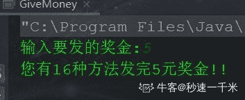

# 【2020】奇安信秋招研发安全方向试卷 1

## 1

以下哪些字段不是 IP 头部中的内容(    )

正确答案: D   你的答案: 空 (错误)

```cpp
版本、报文长度
```

```cpp
服务类型、标识
```

```cpp
源地址、目标地址
```

```cpp
源端口、目标端口
```

None

讨论

[小白巨白](https://www.nowcoder.com/profile/280037898)

一层层的封装，每一层有每一次的作用，端口一般倾向于传输层 tcp/udp 的报文段

发表于 2022-02-12 10:01:35

* * *

## 2

下列选项中，TCP 标志位组合不正确的是(    ）

正确答案: C   你的答案: 空 (错误)

```cpp
SYN+ACK
```

```cpp
PUSH+ACK
```

```cpp
SYN+RST
```

```cpp
FIN+ACK
```

None

讨论

[小白巨白](https://www.nowcoder.com/profile/280037898)

TCP 标志位：URG：表示 TCP 包的紧急指针域有效 ACK：表示该数据包是否有效果 PSH：这个标志位表示 PUSH 操作，立即传送给应用程序，不在缓冲区进行排列 RST：链接复位请求 SYN：表示同步序号，用来建立连接 FIN：是否为最后一个数据包

发表于 2022-02-12 10:07:48

* * *

## 3

TCP SYN 拒绝服务攻击是指？

正确答案: A   你的答案: 空 (错误)

```cpp
发起 TCP 链接后不管，重复不停发送链接
```

```cpp
不停发起 TCP 链接，链接上后立刻断开再次发起链接
```

```cpp
不断发送 TCP ACK 报文
```

```cpp
该攻击对 WEB 服务器不起作用
```

None

讨论

[小白巨白](https://www.nowcoder.com/profile/280037898)

就记住，对应的发送方式是只放出去但不起一点作用

发表于 2022-02-12 10:28:52

* * *

## 4

分片 IP 报文攻击是指？

正确答案: C   你的答案: 空 (错误)

```cpp
将大报文拆分成很小的报文片段发送给被攻击者
```

```cpp
发送大量小片段的 TCP 报文给被攻击者
```

```cpp
将大报文拆分成小报文片段，只发送一部分给被攻击者
```

```cpp
发送大量 UDP 报文给被攻击者
```

None

讨论

[小白巨白](https://www.nowcoder.com/profile/280037898)

因为涉及到的是相关的安全，如果是将所用的小报文进行发送，对应的接收方还是可以进行重新组合，最后达到真实的效果

发表于 2022-02-12 10:30:08

* * *

## 5

永恒之蓝利用哪种协议发起攻击

正确答案: A   你的答案: 空 (错误)

```cpp
SMB
```

```cpp
SSL
```

```cpp
HTTP
```

```cpp
FTP
```

None

讨论

[小白巨白](https://www.nowcoder.com/profile/280037898)

一种利用 Windows 系统的 SMB 协议漏洞来获取系统的最高权限，以此来控制被入侵的计算机。

发表于 2022-02-12 10:30:53

* * *

## 6

ARP 攻击造成网络无法跨网段通信的原因是？

正确答案: B   你的答案: 空 (错误)

```cpp
发送大量 ARP 报文造成网络拥塞
```

```cpp
伪造网关 ARP 报文使得数据包无法发送到网关
```

```cpp
ARP 攻击破坏了网络的物理连通性
```

```cpp
ARP 攻击破坏了网关设备
```

None

## 7

Ping of death 攻击的原理是？

正确答案: C   你的答案: 空 (错误)

```cpp
IP 标准中数据包的最大长度限制是 65536
```

```cpp
攻击者发送多个分片，总长度大于 65536
```

```cpp
操作系统平台未对分片进行参数检查
```

```cpp
IPv4 协议安全机制不够充分
```

None

讨论

[小白巨白](https://www.nowcoder.com/profile/280037898)

死亡攻击是一种拒绝服务（DoS）攻击，攻击者的目标是通过发送大于最大允许大小的数据包来破坏目标机器，导致目标机器冻结或崩溃。

发表于 2022-02-12 10:37:44

* * *

## 8

以下哪项为 Linux 下可用的抓包工具?

正确答案: C   你的答案: 空 (错误)

```cpp
libcap
```

```cpp
firewalld
```

```cpp
tshark
```

```cpp
hping3
```

None

讨论

[wqeqwwer](https://www.nowcoder.com/profile/892454127)

acd 是不是都对呀

发表于 2022-02-16 23:13:30

* * *

## 9

nmap 扫描参数中，以下哪个参数的扫描最快

正确答案: D   你的答案: 空 (错误)

```cpp
T2
```

```cpp
T3
```

```cpp
T4
```

```cpp
T5
```

None

讨论

[小白巨白](https://www.nowcoder.com/profile/280037898)

nmap 的常见参数汇总：端口状态概述 open 开放   closed 关闭  filtered 被过滤掉了，无法进行判断  unfiltered 未被过滤可以进行访问参数：1、-Pn 跳过主机发现，视为所有的主机都在线 2、sn 只做 ping 扫描不做端口扫描 3、sT\A\W\M 不同的扫描端口，进行扫描 4、-p 指定端口进行扫描 --exclude-ports<port ranges>：排除端口进行扫描 5、-sV 探测系统的版本 --version-intensity<level>：设置相关的程度，详细级别，0~9 越高越详细--version-trace：打印详细的版本扫描过程 6、脚本扫描--scri=<scripts> ：指定对应的脚本名称 7、O：激活系统的探测--osscan-limit：只对开放端口的有效主机进行系统的探测 8、-T<0-5>:时间模板，越大速度越快 9、-6：使能 IPV6 探测 10、-A：使能系统探测、版本检测、脚本扫描、路由追踪 11、-V：打印版本号 12、-v：增加输出的详细程度

发表于 2022-02-12 10:56:15

* * *

## 10

以下那个不是 PE 文件结构 

正确答案: D   你的答案: 空 (错误)

```cpp
导入表
```

```cpp
导出表
```

```cpp
重定位表
```

```cpp
字符串表
```

None

## 11

当前进程页目录地址保存在

正确答案: D   你的答案: 空 (错误)

```cpp
cr0
```

```cpp
cr1
```

```cpp
cr2
```

```cpp
cr3
```

None

## 12

以下哪个选项用于解决缓解间接调用和调用不可靠目标的问题

正确答案: D   你的答案: 空 (错误)

```cpp
ASLR
```

```cpp
EDP
```

```cpp
GS
```

```cpp
CFG
```

None

讨论

[小白巨白](https://www.nowcoder.com/profile/280037898)

CFG（Control [Flow](https://so.csdn.net/so/search?q=Flow&spm=1001.2101.3001.7020) Guard）控制流防护，是微软在 Windows8.0 以及 Windows10 上推出的新的防护机制。防护点在于，防护间接调用，防止在程序间接调用函数的时候，使用恶意代码进行替换，导致执行恶意程序。CFG 的实现机制在于每当存在间接调用的函数的时候，就会先去判断一下间接调用的地址处是不是一个有效的函数的起始地址

发表于 2022-02-12 11:05:29

* * *

## 13

Windbg 中通过哪条命令监控指定 dll 加载

正确答案: A   你的答案: 空 (错误)

```cpp
sxe
```

```cpp
lm
```

```cpp
reload
```

```cpp
pct
```

None

## 14

WEB 漏洞扫描工具通过网络爬虫测试 web 应用系统,检测常见的 Web 应用漏洞，以下哪一个工具不是扫描工具呢？

正确答案: C   你的答案: 空 (错误)

```cpp
AppScan
```

```cpp
Netsparker
```

```cpp
Kali
```

```cpp
Nikto
```

```cpp
WebInspect
```

None

## 15

关于 OWASP Top 10 2017 十项最严重的 Web 应用程序安全风险，以下哪种漏洞类型不在范围内？

正确答案: E   你的答案: 空 (错误)

```cpp
不安全的反序列化
```

```cpp
XML 外部实体注入
```

```cpp
使用了已知漏洞的组件
```

```cpp
敏感数据泄露
```

```cpp
SSTI
```

None

## 16

对一个文件的访问，常由（   ）共同限制

正确答案: A   你的答案: 空 (错误)

```cpp
用户访问权限和文件属性
```

```cpp
用户访问权限和文件优先级
```

```cpp
优先级和文件属性
```

```cpp
文件属性和口令
```

None

讨论

[牛客 568626334 号](https://www.nowcoder.com/profile/568626334)

对一个文件的访问，常由用户文件权限和文件属性共同限制

发表于 2022-02-23 19:40:35

* * *

[嘻哈王](https://www.nowcoder.com/profile/813178743)

文件保护的概念对文件访问，一般用用户访问权限和文件属性来限制

发表于 2022-02-13 16:43:07

* * *

## 17

下列关于 TCP 和 UDP 的描述正确的是(   )。

正确答案: B   你的答案: 空 (错误)

```cpp
TCP 和 UDP 都是无连接的
```

```cpp
TCP 是面向连接的，UDP 是面向无连接的
```

```cpp
TCP 适用于可靠性较差的广域网，UDP 适用于可靠性较高的局域网
```

```cpp
TCP 适用于可靠性较高的局域网，UDP 适用于可靠性较差的广域网
```

None

讨论

[快乐怿站](https://www.nowcoder.com/profile/428310779)

TCP 比 UDP 更适合局域网，UDP 更适合广域网，要是都需要三次握手，广域网性能就跟不上

发表于 2022-01-17 09:18:47

* * *

[牛客 602509448 号](https://www.nowcoder.com/profile/602509448)

CD 是为什么都错呢，我网上查的是 C 也对，知道的大佬可以回复或私信我吗

发表于 2022-01-14 15:58:06

* * *

[牛客 808001002 号](https://www.nowcoder.com/profile/808001002)

不会

发表于 2022-01-13 11:35:50

* * *

## 18

下列不属于面向对象的基本原则的是

正确答案: D   你的答案: 空 (错误)

```cpp
单一职责原则
```

```cpp
里氏替换原则
```

```cpp
迪米特法则
```

```cpp
抽象类原则
```

None

讨论

[小白巨白](https://www.nowcoder.com/profile/280037898)

面向对象的三大特性：封装、继承、多态

面向对象的七(或五大原则，前五项)大基本原则：单一职责原则（SRP） 、开放封闭原则（OCP）  、[里氏替换原则](https://so.csdn.net/so/search?q=%E9%87%8C%E6%B0%8F%E6%9B%BF%E6%8D%A2%E5%8E%9F%E5%88%99&spm=1001.2101.3001.7020)（LSP）、  依赖倒置原则（DIP）、  接口隔离原则（ISP）、迪米特法则（Law Of Demeter）、组合/聚合复用原则（Composite/Aggregate Reuse Principle CARP

发表于 2022-02-12 11:22:13

* * *

## 19

以下程序在 little-endian 架构处理器下的输出是：int i;char *pc = &i;pc[0] = 1;printf("%d\n", i);

正确答案: A   你的答案: 空 (错误)

```cpp
1
```

```cpp
16777216
```

```cpp
0
```

```cpp
Segmentation Fault
```

None

讨论

[小白巨白](https://www.nowcoder.com/profile/280037898)

注意地址和相关的关系

发表于 2022-02-12 11:23:08

* * *

[昨日友人在](https://www.nowcoder.com/profile/678522556)

这里说的是小端存储存储数据从低位开始存储所以就是 1 吧如果是高位存储应该就是 1 后面 31 个 0

发表于 2022-03-16 15:04:41

* * *

[BinWatson](https://www.nowcoder.com/profile/839234895)

i 都没有进行初始化。。怎么知道能确定值是多少。

发表于 2022-03-06 23:02:44

* * *

## 20

以下说法错误的是

正确答案: C   你的答案: 空 (错误)

```cpp
一个变量可以既是 const 又是 volatile
```

```cpp
一个指针可以是 volatile
```

```cpp
volatile 可提升程序性能
```

```cpp
当 gcc -O0 时，volatile 起不到作用
```

None

讨论

[cuhk_sc](https://www.nowcoder.com/profile/835924611)

volatile 关键字可以让编译器不对访问该变量的代码进行优化，即每次都重新从该变量所在的内存地址访问数据，从而提供对特殊地址的稳定访问。

发表于 2022-03-05 16:44:49

* * *

## 21

针对 WEB 攻击有？

正确答案: A B C D   你的答案: 空 (错误)

```cpp
XSS
```

```cpp
SQL 注入
```

```cpp
DdoS
```

```cpp
CSRF
```

None

讨论

[牛客 624189085 号](https://www.nowcoder.com/profile/624189085)

Abd

发表于 2022-02-08 16:12:22

* * *

## 22

系统入侵攻击的方式有？

正确答案: A B C D   你的答案: 空 (错误)

```cpp
口令攻击
```

```cpp
漏洞攻击
```

```cpp
木马攻击
```

```cpp
后门攻击
```

None

## 23

下列（    ）能减少用户计算机被攻击的可能性。

正确答案: A B C   你的答案: 空 (错误)

```cpp
选用比较长和复杂的用户登录口令
```

```cpp
使用防病毒软件
```

```cpp
尽量避免开放过多的网络服务
```

```cpp
定期扫描系统硬盘碎片
```

None

## 24

监听以下哪些 TCP 端口需要 root 权限?

正确答案: A B   你的答案: 空 (错误)

```cpp
22
```

```cpp
80
```

```cpp
3306
```

```cpp
8080
```

None

讨论

[wqeqwwer](https://www.nowcoder.com/profile/892454127)

监听 0-1023 都需要 root

发表于 2022-02-16 23:26:13

* * *

## 25

下哪些方式可能导 Windows 10 上控制流劫持？

正确答案: B C D   你的答案: 空 (错误)

```cpp
修改 iat 表
```

```cpp
修改 free hook 等插入得函数指针
```

```cpp
非线性修改函数返回地址
```

```cpp
使用函数指针进行覆写
```

None

## 26

以下哪些方式属于内存破坏类漏洞调试分析中的常见技巧

正确答案: A B C   你的答案: 空 (错误)

```cpp
开启 heap 相关检测选项
```

```cpp
内存访问断点
```

```cpp
条件断点
```

```cpp
搜索 gadget
```

None

## 27

哪些函数或语句是 SQL 延迟盲注利用中会用到?

正确答案: A B C D   你的答案: 空 (错误)

```cpp
sleep
```

```cpp
benchmark
```

```cpp
DBMS_PIPE.RECEIVE_MESSAGE
```

```cpp
WAITFOR DELAY
```

None

## 28

有 5 个元素，A, B, C, D, E, 依次按顺序进栈，进栈过程中允许出栈，以下序列中可能是该序列的出栈顺序的有

正确答案: A C D   你的答案: 空 (错误)

```cpp
CDBAE
```

```cpp
ADBCE
```

```cpp
ABCDE
```

```cpp
CDBEA
```

None

## 29

下列排序算法空间复杂度最小的是：

正确答案: A B C   你的答案: 空 (错误)

```cpp
插入排序
```

```cpp
冒泡排序
```

```cpp
堆排序
```

```cpp
快速排序
```

本题知识点

Java 工程师 C++工程师 酷家乐 2020

讨论

[一鹤排云上](https://www.nowcoder.com/profile/549263312)

快速排序递归函数栈空间复杂度 logN

发表于 2020-05-25 14:24:35

* * *

[青春渐离](https://www.nowcoder.com/profile/883163570)

快速排序虽然也不需要额外数组，但是需要左指针，右指针，base 和空值，四个空间。

发表于 2020-03-10 11:37:02

* * *

## 30

Java 接口的修饰符包括

正确答案: A D   你的答案: 空 (错误)

```cpp
public
```

```cpp
protected
```

```cpp
private
```

```cpp
final
```

None

讨论

[perish](https://www.nowcoder.com/profile/787636277)

JDK1.8 下是可以 final 和 public 不可以 protect

发表于 2022-03-03 19:10:13

* * *

[牛客 125396916 号](https://www.nowcoder.com/profile/125396916)

？来你来给我定义一个 final 的接口

发表于 2022-02-08 21:00:36

* * *

[爱吃葱](https://www.nowcoder.com/profile/353187838)

不知道是不是表述问题，我 public 肯定修饰接口，final 可以修饰接口中的变量为常量

发表于 2022-03-19 15:30:19

* * *

## 31

老板一共需要给某个员工发奖金 n 元，可以选择一次发 1 元，也可以选择一次发 2 元，也可以选择一次发 3 元。请问老板给这位员工发放完 n 元奖金共有多少种不同的方法？数据范围：1 <= n <= 10None

讨论

[秒速一千米](https://www.nowcoder.com/profile/444333129)

分析：可以这样想，发 5 元怎么发？1：先发 1 块的情况下，剩下 4 块是不是就和发 4 块的方法一样了？2：先发 2 块的情况下，剩下 3 块是不是就和发 3 块的方法一样了？3：先发 3 块的情况下，剩下 2 块是不是就和发 2 块的方法一样了？4：先发 4 块的情况下，剩下 1 块是不是就和发 1 块的方法一样了？5：5 块一次性发完，唯一方法这很递归嘛~即符合  f(n) = f(n-1) + f(n-2) + ... + f(1) + 1 为便于理解，本人画了张图。代码和运行结果如下

```cpp
public class GiveMoney {
    public static void main(String[] args) {
        Scanner scanner = new Scanner (System.in);
        System.out.print ("输入要发的奖金:");
        int number = scanner.nextInt ();
        System.out.println ("您有" + f (number) + "种方法发完" + number + "元奖金!!");
    }

    /**
     * 获取 发奖金可用的总方法 的方法
     *
     * @param number 要发的钱数
     * @return 总方法数
     */
    public static int f(Integer number) {
        // 设置递归结束条件
        if (number == 1) {
            return 1;
        }
        // 实现 f(n) = f(n-1) + f(n-2) + ... + f(1) + 1
        int count = 0;
        for (int i = number - 1; i >= 1; i--) {
            count = f (i) + count;
        }
        return count + 1;
    }
}
```



发表于 2022-01-22 22:33:34

* * *

[李彤是快递小哥](https://www.nowcoder.com/profile/94626269)

这不就是 青蛙跳吗

发表于 2022-02-23 22:26:19

* * *

[我要逆天当学霸](https://www.nowcoder.com/profile/245035478)

import java.util.*;
public class Solution {
    /**
     * 
     * @param num_money int 整型 奖金的总数,单位为元
     * @return int 整型
     */
    public void main(String [] args){
        Scanner sc = new Scanner(System.in);
        int num_money = sc.nextInt();
        System.out.println(CalulateMethodCount(num_money));
        sc.close();
    }
    public int CalulateMethodCount (int num_money) {
        // write code here
        if (num_money == 1) return 1;
        if (num_money == 2) return 2;
        if (num_money == 3) return 4;
        int[] dp = new int[num_money + 1];
        dp[0] = 0; 
        dp[1] = 1; 
        dp[2] = 2; 
        dp[3] = 4;
        for (int i = 4; i <= num_money; ++i) {
            dp[i] = dp[i - 1] + dp[i - 2] + dp[i - 3];
        }
        return dp[num_money];
    }
}

发表于 2022-01-20 21:32:27

* * *

## 32

撤销/恢复操作具有广泛的用途，比如 word 文档中输入一个单词，可以点撤销，然后可以再恢复。编程实现如下功能：  从标准输入读取到一个字符串，字符串可包含 0 个或多个单词，单词以空格或者 tab 分隔； 如果遇到 "undo" 字符串，表示"撤销"操作，前一个字符串被撤销掉； 如果遇到"redo"字符串，表示恢复刚才撤销掉的字符串.例如:   输入字符串 "hello undo redo world."，  对字符串中的 undo 和 redo 处理后， 最终输出的结果为 "hello world."None

讨论

[零葬](https://www.nowcoder.com/profile/75718849)

先初始化两个栈 stack 和 redo，然后利用双栈求解。遍历词表：

1.  遇到普通词就压入 stack，并清空 redo 栈，因为此时写入了一个新词，再往前的词已经找不回来了；
2.  遇到 undo 就从 stack 中弹栈至 redo；
3.  遇到 redo 就从 redo 中弹栈至 stack。

最终 stack 中的词就是最后保留下来的词

```cpp
commands = input().strip().split(" ")
stack, redo = [], []
for cmd in commands:
    if cmd == "undo":
        if stack:
            redo.append(stack.pop())
    elif cmd == "redo":
        if redo:
            stack.append(redo.pop())
    else:
        redo.clear()
        stack.append(cmd)
print(" ".join(stack))
```

发表于 2022-01-08 20:08:09

* * *

[牛客 442788909 号](https://www.nowcoder.com/profile/442788909)

import java.util.*;
public class Main{
    public static void main(String[] args){
        Scanner sc = new Scanner(System.in);
        List<String> li = new LinkedList(Arrays.asList(sc.nextLine().split(" ")));
        Deque<String> dq = new LinkedList<String>();
        for(int i = 0;i<li.size();i++){
            if(li.get(i).equals("undo")&&i!=0) {
                dq.push(li.get(i-1));
                li.remove(i);
                li.remove(i-1);
                i-=2;
                continue;
            }
            if(li.get(i).equals("redo")) {
                if(!dq.isEmpty()) {
                    li.remove(i);
                    li.add(i,dq.pop());
                }
            }
        }

        System.out.println(String.join(" ", li));
        sc.close();
    }
}

发表于 2022-01-22 21:09:06

* * *

[軸。](https://www.nowcoder.com/profile/542430771)

```cpp
package main
import(
    "os"  
    "bufio"
    "fmt"
    "strings"
)

func RedoUndoStr(str string) string{
    strList := strings.Split(str," ")
    stack := make([]string,0)
    redo := make([]string,0)
    for _,val:=range strList{
        if val=="redo"{
            if len(redo)>0{
                stack=append(stack, redo[len(redo)-1])
                redo=redo[:len(redo)-1]
            }
        }else if val=="undo"{
            if len(stack)>0{
                redo=append(redo, stack[len(stack)-1])
                stack=stack[:len(stack)-1]
            }
        }else{
            redo=redo[:0]
            stack=append(stack, val)
        }
    }
    return strings.Join(stack," ")
}
func main(){
    reader:=bufio.NewReader(os.Stdin)
    str,_:=reader.ReadString('\n')
    fmt.Println(RedoUndoStr(str))
}
```

编辑于 2022-03-22 09:09:09

* * *