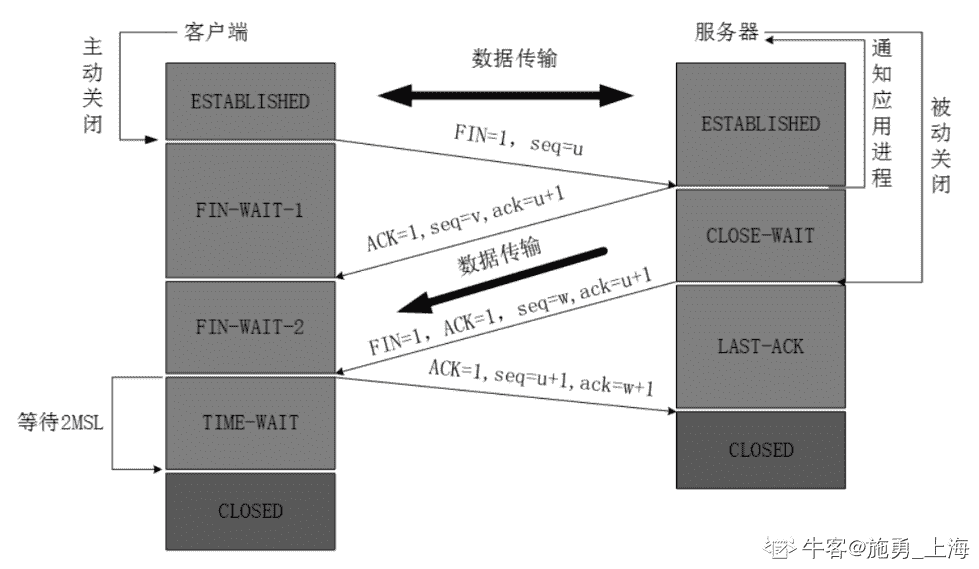

# 【2020】奇安信秋招运维方向试卷 3

## 1

下列类型中，不是 java 语言基本数据类型的是

正确答案: C   你的答案: 空 (错误)

```cpp
long
```

```cpp
double
```

```cpp
String
```

```cpp
float
```

本题知识点

大数据开发工程师 奇安信 2020

讨论

[-13579](https://www.nowcoder.com/profile/654584696)

string 是引用类型

发表于 2021-04-06 13:17:36

* * *

## 2

关于函数的参数传递，下面说法错误的是？

正确答案: D   你的答案: 空 (错误)

```cpp
传值时函数内部对值的修改并不会引发外部值的变化
```

```cpp
传指针时能修改指针指向的对象
```

```cpp
传引用时函数内部对值的改变会引发外部值的变化
```

```cpp
无论传值传引用还是传指针，传递的都是一份拷贝
```

None

## 3

下面属于内核锁的是？

正确答案: A   你的答案: 空 (错误)

```cpp
Semaphore
```

```cpp
Spinlock
```

```cpp
message
```

```cpp
Atomic
```

None

讨论

[初级炼丹师 Yiky](https://www.nowcoder.com/profile/342467844)

1、mutex(互斥信号量)

mutex_init(&mutex); 

mutex_lock(&mutex);、mutex_unlock(&mutex); 

2、semaphore (信号量)

void sema_init (struct semaphore *sem, int val); 

void down(struct semaphore * sem); 

int down_interruptible(struct semaphore * sem); 

void up(struct semaphore * sem); 

3、rw_semaphore （读写信号量）

void init_rwsem(struct rw_semaphore *sem); 

void down_read(struct rw_semaphore *sem); 

void down_write(struct rw_semaphore *sem); 

void up_read(struct rw_semaphore *sem); 

void up_write(struct rw_semaphore *sem);

4、Spanlock(自旋锁)

spin_lock_init(x)、DEFINE_SPINLOCK(x)、SPIN_LOCK_UNLOCKED

spin_is_locked(x)、spin_unlock_wait(x)、spin_trylock(lock)

spin_lock(lock)、spin_unlock(lock)

spin_lock_irqsave(lock, flags)、spin_unlock_irqrestore(lock, flags) 

spin_lock_irq(lock)、spin_unlock_irq(lock) 

spin_lock_bh(lock)、spin_unlock_bh(lock) 

spin_trylock_irqsave(lock, flags) 

spin_trylock_irq(lock) 

5、seqlock（顺序锁）

6、rwlock （读写锁）

rwlock_init(x) 

read_trylock(lock) 

write_trylock(lock) 

read_lock_irqsave(lock, flags) 

write_lock_irqsave(lock, flags) 

read_unlock_irqrestore(lock, flags) 

write_unlock_irqrestore(lock, flags)

7、RCU（read-copy-update）

8、BKL（大内核锁） // to be deleted

发表于 2022-02-26 10:56:19

* * *

## 4

下列说法错误的是

正确答案: C   你的答案: 空 (错误)

```cpp
final 修饰的类不可以被继承
```

```cpp
final 修饰的变量不可以被改变
```

```cpp
final 修饰的方法不可以重载
```

```cpp
final 修饰的方法可以被继承
```

None

讨论

[爱好儿科](https://www.nowcoder.com/profile/924267471)

**1.如果一个方法使用 final 修饰，则该方法不能被子类覆盖。**

**2.重载与覆盖有什么区别？**

.定义区别：

①重载是指不同的函数使用相同的函数名，但是函数的参数个数或类型不同。调用的时候根据函数的参数来区别不同的函数。

②覆盖（也叫重写）是指在派生类中重新对基类中的虚函数（注意是虚函数）重新实现。即函数名和参数都一样，只是函数的实现体不一样。

2.类的关系区别

覆盖是子类和父类之间的关系，是垂直关系；重载是同一个类中方法之间的关系，是水平关系。

编辑于 2022-02-08 23:52:50

* * *

## 5

关于协程，下面说法正确是？

正确答案: C   你的答案: 空 (错误)

```cpp
协程创建的数量没有限制
```

```cpp
线程比协程更轻量级
```

```cpp
通过 channel 来进行协程间的通信
```

```cpp
协程不存在死锁问题
```

None

## 6

请选出以下不是线程安全的类。

正确答案: D   你的答案: 空 (错误)

```cpp
ConcurrentSkipListMap
```

```cpp
CopyOnWriteArrayList
```

```cpp
Hashtable
```

```cpp
TreeMap
```

None

讨论

[love_wendy](https://www.nowcoder.com/profile/960149801)

记忆口诀：喂，SHE，CC vector、statck、hashtable、enumeration、ConcurrentSkipListMap、CopyOnWriteArrayList 

发表于 2022-03-16 20:46:40

* * *

## 7

以下语句错误的是？

正确答案: B   你的答案: 空 (错误)

```cpp
char *s = "abcd";
```

```cpp
char s[10]; s = "abcd";
```

```cpp
char s[10] = "abcd";
```

```cpp
char s[10] = {'a','b','c','d'};
```

None

讨论

[爱好儿科](https://www.nowcoder.com/profile/924267471)

s 是个地址

发表于 2022-02-14 17:02:06

* * *

## 8

链栈与顺序栈相比，比较明显的优点是？

正确答案: C   你的答案: 空 (错误)

```cpp
插入操作更加方便
```

```cpp
删除操作更加方便
```

```cpp
不会出现上溢的情况
```

```cpp
不会出现下溢的情况
```

None

## 9

下列序列中哪个选项不是堆？

正确答案: C   你的答案: 空 (错误)

```cpp
12 36 53 68 48 60 75
```

```cpp
12 48 36 60 75 68 53
```

```cpp
75  53 68 36 60 48 12
```

```cpp
75 68 53 60 36 12 48
```

None

## 10

监听下面哪些端口需要 root 权限?

正确答案: A   你的答案: 空 (错误)

```cpp
80
```

```cpp
8080
```

```cpp
1008
```

```cpp
443
```

本题知识点

Java 工程师 C++工程师 PHP 工程师 golang 工程师 奇安信 2020 运维工程师 安卓工程师 iOS 工程师

讨论

[陌上*花*开](https://www.nowcoder.com/profile/594946438)

不是监听 1024 以下的端口都要 root 权限嘛？？？？

发表于 2021-08-22 17:23:17

* * *

## 11

MySQL 中可以查看和分析语句的执行情况的关键字是？

正确答案: A   你的答案: 空 (错误)

```cpp
explain
```

```cpp
watch
```

```cpp
select
```

```cpp
alter
```

None

## 12

关于代理服务器论述正确的是?

正确答案: A   你的答案: 空 (错误)

```cpp
使用代理服务器的客户端可以不配置 dns 就可以访问 web 页面
```

```cpp
代理服务器只能代理客户端的 http 请求
```

```cpp
使用代理服务器的客户端可以没有自己的 IP 地址
```

```cpp
HTTPS 加密的流量无法通过代理服务器进行访问
```

None

## 13

以下关于函数参数传递的描述，错误的是？

正确答案: D   你的答案: 空 (错误)

```cpp
定义函数的时候，可选参数必须写在非可选参数的后面
```

```cpp
函数的实参位置可变，需要形参定义和实参调用时都要给出名称
```

```cpp
调用函数时，可变数量参数被当做元组类型传递到函数中
```

```cpp
Python 支持可变数量的参数，实参用”*参数名”表示
```

None

## 14

以下代码输出结果是？int main(int argc, char *argv[]){    int x = 10;    int y = 10, i;    for (i = 0; x > 8; y = i++) {        printf("%d,%d,", x--, y);    }    return 0;}

正确答案: A   你的答案: 空 (错误)

```cpp
10,10,9,0
```

```cpp
10,0,9,1
```

```cpp
9,10,8,0
```

```cpp
10,1,9,2
```

None

讨论

[吴烫烫](https://www.nowcoder.com/profile/553121938)

第一次循环执行完后才执行表达式 3

发表于 2022-01-27 10:28:17

* * *

## 15

以下说法正确的是？

正确答案: C   你的答案: 空 (错误)

```cpp
goroutine 起的越多越好
```

```cpp
goroutine 启动的数量与 cpu 数量相关
```

```cpp
goroutine 启动的数量跟内存相关
```

```cpp
所有 goroutine 都可以在同一时刻一起运行
```

None

## 16

下面这段代码输出什么? package mainimport (    "fmt"    "unicode/utf8")func main(){    s:="奇安信 666"    l1:=len(s)    l2:=utf8.RuneCountInString(s)    fmt.Println(l1)    fmt.Println(l2)}

正确答案: B   你的答案: 空 (错误)

```cpp
6 6
```

```cpp
12  6
```

```cpp
9 6
```

```cpp
6 12
```

None

## 17

以下选项中不是 Python 对文件的写操作方法的是？

正确答案: D   你的答案: 空 (错误)

```cpp
writelines
```

```cpp
write
```

```cpp
write 和 seek
```

```cpp
writetext
```

None

## 18

避免死锁的一个著名算法是？

正确答案: D   你的答案: 空 (错误)

```cpp
萨默尔算法
```

```cpp
完全公平算法
```

```cpp
旅行商算法
```

```cpp
银行家算法
```

None

## 19

对于线性表（2，34，55，25，64，46，20，10）进行散列存储时，若选用 H（K）=K %9 作为散列函数，则散列地址为 2 的元素有几个？

正确答案: B   你的答案: 空 (错误)

```cpp
1
```

```cpp
2
```

```cpp
3
```

```cpp
4
```

None

## 20

SQL 标准中的四种隔离级别中，在可重复读(REPEATABLE READ)级别下不可能发生的问题有？

正确答案: A   你的答案: 空 (错误)

```cpp
脏读、不可重复读
```

```cpp
脏读、幻读
```

```cpp
不可重复读、幻读
```

```cpp
不可重复读、脏读、幻读
```

None

讨论

[初级炼丹师 Yiky](https://www.nowcoder.com/profile/342467844)

[SQL 标准中的四种隔离级别](https://www.cnblogs.com/zhengyanqiu/p/4970216.html)

READ UNCOMMITED(未提交读)

在 RERAD UNCOMMITED 级别，事务中的修改，即使没有提交，对其他事务也都是可见的。事务可以读取未提交的数据，这也成为脏读（Dirty Read）。这个级别会导致很多问题，从性能上说 READ UNCOMMITED 不会比其他的级别好太多，但缺乏其他级别的好多好处，除非有非常必要的理由，在实际的应用中一般很少使用 READ UNCOMMITED.

READ COMMITED (提交读)

大多数数据库系统的默认隔离级别都是 READ COMMITED （但是 MYSQL 不是）。READ COMMITED 满足前面提到的隔离性的简单定义：一个事务开始时，只能看到已经提交的事务所做的修改。换句话说，一个事务从开始到提交之前，所做的任何修改对其他事务都 是不可见的。这个级别有时候也叫做不可重复的（nonerepeatable read），因为两次执行同样的查询，可能会得到不一样的结果。

REPEATABLE READ (可重复读)

REPEATABLE READ (可重复读) 解决了脏读问题。该级别保证了在同一个事务中多次读取同样的记录的结果是一致的。但是，理论上，可重复读隔离级别还是无法解决另一个幻读 （PhantomRead）的问题。所谓幻读，指的是当某个事务在读取某个范围内的记录时，另外一个事务又在该范围内插入了新的记录，当之前的事务再次读 取该范围的记录时，会产生幻行（Phantom Row）。InnoDB 和 XtraDB 存储引擎通过多版并发控制（MVCC ,Multivesion Concurrency Control ）解决了幻读问题。

可重复读是 Mysql 默认的事务隔离级别。

SERIALIZABLE(可串行化)

SERIALIZABLE 是最高的隔离级别。它通过强制事务串行，避免了前面说的幻读问题。简单的来说，SERIALIZABLE 会在读的每一行数据上 都加上锁，所以可能导致大量的超时和锁征用问题。实际应用中也很少用到这个隔离级别，只有在非常需要确保数据的一致性而且可以接受没有并发的情况，才可考 虑用该级别。

隔离级别　　　　脏读可能性　　　　不可重复读可能性　　　　幻读可能性　　　　加锁读

READ UNCOMMITED　　YES　　　YES　　　　　　　　　　YES　　　　　　　NO

READ COMMITED　　　　NO　　　YES　　　　　　　　　　YES　　　　　　　NO

REPEATABLE READ　　　NO　　　NO　　　　　　　　　　  YES　　　　　　  NO

SERIALIZABLE 　　　　　NO 　　  NO　　　　　　　　　　　NO　　　　　　　YES

发表于 2022-02-26 10:38:34

* * *

[A 赵先森](https://www.nowcoder.com/profile/178508952)

脏读就是指当一个事务正在访问数据，并且对数据进行了修改，而这种修改还没有提交到数据库中，这时，另外一个事务也访问这个数据，然后使用了这个数据。因为这个数据是还没有提交的数据，那么另外一个事务读到的这个数据是脏数据

发表于 2022-02-26 09:13:03

* * *

## 21

下列关于创建索引时注意的事项中，错误的是？

正确答案: D   你的答案: 空 (错误)

```cpp
要考虑用于搜索、排序或分组的列创建索引
```

```cpp
选择区分度高的列作为索引
```

```cpp
索引列的类型应尽量小
```

```cpp
要考虑出现在查询结果列表中的列作为索引
```

None

## 22

Linux 系统下，可以用以下哪个命令查看系统端口的占用情况?

正确答案: C   你的答案: 空 (错误)

```cpp
ifconfig
```

```cpp
iostat
```

```cpp
netstat
```

```cpp
top
```

None

## 23

下面说法正确的是?

正确答案: B   你的答案: 空 (错误)

```cpp
大端序表示高位字节存储在高地址
```

```cpp
connect()函数既可以用于 TCP，也可以用于 UDP
```

```cpp
信号是一种同步通讯方式
```

```cpp
发送一个 UDP 数据报，必须使用 sendto()函数
```

None

## 24

sizeof(double)的值是？

正确答案: A   你的答案: 空 (错误)

```cpp
A.8
```

```cpp
B.4
```

```cpp
C.2
```

```cpp
D.1
```

None

## 25

关于 Python 的 lambda 函数，以下选项中描述错误的是？

正确答案: B   你的答案: 空 (错误)

```cpp
lambda 函数将函数名作为函数结果返回
```

```cpp
f = lambda x,y:x+y 执行后，f 的类型为数字类型
```

```cpp
lambda 用于定义简单的、能够在一行内表示的函数
```

```cpp
可以使用 lambda 函数定义列表的排序原则
```

None

## 26

一个进程释放一种资源将有可能导致一个或多个进程？

正确答案: B   你的答案: 空 (错误)

```cpp
由运行变阻塞
```

```cpp
由阻塞变就绪
```

```cpp
由运行变就绪
```

```cpp
由就绪变运行
```

None

## 27

栈和队列，ABCDEF 分别入栈，且出栈后及入队列。出队的顺序是 BDCFEA，问栈的容量至少为？

正确答案: C   你的答案: 空 (错误)

```cpp
1
```

```cpp
2
```

```cpp
3
```

```cpp
4
```

None

## 28

关于算法的描述正确的是？

正确答案: A   你的答案: 空 (错误)

```cpp
问题求解步骤的描述 
```

```cpp
算法是程序
```

```cpp
解决问题的计算方法
```

```cpp
要满足五个基本属性 
```

None

## 29

广度优先遍历类似于二叉树的？

正确答案: B   你的答案: 空 (错误)

```cpp
先序遍历
```

```cpp
层次遍历
```

```cpp
中序遍历
```

```cpp
后序遍历
```

None

## 30

下面关于 Java 反射的描述，正确的是

正确答案: A C D   你的答案: 空 (错误)

```cpp
利用反射可以访问类的私有属性及方法
```

```cpp
通过反射可以动态的实现一个接口，形成一个新的类
```

```cpp
反射会降低效率
```

```cpp
禁止安全检查，可以提高反射的运行速度
```

本题知识点

Java 工程师 C++工程师 PHP 工程师 golang 工程师 奇安信 2020 大数据开发工程师

讨论

[微风那么绚烂](https://www.nowcoder.com/profile/395775192)

为啥 B 不对啊

发表于 2021-10-24 16:54:34

* * *

## 31

关于 truncate table 以下描述是正确的

正确答案: C D   你的答案: 空 (错误)

```cpp
Truncate table 可跟 Where 从句，根据条件进行删除
```

```cpp
触发器对 Truncate table 有效
```

```cpp
Truncate table 可义删除全部记录
```

```cpp
truncate 比 delete 快
```

本题知识点

测试开发工程师 测试工程师 奇安信 2020 运维工程师

讨论

[牛客 504104551 号](https://www.nowcoder.com/profile/504104551)

truncate table ：截断表，用于清空一个表，是一个 DDL 语言，效率高，比 Delete 快。

发表于 2021-03-22 21:22:40

* * *

[牛客 _s.j.l](https://www.nowcoder.com/profile/427273944)

数据库–关于 truncate 和 delete 的区别 1.truncate 删除表中的内容，不删除表结构，释放空间； 2.delete 删除内容，不删除表结构，但不释放空间 3.区别 3.1 内存空间 truncate 删除数据后重新写数据会从 1 开始，而 delete 删除数据后只会从删除前的最后一行续写；内存空间上，truncate 省空间 3.2 处理速度 因为，truncate 是直接从 1 开始，即全部清空开始，而 delete 需要先得到当前行数，从而进行续写；所以 truncate 删除速度比 delete 快；

发表于 2021-03-21 07:22:00

* * *

## 32

以下代码写法有错误的是？

正确答案: B D   你的答案: 空 (错误)

```cpp
  func test() []string {    var a []string    a = append(a, "a")    return a   } 
```

```cpp
  func test() {    var m map[string]string    m["a"] = "a"   } 
```

```cpp
  func test() (b string) {    var a []byte    b = string(a)    return b   } 
```

```cpp
  func test() string {    x := "text"    x[0] = 'T'    return x   } 
```

None

## 33

以下说法正确的是？

正确答案: B C   你的答案: 空 (错误)

```cpp
channel 不能有多个消费者
```

```cpp
有多个生产者时，在生产者端关闭 channel，可能会出现 panic
```

```cpp
channel 关闭后，在次写数据会触发 panic
```

```cpp
有缓存 channel 关闭后，里面的数据就无法消费了
```

None

## 34

下列关于 Annotation 的描述，正确的是?

正确答案: A B C D   你的答案: 空 (错误)

```cpp
Annotation 是一个接口
```

```cpp
Annotation 可用于编译检查
```

```cpp
Annotation 使用@interface 关键字定义
```

```cpp
Annotation 可以被继承
```

None

## 35

Python 是如何进行内存管理的？

正确答案: A B C   你的答案: 空 (错误)

```cpp
对象的引用计数机制
```

```cpp
垃圾回收机制
```

```cpp
内存池机制
```

```cpp
内存管理机制
```

None

讨论

[牛客 892898651 号](https://www.nowcoder.com/profile/892898651)

abc

发表于 2022-02-21 18:47:35

* * *

## 36

设 a,b,c 都是 int 型变量，且 a=3,b=4,c=5,则下列表达式中，值不为 0 的表达式有：

正确答案: A B C   你的答案: 空 (错误)

```cpp
a&&b
```

```cpp
a<=b
```

```cpp
a||b+c&&b-c
```

```cpp
!((a<b)&&!c||1)
```

None

## 37

下面语句中表示过滤条件的是 vend id=1002 或 vend id=1003 的是

正确答案: A B   你的答案: 空 (错误)

```cpp
select * from products where vend_id=1002 or vend_ id=1003
```

```cpp
select * from products where vend id in（1002， 1003）
```

```cpp
select * from products where vend id not in（1004， 1005）
```

```cpp
select * from products where vend id=1002 and vend id=1003
```

None

## 38

定义类如下：   class hello(): def showInfo(sef):  print(self.x)下面描述正确的是？

正确答案: A C   你的答案: 空 (错误)

```cpp
该类不可以实例化
```

```cpp
该类可以实例化
```

```cpp
在 pycharm 工具中会出现语法错误，说 self 没有定义
```

```cpp
该类可以实例化，并且能正常通过对象调用 showInfo()
```

None

讨论

[A 赵先森](https://www.nowcoder.com/profile/178508952)

没有 init

发表于 2022-02-26 09:15:16

* * *

## 39

void alloc_memory(char *var, const int size){    var = malloc(size);}int main(){    char *s;    alloc_memory(s, 10);    strcpy(s, "abc");    free(s);    return 0;}

正确答案: A B C   你的答案: 空 (错误)

```cpp
s 未初始化
```

```cpp
内存泄漏
```

```cpp
segmentation fault
```

```cpp
bus error.
```

None

讨论

[OFFER/OFFER](https://www.nowcoder.com/profile/203895943)

选项 B，函数应该传入二重指针，这样才能赋值，不然到函数哪里作为形参，会进行复制依次指针，指向的地址不是 main 中的地址了。

发表于 2022-03-17 18:36:27

* * *

[昨日友人在](https://www.nowcoder.com/profile/678522556)

main 函数里的 s 指向的地址未知 strcpy 拷贝数据时会段错误而且 alloc_memory 函数里申请的空间没有释放因为 main 函数指针 s 和 alloc_memory 里 var 指向的地方根本不是同一个所以 free 了个寂寞

发表于 2022-03-16 15:20:11

* * *

## 3

下面属于内核锁的是？

正确答案: A   你的答案: 空 (错误)

```cpp
Semaphore
```

```cpp
Spinlock
```

```cpp
message
```

```cpp
Atomic
```

None

讨论

[初级炼丹师 Yiky](https://www.nowcoder.com/profile/342467844)

1、mutex(互斥信号量)

mutex_init(&mutex); 

mutex_lock(&mutex);、mutex_unlock(&mutex); 

2、semaphore (信号量)

void sema_init (struct semaphore *sem, int val); 

void down(struct semaphore * sem); 

int down_interruptible(struct semaphore * sem); 

void up(struct semaphore * sem); 

3、rw_semaphore （读写信号量）

void init_rwsem(struct rw_semaphore *sem); 

void down_read(struct rw_semaphore *sem); 

void down_write(struct rw_semaphore *sem); 

void up_read(struct rw_semaphore *sem); 

void up_write(struct rw_semaphore *sem);

4、Spanlock(自旋锁)

spin_lock_init(x)、DEFINE_SPINLOCK(x)、SPIN_LOCK_UNLOCKED

spin_is_locked(x)、spin_unlock_wait(x)、spin_trylock(lock)

spin_lock(lock)、spin_unlock(lock)

spin_lock_irqsave(lock, flags)、spin_unlock_irqrestore(lock, flags) 

spin_lock_irq(lock)、spin_unlock_irq(lock) 

spin_lock_bh(lock)、spin_unlock_bh(lock) 

spin_trylock_irqsave(lock, flags) 

spin_trylock_irq(lock) 

5、seqlock（顺序锁）

6、rwlock （读写锁）

rwlock_init(x) 

read_trylock(lock) 

write_trylock(lock) 

read_lock_irqsave(lock, flags) 

write_lock_irqsave(lock, flags) 

read_unlock_irqrestore(lock, flags) 

write_unlock_irqrestore(lock, flags)

7、RCU（read-copy-update）

8、BKL（大内核锁） // to be deleted

发表于 2022-02-26 10:56:19

* * *

## 41

以下哪些是 TCP 连接断开过程中出现的状态？

正确答案: A C D   你的答案: 空 (错误)

```cpp
TIME_WAIT
```

```cpp
SYNC_RCVD
```

```cpp
LAST_ACK
```

```cpp
FIN_WAIT_1
```

None

讨论

[施勇 _ 上海](https://www.nowcoder.com/profile/228323617)



发表于 2022-02-13 18:21:11

* * *

## 42

以下哪个指令可用于查看文件内容？

正确答案: A B C   你的答案: 空 (错误)

```cpp
cat
```

```cpp
less
```

```cpp
more
```

```cpp
tee
```

None

讨论

[初级炼丹师 Yiky](https://www.nowcoder.com/profile/342467844)

1、cat 后面跟要查看的文件，文件内容全部输出到屏幕，

2、more 文件内容或输出查看工具；

more 是我们最常用的工具之一，最常用的就是显示输出的内容，然后根据窗口的大小进行分页显示，然后还能提示文件的百分比；

3、less 查看文件内容 工具:

less 工具也是对文件或其它输出进行分页显示的工具，应该说是 Linux 正统查看文件内容的工具，功能极其强大；您是初学者，我建议您用 less。由于 less 的内容太多，我们把最常用的介绍一下；

-b <缓冲区大小> 设置缓冲区的大小

-e 当文件显示结束后，自动离开

-f 强迫打开特殊文件，例如外围设备代号、目录和二进制文件

-g 只标志最后搜索的关键词

-i 忽略搜索时的大小写

-m 显示类似 more 命令的百分比

-N 显示每行的行号

-o <文件名> 将 less 输出的内容在指定文件中保存起来

-Q 不使用警告音

-s 显示连续空行为一行

-S 行过长时间将超出部分舍弃

-x <数字> 将“tab”键显示为规定的数字空格

/字符串：向下搜索“字符串”的功能

?字符串：向上搜索“字符串”的功能

n：重复前一个搜索（与 / 或 ? 有关）

N：反向重复前一个搜索（与 / 或 ? 有关）

关于 less 的动作

b 向后翻一页

d 向后翻半页

h 显示帮助界面

Q 退出 less 命令

u 向前滚动半页

y 向前滚动一行

空格键 滚动一行

回车键 滚动一页

4、head 工具，显示文件内容的前几行:

head 是显示一个文件的内容的前多少行；

用法比较简单；
head -n 行数值 文件名；

比如我们显示/etc/profile 的前 10 行内容，应该是：
[root@localhost ~]# head -n 10 /etc/profile

5、tail 工具，显示文件内容的最后几行:

tail 是显示一个文件的内容的前多少行；

用法比较简单；
tail -n 行数值 文件名；

比如我们显示/etc/profile 的最后 5 行内容，应该是：
[root@localhost ~]# tail -n 5 /etc/profile

tail -f /var/log/messages
参数-f 使 tail 不停地去读最新的内容，这样有实时监视的效果 用 Ctrl＋c 来终止！

发表于 2022-02-26 11:00:37

* * *

## 43

以下哪些上下文的切换是由 cpu 来执行的

正确答案: A B D   你的答案: 空 (错误)

```cpp
进程上下文切换
```

```cpp
线程上下文切换
```

```cpp
协程上下文切换
```

```cpp
中断上下文切换
```

本题知识点

安卓工程师 iOS 工程师 奇安信 2020 运维工程师 Java 工程师 C++工程师 golang 工程师 PHP 工程师

讨论

[psychowo](https://www.nowcoder.com/profile/980213287)

[`blog.51cto.com/u_12924846/2406421`](https://blog.51cto.com/u_12924846/2406421)

发表于 2021-05-29 15:58:11

* * *

## 44

下面属于传输层协议的是?

正确答案: B D   你的答案: 空 (错误)

```cpp
IP 协议
```

```cpp
TCP 协议
```

```cpp
ARP 协议
```

```cpp
UDP 协议
```

None

## 45

以下哪些属于 HTTP 请求方式中的请求方法?

正确答案: A B C D   你的答案: 空 (错误)

```cpp
HEAD
```

```cpp
CONNECT
```

```cpp
OPTIONS
```

```cpp
TRACE
```

None

## 46

有一个大型仓库使用拣货机器人从不同的货架间取货。已知：1、货架呈二维网格排列，网格中的每个货架只会放置一种商品。2、受这代设备的技术水平所限，**机器人只能沿上下左右四个方向移动**，还不能沿斜线移动，请理解。仓库当前使用的拣货算法是这样：1、一张订单会包含 X 种商品，分布在 X 个货架上 2、结合将这 X 种商品的所在位置，将地图上的商品分解为 Y 个“商品堆”，然后同时派出 Y 个机器人，并发取货，每个机器人只负责一个“商品堆”。3、“商品堆”的定义是上下左右彼此相邻的一组商品。在订单被分析后，给你一个由 '1'（该货架有待取货物）和 '0'（该货架没有待取货物）组成的的二维网格表示货架地图，请计算需要派出的机器人的数量。比如，下面的这张货物地图：
在这个例子中，一共有 6“堆”商品，共需要同时派出 6 个机器人。None

讨论

[零葬](https://www.nowcoder.com/profile/75718849)

很简单，就是岛问题换了个业务说法，直接深度优先遍历进行感染

```cpp
import java.util.*;

public class Solution {
    /**
     * 代码中的类名、方法名、参数名已经指定，请勿修改，直接返回方法规定的值即可
     * 
     * @param grid char 字符型二维数组 
     * @return int 整型
     */
    public int numIslands (char[][] grid) {
        // write code here
        int count = 0;
        for(int i = 0; i < grid.length; i++){
            for(int j = 0; j < grid[0].length; j++){
                if(grid[i][j] == '1'){
                    dfs(grid, i, j);
                    count ++;
                }
            }
        }
        return count;
    }

    private void dfs(char[][] grid, int x, int y) {
        if(x < 0 || x >= grid.length || y < 0 || y >= grid[0].length || grid[x][y] == '0'){
            return;
        }
        grid[x][y] = '0';     // 遍历过的位置感染成 0，避免重复经过
        dfs(grid, x + 1, y);
        dfs(grid, x - 1, y);
        dfs(grid, x, y - 1);
        dfs(grid, x, y + 1);
    }
}
```

发表于 2022-01-08 19:27:43

* * *

[牛客 100178796 号](https://www.nowcoder.com/profile/100178796)

这题够坑的给的数据明明是 int 型，判断却用的是 str 型。麻烦以后给样例数据的时候，给准确一点## 代码中的类名、方法名、参数名已经指定，请勿修改，直接返回方法规定的值即可
# 
# @param grid char 字符型二维数组 
# @return int 整型
#
class Solution:
    def numIslands(self , grid ):
        # write code here
        ls=[(-1,0),(1,0),(0,-1),(0,1)]
        n=len(grid)
        m=len(grid[0])
        nums=0
        def dfs(i,j):
            grid[i][j]=0
            for k in ls:
                new_i=k[0]+i
                new_j=k[1]+j
                if 0<=new_i<n and 0<=new_j<m and grid[new_i][new_j]=="1":
                    dfs(new_i,new_j)
        for i in range(n):
            for j in range(m):
                if grid[i][j]=="1":
                    nums+=1
                    dfs(i,j)
        return nums

发表于 2022-03-05 09:57:54

* * *

[牛客 471114419 号](https://www.nowcoder.com/profile/471114419)

力扣岛问题

```cpp
import java.util.*;

public class Solution {

    int[] tmpX = {0,1,0,-1};
    int[] tmpY = {1,0,-1,0};
    int col=0,row=0;
    public int numIslands (char[][] grid) {
        col=grid[0].length;
        row=grid.length;
        int ans = 0 ;
        for(int x=0;x<col;x++){
            for(int y=0;y<row;y++){
                if( grid[y][x] == '1'){
                    ans++;
                    dfs(grid,x,y);
                }
            }
        }
        return ans;
    }

    public void dfs(char[][] grid , int x ,int y){
        grid[y][x]='0';
        for(int i=0;i<4;i++){
            int x1=tmpX[i]+x;
            int y1=tmpY[i]+y;
            if( x1 >= 0 && y1 >= 0 && x1 < col && y1 < row && grid[y1][x1] == '1'){
                dfs(grid,x1,y1);
            }
        }
    }
}
```

发表于 2022-02-28 15:32:34

* * *

## 47

在某厂，产品经理同学的工作职责除了给开发同学提需求，还有一件极其重要的事：对产品运营数据做归因分析。某天，该产品经理同学接到老板要求：根据在过去一段时间内产品的“每日活跃用户数”，统计出最长的增长总天数，也就是把保持增长势头（**可以不连续**）的天数抽出来，你可能会得到多个新序列，计算最长的那个序列的总天数。我们把该产品自上线以来“每日的活跃用户数”，都按照顺序放入一个数组，比如：[1,5,122,34,45,232,342,34]，以这组数据为例，把其中所有的增长子序列罗列出来：形成了第一个子序列： [1,5,122]第二个子序列：[34,45,232,342]第三个子序列：[1,5,122,232,342]第四个子序列：[1,5,34,45,232,342]这四个序列，其中最长的是第四个，所以这个例子中，最长的增长总天数是：6 因为该产品上线时间有十几年了，产品同学数了 1 个小时，眼都数花了，最后只好放弃，她决定用请开发同学吃饭，来解决这个问题，你能帮帮她吗？None

讨论

[零葬](https://www.nowcoder.com/profile/75718849)

就是给最长递增子序列套了个业务背景，我们可以将时间复杂度为 O(n²)的经典动态规划方法优化成 O(nlogn)的算法

```cpp
import java.util.*;

public class Solution {
    /**
     * 代码中的类名、方法名、参数名已经指定，请勿修改，直接返回方法规定的值即可
     * 
     * @param nums int 整型一维数组 
     * @return int 整型
     */
    public int lengthOfLIS (int[] nums) {
        // write code here
        int n = nums.length;
        int[] ends = new int[n];    // ends[i]表示长度为 i+1 的递增子序列中的最小结尾
        ends[0] = nums[0];
        int tail = 0, maxLen = 1;
        for(int i = 1; i < n; i++){
            int index = lowerBound(ends, 0, tail, nums[i]);
            ends[index] = nums[i];
            if(index > tail){
                tail ++;
            }
            maxLen = Math.max(maxLen, index + 1);
        }
        return maxLen;
    }

    private int lowerBound(int[] nums, int L, int R, int target) {
        int left = L, right = R, index = R + 1;
        while(left <= right){
            int mid = left + ((right - left) >> 1);
            if(nums[mid] < target){
                left = mid + 1;
            }else{
                index = mid;
                right = mid - 1;
            }
        }
        return index;
    }
}
```

编辑于 2022-01-08 19:30:32

* * *

[今夜早睡](https://www.nowcoder.com/profile/875349080)

```cpp
/*
    因为只需要求最长上升子序列的值，所以只需要 O(n)复杂度即可
*/
class Solution {
public:
    /**
     * 代码中的类名、方法名、参数名已经指定，请勿修改，直接返回方法规定的值即可
     *
     * @param nums int 整型 vector
     * @return int 整型
     */
    int lengthOfLIS(vector<int>& nums) {
        // write code here
        int num = 0;
        int ans = 0;
        for(int i = 0;i < nums.size();i++){
            if(num < nums[i]) ans++;
            num = nums[i];
        }
        return ans;
    }
};
```

发表于 2022-03-10 19:50:52

* * *

[牛客 100178796 号](https://www.nowcoder.com/profile/100178796)

#
# 代码中的类名、方法名、参数名已经指定，请勿修改，直接返回方法规定的值即可
# 
# @param nums int 整型一维数组 
# @return int 整型
#
class Solution:
    def lengthOfLIS(self , nums ):
        # write code here
        dp=[1 for i in range(len(nums))]

        for i in range(1,len(nums)):
            for j in range(i):
                if nums[i]>nums[j]:
                    dp[i]=max(dp[i],dp[j]+1)
        return max(dp)

发表于 2022-03-03 21:10:02

* * *