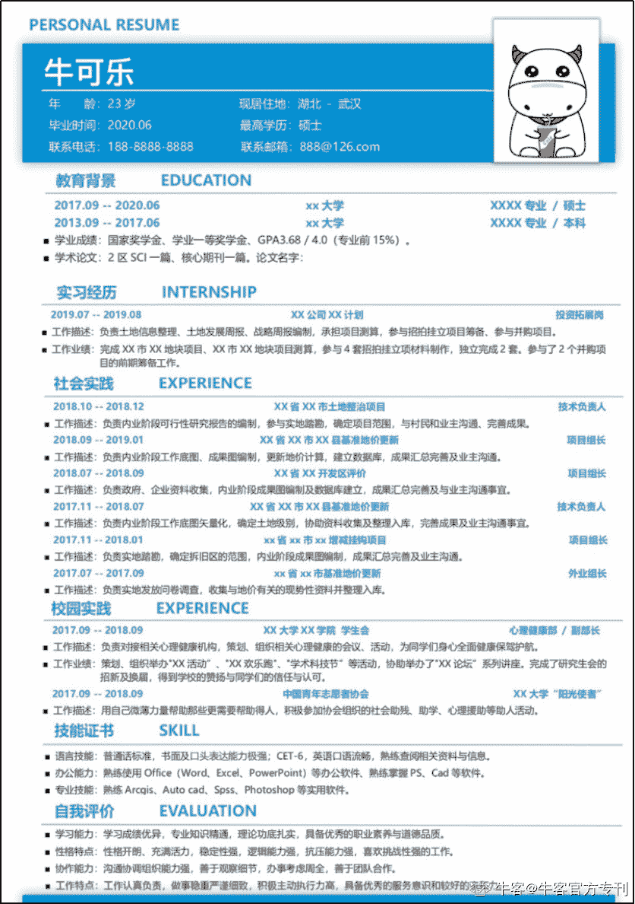
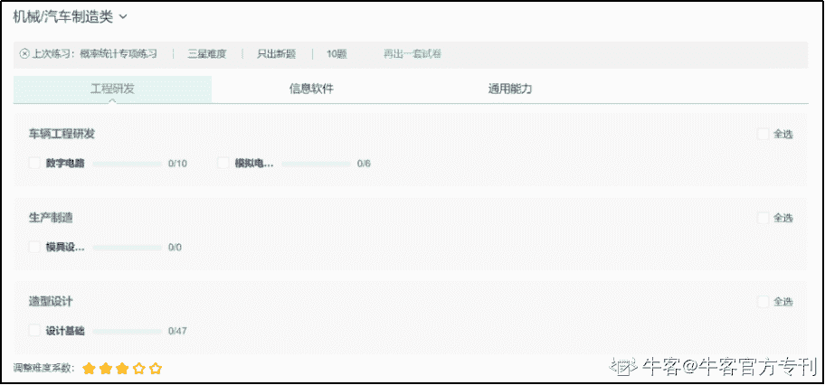

# 第三章 第 1 节 汽车行业求职攻略指南

> 原文：[`www.nowcoder.com/tutorial/10026/3d1d81db8b154b1f894adb77e46b11fb`](https://www.nowcoder.com/tutorial/10026/3d1d81db8b154b1f894adb77e46b11fb)

# **1.1 ****准备工作**

### **1、时间规划：**

因为找工作的时候也是毕业季，除了找工作可能还有论文或其他项目在身，所以首先要规划好你的时间，你可以拿出多少的时间投入到找工作上，根据你的时间决定你找工作的策略。比如，你有可自由支配的暑假，那么你可以利用这个暑假去你心仪的公司实习，增加拿 offer 的概率。

车企的实习一般都是在暑假，七八月份左右，正式招聘从九月份开始，一直延续到十一二月份，甚至和春招衔接。规划好你的时间，把其他任务提前完成或往后挪，才能将更多的时间和精力投入到找工作中。

### **2、简历准备：**

如果你准备实习，那么在七月份左右就要开始准备简历了，简历一般准备两份，一份中文，一份英文。此外，最好提前在各个招聘网站上也填写好自己的简历，尤其是对于准备广撒网的同学。下图为简历参考示意图：

简历需要包含的内容：

**·基本信息：**姓名、性别、联系方式、籍贯、出生年月、政治面貌等。：

**·教育经历：**从本科开始写，可附上成绩和四、六级分数。

**·科研项目经历：**硕士同学应该都参与过导师的项目，可以是横向的也可以是纵向的项目，总结起来写进简历，这是最重要的部分，写清楚在项目中所做工作。

**·实习实践经历：**如果有出彩的奖项可重点突出。

**·技能及证书：**可包括语言证书、计算机证书和专业软件掌握情况。

**·成果奖项及个人评价：**属于锦上添花的部分，如果有出彩的奖项可重点突出。

**建议：****根据投递岗位准备简历****。**

每个公司岗位需求可能不同，有时候不同公司类似的岗位对求职者的要求也不相同，如果想最大概率地通过简历筛选环节，需要你的简历和岗位的匹配程度尽量地高，因此需要根据不同的岗位调整你的简历，不要想着用一份相同的简历投递所有的公司。

    举个例子，你有三个项目经历，其中一个和 A 岗位非常匹配，一个和 B 岗位匹配，那么在投递 A 岗位的时候，就要突出你这个与之匹配的项目，描述更详实一些，剩下的关联不大的项目可以一笔带过甚至不写。面试官每天面临大量的简历，筛选阶段每个简历在手上停留的时间可能很短，要做的就是让浏览你简历的人一眼就看到，你是符合这岗位的。

# **1.2 ****比赛**

部分车企为了吸引特定专业的应届生组织一些比赛来吸引人才。比如上汽大众暑期有智能车比赛，来为他们 ADAS 部门招聘提前掐尖，此外还有上汽乘用车的汽车软件挑战赛、营销国际挑战赛等，在比赛中获得好成绩的小组或个人可以直接获得 offer。这些信息可以在各个公司招聘公众号中获取。

下面我们以上汽乘用车 2019 年“大学生软件挑战赛”为例看一下比赛的要求和形式。

## **参赛要求**

参赛对象：2020 届（本科及以上学历）应届毕业生

英语要求：通过大学英语六级

参赛方式：个人或团队（团队不超过 3 人）

初赛作品：限选一个任务，按要求提交作品

## **任务一**

**智能小车定向越野赛**

如今，自动驾驶研究正在如火如荼地进行，尤其是 L4 级别以上的自动驾驶，倒车入库、转弯、起步刹停等等动作全部可由自动驾驶完成。今天，就让我们通过一个“定向越野赛”，来检验智能小车的十八般武艺吧！

**任务要求：**

请设计一款自动驾驶小车，使其能在设计的定向越野赛道上完成指定任务，包括：

1．基本任务：坡道起步、侧方位停车、直角转弯、S 弯、倒车入库；

2．即兴任务：指定位置接客、限速控制等。

模型车利用其感知系统（摄像头+超声波雷达等），识别障碍物、车道线、目标指示牌、斑马线、红绿灯等交通标识，并根据路况场景信息，实时规划行驶路径，控制车辆到达目标点。

决赛阶段，主办方将提供模型平台与硬件设备，同时参赛者也可根据需要自行搭建平台。主办方提供资深专家团队答疑。

**作品内容：**

初赛阶段，请在基本/即兴任务中自选一项，设计完成包括感知/决策/控制的至少一种软件算法，并提交设计方案文档，基本代码（若有），仿真结果（若有）。决赛阶段，实现模型小车在整个定向越野赛中的全部实景功能。

**作品提交：**

请根据《“上汽杯”大学生汽车软件挑战赛初赛作品提交模板》要求完成初赛作品报告，并以“任务名称-队长在读学校-队长姓名-队长手机号码-参赛人数”为邮件主题，发往 jiangyan@saicmotor.com，附件请勿超出 10M。

## **任务二**

**新一代智能座舱产品**

上汽推出的新物种——荣威 MARVEL  X，车上搭载的智联 APP 把车内车外的设备都连接起来，为车主提供了诸多智能便利的出行服务。荣威 MARVEL X 上的智能座舱作为承载智能网联化的载体，把未来的科技魅力带给用户。

在未来，驾驶出行将融合云计算、大数据、5G 通信、V2X、IoT 等先进技术及理念，形成新业态和新模式。技术的出现和进步带来了新的想象空间。打开你的脑洞，让我们一起探讨研究那些能为客户提供更智能便捷的新一代智能座舱产品吧！

**任务要求：**

要求完成从元器件到功能实现完整的智能座舱产品方案设计，解决出行服务中的用户痛点，给客户提供更好的用户体验。

**作品内容：**

产品说明书（背景、出行场景描述、技术方案以及可行性分析）、硬件解决方案、UE/UI 展示、代码（若有）、Demo 展示（若有）。

**作品提交：**

请根据《“上汽杯”大学生汽车软件挑战赛初赛作品提交模板》要求完成初赛作品报告，并以“任务名称-队长在读学校-队长姓名-队长手机号码-参赛人数”为邮件主题，发往 xiangwenzhuo@saicmotor.com，附件请勿超出 10M。若有 Demo 展示请邮件说明后反馈邮寄接收人信息。

## **任务三**

**大数据让汽车更聪明**

随着人工智能高速发展，大数据、机器学习应用等使得整车系统得以快速发展。基于大数据时代下的汽车开发和其他领域一样，面临着大数据如何高效存储、提炼、优化功能等问题，比如：数据如何上传到云端？数据在云端如何挖掘？汽车功能如何通过大数据进行优化和升级？……

**任务要求：**

请针对如下一个或多个领域方向设计大数据解决方案（领域不局限于此），用于说明大数据解决方案的数据内容或具体汽车功能可自行设定。

1．数据上传（如：车载总线数据如何压缩，数据如何批量上传等）；

2．数据挖掘（如：关联分析，数据聚类等）；

3．基于数据的功能优化（如：整车蓄电池充放电管理、零件磨损程度预估、后视镜自适应调节、无占位传感器车辆乘员分布识别等）。

**作品内容：**

初赛阶段，完成系统设计方案、算法框架、核心源码（若有）、仿真模型（若有）、仿真结果及分析（若有）。决赛阶段，基于主办方提供的数据、指定的功能课题等，进一步完成模型软件开发，并在主办方提供的硬件平台上进行集成。

**作品提交：**

请根据《“上汽杯”大学生汽车软件挑战赛初赛作品提交模板》要求完成初赛作品报告，并以“任务名称-队长在读学校-队长姓名-队长手机号码-参赛人数”为邮件主题，发往 zhaihuidong@saicmotor.com，附件请勿超出 10M。

# **1.3 ****实习**

大部分车企招应届生实习的目的是提前锁定人才。很多同学也通过实习的方式提前锁定 offer。车企实习的方式有多种，举一个典型的例子，实习从申请到结束一般的流程一般的流程如下：

## **第一步：网申**

关注各个车企招聘的公众号或者上述牛客网的企业校招日程汇总，大部分会在 7 月份之前发布实习招聘信息，然后按照引导进入网申入口，填写简历。

**校招日程汇总地址：**[`www.nowcoder.com/school/schedule`](https://www.nowcoder.com/school/schedule)

## **第二步：测评**

网申的简历通过审核后，将给你发送测评链接，进入答题即可，一般都是类似行测题和职业测试题。

这类题只要考前刷刷牛客通用能力题库，基本就没有什么问题了。

**题库地址：**[`www.nowcoder.com/intelligentTest?categories=2`](https://www.nowcoder.com/intelligentTest?categories=2)

## **第三步：电话面试或现场面试**

实习面试一般只有一轮，面试你的人一般是你将进入实习部门的领导，通过面试后会给你一个时间段，你可以在这个时间段内进行实习。

实习面试和求职面试的技术面类似，可能会适当宽松一些，根据该部门需求人数变化。面试内容和简历所写内容有关也和该部门所涉及业务有关，因此面试前最好弄清楚投递部门的业务，提前做好准备。面试官一般有多年专业上的工作经验，对于实习生是比较宽容的，不需要你什么都会，但如果你展现出了面试官所期待的学习能力对这个岗位正确的理解，那么你的机会将大大增加，因为学习能力+正确的方向=具有符合该工作岗位的潜质。

## **第四步：进入部门**

实习一般的时间是一个月或半个月，在这个阶段，可能会有带你的导师专门给你布置一个任务，到实习结束后考核任务完成的情况，这也将是你最终是否能拿到正式 offer 的重要指标。

## **第五步：正式面试或实习答辩**

在实习期结束后，一般会有一个正式的面试来决定是否给你下发正式的 offer，面试官有可能是你的部门大 boss，通过这个面试之后，幸运的同学就可以拿到正式的 offer 了。

# **1.4 ****正式校招**

校招的网申可参考实习环节，网申途径见 2.3 校招信息渠道。

如果企业来你所在的城实宣讲，建议同时线下投递简历，HR 会在宣讲后，当天筛选简历，发送面试通知。

**企业校招日程汇总地址：**[`www.nowcoder.com/school/schedule`](https://www.nowcoder.com/school/schedule)

# **1.5 ****笔试攻略**

车企笔试一般为行测题，不涉及专业知识，认真答题大部分问题情况不会卡在笔试。

建议考前在牛客汽车题库中认真刷一遍，不要因为大意而折在笔试。

**题库地址：**[`www.nowcoder.com/intelligentTest?categories=2`](https://www.nowcoder.com/intelligentTest?categories=2)

 

# **1.6 ****面试攻略**

一般为两轮面试，第一轮群面或 HR 面，第二轮技术面，也有公司将两轮合并为一轮。

## **1、群面**：

群面题目五花八门，有的是哲学类的小辩题，有的是方案设计。

群面题目一般都是开放性的，没有完全的正确答案，只要能在有限的时间内打动面试官，就能通过面试。

举个例子，东风日产某群面试题，设计一种无人物流车。每个人三分钟时间思考，然后开始讨论，最终形成方案，并推举发言。

【题目解析】

**第一阶段：思考时间。**

在这个时间段内，你要运自己的专业技能，形成一套闭环的方案，并且最好有一定的亮点，这样在决策阶段，即使你的方案没有被使用，你的亮点部分也可能能成为设计的一部分。例如一个闭环的方案包括，小车感知、定位、路径规划和控制执行。把整个框架搭起来，在你熟悉的领域多做建设，不熟悉的领域可在下个阶段吸收其他同学的设计。

**第二阶段：轮流发言。**

在自己发言的时候，首先要控制好时间，根据在思考阶段规划的提纲有逻辑地发言。在其他人发言期间，需要认真听，做好记录，对每个方案的优缺点有一个初步评价。

**第三阶段：讨论决策。**

这个阶段是一个不仅考验专业能力更考验情商的阶段，记住不要为了吸引面试官的注意而去拉仇恨，这样是得不偿失的。根据第二阶段每个同学的发言，如果你觉得某个同学的方案更好，可以放弃一部分自己的方案，想办法把自己设计的一部分和该方案结合。努力引导大家达成一致。如果你认为自己的方案更好，可以主动吸收其他同学的亮点设计，拉入更多队友站在你的一方。不论哪一种途径，如果最终在你的推动下达成一致，你都是推动团队前进的那个人。

**第四阶段：总结发言。**

这个比较看硬实力，需要有短时间内的语言组织能力和清晰的发言逻辑，建议在有信心的情况下在抢这个角色。这个属于发言好可以加分，发言不好会扣分的项目。如果你觉得没信心说好，又不想放过发言机会，可在队友发言完成后进行补充，这个阶段属于进可攻退可守，也能很好地展现自己。

总结来看，要想在群面中脱颖而出，首先要理解 HR 关注的是什么，换句话说，在这几十分钟的观察中，你的哪些点能打动面试官。

第一，面试者观点清晰有逻辑性；

第二，面试者的能力和主观能动性，能够短时间内根据自己的经验形成一套较好的解决方案。

**基于这两点，我们在发言的时候要注意：**

（1）不要过于表现自己，你的每一个观点必须是经过思考，逻辑统一的。

（2）发言时自信一些，但要措辞温和，把握好节奏，更多地赢得好感而不是敌意；

（3）放下包袱，该说时一定要敢于表达。

## **2、技术面：**

一般是一个或两到三面试官，首次见面一般从自我介绍开始。对于自我介绍，建议逻辑清晰，突出重点。自我介绍把控在两分钟左右，建议分为三个层次：

第一，基本信息，姓名学校专业研究方向；

第二，研究生（本科）期间的主要工作，有亮点的项目或经历可以适当展开一下，这样可以把接下来的焦点引导到你想要谈论的话题上；

第三，业余爱好之类的，简明扼要，一笔带过即可。

同时，要提前准备好英文的自我介绍，并提前演练熟练。汽车行业的大部分岗位英文很重要，合资和外企这属于基本技能，因为你的领导很多都是外国人，自主企业也会在上下游对接外企，所以对英文的都有一定的要求。如果英语自我介绍都磕磕绊绊，会非常减分。你可能口语不太好，但提前准备总能弥补一些。

自我介绍后，面试官会根据你的自我介绍或简历切入话题。所以需要对简历上的项目掌握清楚。你简历中的项目可以适当美化，但要能把故事讲明白。

比如，一个项目，你可能参与了 30%，但这个项目和你想投的岗位很匹配，你可以写出来，但需要提前把这个项目从头至尾捋一遍，细节尽量丰富，这样聊起来的时候才能让面试官认为，你确实做了这方面的工作。

这里有一点提醒，为了求证你是否真的在这个项目上花了经历，面试官有可能会问道很细的技术细节，比如你使用的某设备的技术参数，答不上来不要强答，可以说记不太清了，可以的话，说一个你能确定的范围，让面试官知道，你至少对这一块是了解的。

最后，面试最后阶段面试官一般会问，你有没有什么问题。这时候不建议提问工资待遇相关问题，这些问题等拿到 offer 的时候，HR 会和你谈。建议问一些工作相关问题，表现出你对这份工作的兴趣。

最后，希望这份攻略能对学弟学妹们找工作有所帮助，在面试前多到牛客网刷刷真题、看看面经，让心里更有底，发挥更稳定，拿到更好的 offer。

附录里将总结下所有求职资源即地址，祝大家一切顺利。有任何疑问都可以到“牛客汽车行业求职交流群”咨询，扫描下方二维码，回复【求职群】即可。

 扫码关注【机械校招实习】及时获取最新资源