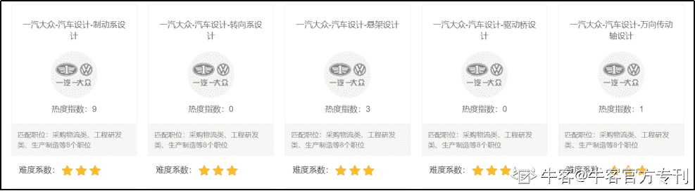
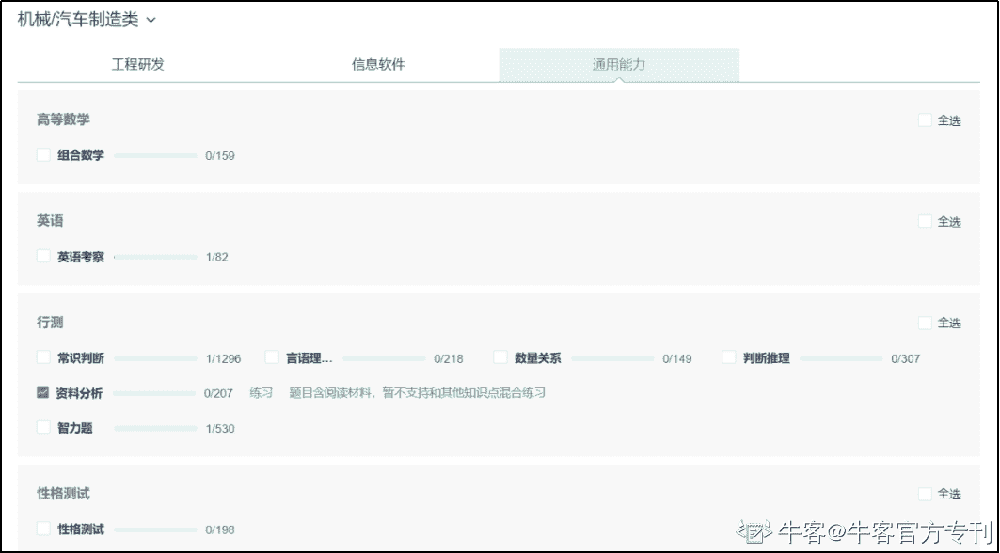

# 第四章 第 1 节 笔试考点

> 原文：[`www.nowcoder.com/tutorial/10026/9208e9ad88df4775ba14ff2009361a5d`](https://www.nowcoder.com/tutorial/10026/9208e9ad88df4775ba14ff2009361a5d)

# **一、笔试考点**

## **1、企业真题**

包含一汽大众、北汽等知名汽车公司笔试真题原卷（如图 1），题库地址如下：

电脑端：牛客网>题库>公司真题>机械/汽车制造类

网址：[`www.nowcoder.com/intelligentTest?categories=2`](https://www.nowcoder.com/intelligentTest?categories=2) 

手机端：牛客 APP >公司套题>机械/汽车制造类 

 图 1

## **2、行测题库**

电脑端：牛客网> 题库> 知识点专项练习>机械/汽车制造类（如图 2）

手机端：牛客 APP >专项练习>机械/汽车制造类

地址：[`www.nowcoder.com/intelligentTest?categories=5`](https://www.nowcoder.com/intelligentTest?categories=5)

扫描右下方二维码下载牛客 APP，题库装口袋，随时随地刷题复习！

