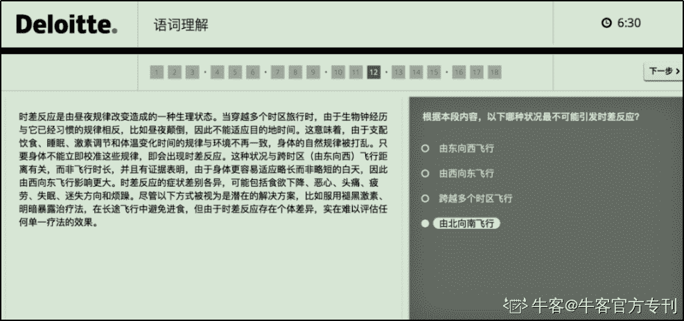
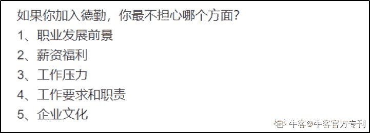
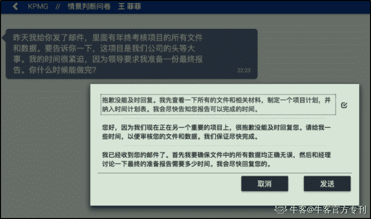

# 第二章 第 3 节 求职攻略指南-笔试与面试

> 原文：[`www.nowcoder.com/tutorial/10022/afecb3eb490d4846980e4885ba84554d`](https://www.nowcoder.com/tutorial/10022/afecb3eb490d4846980e4885ba84554d)

# **笔试**

通常来说四大的笔试一般是**逻辑 L+语言 V+数字 N+性格测试四合一，但今年安永 SLP 和普华秋招中首次使用游戏作为笔试内容。**

笔试链接会以邮件的形式发送到网申填写的邮箱地址，请及时检查邮箱，以防漏收。点进链接会弹出笔试网页，上面显示了需要完成的模块内容，在规定时间内完成即可，无需一次性做完。

关于笔试准备，四大的笔试多练多做，都称不上难，因为碰上原题的概率较高，即便遇到了新题，也可以凭借刷题得来的经验做出来。

**所以关键是多刷题库，掌握规律，在这里推荐牛客网的题库：**

**（1）企业真题**

包含四大会计师事务所、各大银行等知名企业近几年的校招笔试原卷。

电脑端地址：牛客网>题库>公司真题[www.nowcoder.com/contestRoom?categories=4](http://www.nowcoder.com/contestRoom?categories=4)

手机端地址：牛客 APP > 公司真题> 财务财会类/经济学类/金融学类

**（2）行业专项题库**

刷完公司真题后，就需要来专项题库进行检测。牛客专项练习题库是专门为各行业单独打造的专属题库，集合行业笔试考点，日常刷题练习的基站。

电脑端地址：牛客网>题库>专项练习[www.nowcoder.com/intelligentTest?categories=4](http://www.nowcoder.com/intelligentTest?categories=4)

手机端地址：牛客 APP > 专项练习> 财务财会类/经济学类/金融学类

 

 **扫码下载牛客 A****PP****，随时随地刷题练习**

## **游戏测评-普华永道、安永**

笔试求职者需要通关 10 到 11 个游戏，完成后不仅能看到游戏得分，还能收到一份根据求职者在游戏中的行为为分析的性格报告。据称，游戏总分不重要，四大的 HR 更看重性格报告，用以判断求职者是否符合公司招聘要求。

下面直接为大家罗列每道题目。

**第一关：**

【题目简介】

给气球充气，每充一次得五分，充气次数越多气球越值钱，不过气球有充气次数上限（未知），超过上限将会爆，爆炸的气球不得钱。只要气球不爆炸，求职者可以随时卖出气球换钱，最后统计所获金额。

【题目分析】

考察取舍能力和判断能力。

气球一共四种形状，最好在前几个气球拼命充气以试出四种不同形状气球的可充气上限的一个大概范围，接下来的气球的充气次数控制在这个范围里。一些充气上限小卖钱少的气球爆就爆了，不用管，重点是找到充气上限大卖钱多的气球，这样总收入才高。

**第二关**

【题目简介】

按空格键或鼠标左键使阴影面积覆盖高亮面积。

【题目分析】

考察反应力、耐心和面对困难的反应。

最好控制在第 16 或第 17 个数字，不建议过早放弃。

**第三关**

【题目简介】识别人脸情绪。

【题目分析】

考察对情绪的识别能力。

尽量细腻敏感一些，你觉得是什么就是什么。

**第四关**

【题目简介】三个黑格，依次出现灯泡和齿轮两种图案，灯泡按 Q，齿轮按 P。图案出现速度会越来越快。

【题目分析】

考察反应能力和处理速度。

**第五关**

【题目简介】中间箭头向左按 Q，向右按 P。

【题目分析】

考察反应能力和处理速度。

**第六关**

【题目简介】

按四个电闸，每次可能获得也可能损失电力（存在规律），必须按够特定的次数本关才会结束，结束时电力越高分数越高。

【题目分析】

考察找规律能力和风险承担能力。

有个电闸基本每次都能获得 50 电力，偶尔损失 25/50/75 电力，一直点这个电闸能保证净电力为正且总电力加到最满，找到这个电闸即可。这个方法能保证本关拿满分，性格报告偏审慎稳重。通关方法不唯一，通关方法不同对性格报告的影响不同。

**第七关**

【题目简介】

绿色的瓶盖会按顺序出现在 15 个盒子里，偶尔会有红色的邮票出现干扰，记忆瓶盖出现的顺序。

【题目分析】

考察记忆力。

但是建议备好纸笔，一个个记录下来，毕竟好记性不如烂笔头，而且最多一次要记十几个瓶盖。

**第八关**

【题目简介】

求职者队和电脑队都属于普华永道公司，求职者和电脑队比出价，都出高价得 200，都出低价得 50，一方高一方低，低的得 300 高的得 0，最终看本队总收入和两队总收入。

【题目分析】

囚徒困境，考察博弈能力。

理论上一直点低价能保证本队总收入高，但是这么做对性格测试评价不好，因为这么做会使两队总收入也就是公司的收入低，这某种程度上反应你比较关心个人利益。本队总收入影响本关分数，本队总收入和两队总收入影响性格报告。建议一直点低价最后几次点高价。

第九关

【题目简介】

回答问题，“是”按 Q，“否”按 P。

【题目分析】

考察反应力和处理速度。

**第十关**

【题目简介】

从下面四个选项选出满足上列图形变化规律的选项

【题目分析】

考察逻辑推理能力。

主要通过变色或移动的图形来发现规律，注意移动的图形有时可能会被其他图形覆盖。

**第十一关**

【题目简介】根据给出数字推算第六位数字。

【题目分析】

考察计算和推理能力。

加减乘除计算即可，有的需要 135 和 246 跳着看。

## 常规笔试-毕马威和德勤

笔试的四个部分包含：逻辑 L、语言 V、数字 N 和性格测试，在规定时间内完成即可，不一定要一次性做完，大家可以根据自己的情况合理安排。

由于普华永道和安永 2019 年采用了游戏笔试，故往年笔试形式不再赘述，此处仅详解德勤和毕马威的。

德勤采用的是 ACE 题库，中文；毕马威采用的是 CUTE 题库，英文。难度上来说毕马威大于德勤，不过德勤比毕马威多一个英语小作文。

关于笔试准备还是如前面所述，多刷多练，就基本没有什么问题。即便遇到了新题，也可以凭借刷题得来的经验做出来。

**四大校招题库：**[`www.nowcoder.com/contestRoom?categories=4`](https://www.nowcoder.com/contestRoom?categories=4)

**1、德勤**

**（1）逻辑推理**

【题目简介】从下方的五个选项中选出满足图形变化规律的一项**（6 分钟 15 题）**

 

 

【题目分析】

德勤的逻辑测试较为简单，一般变化规律与图案大小、长短、形状、数量、增减、旋转角度、旋转方向等方面有关。

**（2）语言理解**

【题目简介】根据短文内容选择满足题意的一项**（12 分钟 18 题）**

 

【题目分析】

有些选项存在争议，选择你认为正确的那个。

（3）数字分析

【题目简介】根据图表数据选择满足题意的选项**（12 分钟 12 题）**

 

【题目分析】

多练多做，老生常谈。

**（4）性格测试**

【题目简介】

根据自己情况回答问题

**（30 分钟 76 题）**

【题目分析】

从心所欲，千万别撒谎。一般来说，四大喜欢团结合作、诚信友善、吃苦耐劳、勇于创新的人，可参考公司介绍里的价值观。

**（5）英文写作**

【题目简介】30 分钟内按题目要求写出一篇不少于 250 个单词的英语作文。

作文题包括但不限于：

① 如果人类被机器人抢走了 50%的工作会怎样

② Some people quit their job or study to go to working holiday. Would you do the same?

有些人辞去工作或学习去度假。你也会这样做吗？

③ Which one of the following super powers do you want to possess? Why? (1.Instant travel 2.Future prediction 3\. Mind control)

如果让你拥有以下超能力，你会选择哪一种，说明理由（1、远距离移动 2、预测未来 3、控制思维）

④ cloud computing（云计算对生活的影响？）

⑤ aerial cameras（航空相机）对个人隐私问题造成的影响，你对此的看法是什么？

⑥ a few years ago, a person died from driving a Tesla by using its autopilot system. do you think the autopilot system is reliable or not?

几年前，一个人因驾驶特斯拉汽车的自动驾驶系统而死亡。你认为自动驾驶系统可靠与否？

⑦ 很多年轻人毕业后创业，你怎么看？

⑧如果让你在 light bulb（电灯泡）和 telephone（电话）中选择一个不要被发明出来你会选择哪个？

⑨ mobile payment（移动支付）会取代 physical money（实物货币）吗？

【题目分析】

可视情况提前准备。不一定要使用高级词汇句法来展示文采，表达清楚自己想说的，不犯拼写和语法错误即可。

**2、毕马威**

（1）逻辑推理

【题目简介】

往年为数独题，每列每行不能有重复的图案，选出“？”一格的图案。

**（6 分钟，答题数量没有限制）**

【题目分析】

题目难度会随着正确率的提升逐渐加大，一开始是 3x3，然后是 4x4，最后是 5x5，没有 6x6。答案正确与否会立马反馈给答题者，所以考验智力的同时也十分考验心态。理论上来说正确的数量越多越好，但是有的人答对了二三十个没过，而有的人只答对了八个过了，可见正确率更为重要一些。

但是，毕马威今年将数独题改为翻转管道题，如下图所示：

【题目简介】每个图形代表 1 到 4 中的一个数字，改变或交换图形或数字的顺序后，选择正确的图形或数字的顺序选项。

**（6 分钟，答题数量没有限制）**

【题目分析】

多练多做，提高做题速度。

**（2）语言理解**

【题目简介】

根据短文内容判断选项正确与否**（6 分钟 18 题）**

 

【题目分析】

毕马威有两套题，欧陆银行 euro bank 或者爱威格 evergreen（也称为长荣）。即便是一套题，细节可能不一样，不可根据所背题库作答，需要根据所给原文作答。

**（3）数字分析**

【题目简介】

根据图表数据选择满足题意的选项**（6 分钟 18 题）**

【题目分析】

毕马威有两套题，欧陆银行 euro bank 或者爱威格 evergreen（也称为长荣）。总之多练多做，老生常谈。

**（4）性格测试**

【题目简介】

假设你是一名毕马威的员工，你会如何处理工作事务和同事来信**（25 分钟）**

【题目分析】

可以参考毕马威喜欢什么样的人的回答，注意分清轻重缓急。

# 面试

面试有四种，AC 面、M 面、Par 面以及最新的视频面试。

### **AC 面**

AC 面也称群面，难度最大。人数在 5 到 10 人之间，持续时间为两个小时左右，通常有三个 Manager 或两个 Manager 一个 Partner 全程观察。小组讨论内容为案例分析，材料为英文。

【面试流程】

自我介绍（1-2 分钟）→阅读材料（10-15 分钟）→小组讨论（30-40 分钟）→总结陈词（10-20 分钟）。自我介绍为中文或者英文，小组讨论为中文，小组总结为英文。

【典型案例】

给出一个公司的财务、人事、市场情况、竞争对手等等各种资料，要求小组为这家公司定目标和制定战略计划，计划要有详细步骤。

【注意事项】

① 准备 1 到 3 分钟的中英文自我介绍，突出自己的优势，最好能让人记住的那种。

② 练好英语口语，说错没关系，能清楚表达自己，做到流利不怯场即可。

③ 掌握一些分析案例的基本方法，可与人 mock。

④ 找准适合自己的角色定位，多说有益于讨论进展的发言，提高在小组讨论中的贡献度。

⑤ 四大不喜欢太强势的人，所以态度一定要温和有礼，就算组员的发言有问题。

⑥ 发言一定要有理有据，最好是“我觉得”+“为什么”+“怎么做”。

⑦ 如果组员发言有问题，要么说服 TA 要么折中，不要在争执上浪费太多时间。

⑧ 如果组员为一个问题争执不休，努力调停，态度一定要好。

### **M 面**

通常来说，AC 面结束后就是 M 面。HR 会按顺序把人一个接一个叫到小房间和 Manager 一对一单聊，一般是 10 到 15 分钟。Manager 可能会先让你评价你或组员刚刚在群面的表现，然后根据你的简历问一些和校园实习经历相关的问题，再根据你的回答适当地问几句和专业有关问题，最后是必问的“你还有什么问题要问我吗？”，不排除某些非常规问题。

【典型问题】

① 评价你或组员刚刚在群面的表现？

② 你有什么最难忘/骄傲的校园/实习/经历吗？

③ 3why：为什么是你，为什么选择我们公司，为什么干这行？

④ 你还有什么问题要问我吗？

【注意事项】

① 保持冷静，温和大方，回答要有逻辑，建议按 STAR 法则回答。

② STAR 法则是情境(situation)、任务(task)、行动(action)、结果(result)四项的缩写，情境(situation)指事情在什么情况下发生的，任务(task)指你的目标或任务是什么，行动(action)指你为了完成这个目标或任务采取了什么行动或计划，结果(result)指这件事的结局是什么，你从中学到了什么。

③提前过一遍自己的简历，想想自己可能会被问什么问题。被问不懂的问题千万不要不懂装懂，回答完会的就大方说不会。

④回答可能要用英文也可能不用，看 Manager 的要求。

### **Par 面**

老实说 Par 面和 M 面差不多，只是面试官从 Manager 变成了 Partner。比起 M 面，Par 面的压力会小一些，因为大部分 Partner 不会问特别难的问题，氛围近似闲谈，除了一些在 M 面可能会被问的常规问题，还可能会问到家乡、学校、成绩之类的事。

【典型问题】

①你有什么最难忘/骄傲的校园/实习/经历吗？

②3why：为什么是你，为什么选择我们公司，为什么干这行？

③你还有什么问题要问我吗？

【注意事项】

成功就在眼前，冷静，千万不要慌。要求基本和 M 面一样，注意诚实回答，在回答中展现你想去这家公司的诚意。

### **视频面试**

一共八个 OQ，每个问题有 45 秒准备时间，三分钟录制，只有一次机会，录制好的视频会上传到官网。

【面试问题】

① 在普华永道，我们的企业目标是解决重要问题，营造社会诚信，我们致力于成为专业服务公司。想要实现这一目标，我们必须勇于创新，有高度责任感，并积极吸引人才。

请你简单介绍一下自己，告诉我们你为什么要加入普华永道。

【关键词】3why，为什么是你，为什么选择我们公司，为什么干这行？

② 我们需要灵活地应对变化复杂的环境，请分享你主动学习一项新技能或新技术的例子: 你是如何确定学习需求的？你采取了什么步骤来实现这个学习目标？

【关键词】主动学习新知识

【万能模板】为什么学这个+学习计划+具体行动+结果

③ 我们通过高标准的工作结果，对同事、客户和社会产生积极影响。请给我们分享一个你过往的例子，当时你能保持高标准的工作要求，并且在执行过程中没有错误或纰漏之处。

请描述一下当时的具体情况，你采取了什么行动，结果如何？

【关键词】以高要求完成工作

【万能模板】当时情况+计划行动+结果

④ 在普华永道，我们分析复杂的信息来为客户提供有价值的商业建议。请分享一个你在信息矛盾或信息不全的情况下，必须迅速做出重要决定的例子。

请说明当时的情况，你采取了什么行动，结果如何？

【关键词】信息矛盾/不全时，迅速做决定

【万能模板】当时情况+计划行动+结果

⑤ 在普华永道，我们言行举止都讲求诚信。请跟我们分享一次经历，尽管你有捷径可走，但你还是选择了诚信道德的方式去处理问题。

请描述一下当时的情况，你是如何做的，结果是什么？

【关键词】可以走捷径却坚持诚信道德

【万能模板】当时情况+计划行动+结果

⑥ 我们致力于解决复杂和重要的问题。请分享一个学校或工作的例子，由于工作的复杂性或较大的工作量导致你感到压力非常大的情况。

请描述一下你当时的感受，你是如何做的？结果如何？

【关键词】工作难/大导致压力大

【万能模板】当时情况+计划行动+结果

⑦ 我们的价值观之一是 reimagine the possible。请给我们分享一个例子，告诉我们你如何为自己设定了一个挑战的目标并付出努力达成了这个目标。

请描述一下当时的情况，你采取了哪些行动，结果如何？

【关键词】工作难/大导致压力大

【万能模板】当时情况+目标+设定目标原因+计划行动+结果

⑧ 我们鼓励并帮助内部同事都成为 game changer。请给我们分享一个你不得不适应一个项目或者工作中的巨大变化的例子。

请描述一下当时的情况，你是如何适应变化的？结果如何？

【关键词】适应项目/工作变化

【万能模板】当时情况+目标+设定目标原因+计划行动+结果

### **注意事项：**

可以用中文回答，建议提前按 STAR 法则打好草稿，写稿时善用对比，即以当时情况之不容易来突出自己的优秀。不一定要录满三分钟，但最好超过两分钟。想象自己是在和真人说话，按屏幕提示坐在镜头正中央，眼睛看镜头，最好微笑，语速放慢。

除了以上常见问题，各公司的面试问题还有很多，具体可以直接到牛客网面试资料馆查看学习，同时推荐牛客网的 AI 模拟面试，**在线模拟现场面试场景，锻炼面试应答能力。**

**面试资料馆地址**：牛客网>面试>面经汇总（[www.nowcoder.com/interview/center](http://www.nowcoder.com/interview/center)）

**A****I****模拟面试地址：**牛客网>面试>AI 模拟面试（[www.nowcoder.com/interview/ai/index](http://www.nowcoder.com/interview/ai/index)）附录里将总结下所有求职资源即地址，祝大家一切顺利。

有任何疑问都可以到“牛客金融行业求职交流群”咨询，扫描下方二维码，回复【求职群】即可。

 

 扫码关注【经管校招实习】及时获取最新资源