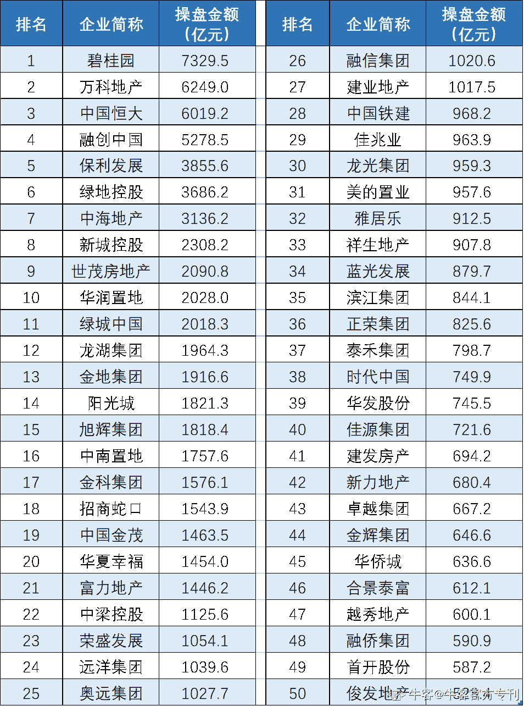

# 第四章 第 1 节 行业介绍

> 原文：[`www.nowcoder.com/tutorial/10022/f1e899d326234c25b47f237e75d9e298`](https://www.nowcoder.com/tutorial/10022/f1e899d326234c25b47f237e75d9e298)

# **一、行业介绍**

## **1.1** **行业简介**

地产行业作为三大高薪行业（互联网、金融、地产）之一，一直是应届生的求职热门行业。相比互联网，地产要求的技术门槛较低；相比金融，地产要求的学历背景较低。目前存在很多声音说地产是夕阳行业、已经接近了行业拐点、结束了黄金时代等等，其实没这么悲观，应届生进入地产行业还是一个不错的选择。

应届生最缺乏的是工作经验，目前大型房企自己的管培生计划都会有比较完善的培养体系，如万科“新动力”、中海“海之子”、龙湖“仕官生”等等，可以给应届生提供完善的培养方案。且目前房地产行业是中国最大的制造业，同时也是中国上下游产业链最长的一个行业，但竞争日趋激烈是肯定的，大鱼吃小鱼的并购案市场上已经屡见不鲜，这就需要同学们尽量去竞争头部房企和主流产业。

地产行业按照业态主要可以分为以下几个方向：住宅地产、商业地产、长租公寓、文旅地产。

**·住宅地产**：是目前主流模式，周转快、项目周期短、行业培养体系较为完善，相较于其他几个方向，对于应届生来说可能更为稳妥。所以建议首选住宅地产。

**·商业地产：**顾名思义就是作为商业用途的地产，地产公司开发的商业地产可以自持运营、出租或者出售等，可以用来用于零售、批发、餐饮、娱乐、健身、休闲等经营用途，也可以用来做写字楼办公。

**·长租公寓：**目前新兴的地产方向，地产公司运营自持为主，由于目前房价较高，大城市中年轻人的租房需求日益旺盛，长租公寓的市场潜力较大，做得比较好的如龙湖“冠寓”、万科“泊寓”等等。

**·文旅地产：**主要是指房地产和旅游或者和文化相结合，业内做得比较好的如华侨城欢乐谷、融创冰雪水世界等等。

## **1****.2** **企业介绍**

对于地产公司的校招口碑，业内流传很多说法，在这里进行整理，供大家参考。单就平台来说，“万中龙”、“招保万金”、“中华万金龙“这几个口号出现得比较频繁，分别对应为：“万科、中海、龙湖”，“招商蛇口、保利、万科、金地”，“中海、华润、万科、金地、龙湖”。

此外，有人将一些品牌房企按照职场特质模型分为四类：金牛、黑马、焊狼、骆驼。

金牛的特征是老牌房企、发展稳健、体系健全、能培养人，包括万科、中海、龙湖、金地、世贸。

黑马的特征是发展迅速、敢于用人、薪酬较高、晋升很快，包括旭辉、正荣、阳光城、泰禾、中南、新城。

悍狼的特征是增速凶猛、打发彪悍、强调竞争、大浪淘沙，包括碧桂园、恒大、融创、中梁、华夏幸福。

骆驼的特征是大型国企、实力雄厚、稳定均衡、注重长期，包括保利、绿地、华润、绿城、招商、金茂。

在求职的时候同学们通常会问：那我投哪家地产较好呢？其实如果想专注于地产行业的话，应该海投。根据近几年秋招情况来看，房企对于校招的要求进一步提高，很多岗位学历要求都是硕士，双非的同学拿 offer 占比越来越小，甚至很多 985/211 的同学由于没有地产相关实习，校招也不太顺利。因此建议海投，尽可能多的去拿 offer，等拿到 offer 后再开始做比较。建议投递 top50，下面附上 2019 年地产销售金额榜单 top50 公司。

图片来源于乐居财经

**下面将简单为大家介绍各公司的特征及薪资水平：**

**万科：**这两年被快周转的碧桂园反超，是一家讲“情怀”的公司。貌似工资水平在行业内没有竞争力，但是培养体系特别有竞争力，业界口碑较好，企业文化是阳光、运动，有同学在里面实习告知要求每周慢跑打卡，对校招生有系统培养，新动力出来后也比较受其他企业追捧。如果想在房地产深耕，万科新动力是一个非常好的选择。新动力薪资硕士年收入 15w 左右。

**中海：**“海之子”品牌热度一直很高，被称为行业英才创造者。中建背景，对业绩渴望没有民企那么大，融资成本较低，成本管控非常好。海之子发展平稳，业内比较认可，整体来看中海压力适中，企业福利较好，适合小资毕业生加入。海之子薪资不同城市略有不同，薪资 15-18w。

**龙湖：**渝派房企，景观打造能力业内一流，房屋以品质著称，但最近口碑略有下滑。龙湖仕官生业界认可度颇高，对人才的选拔力度也非常大。校招要求也较高，基本要 985 硕士，投资等热门岗位今年要求双 985 硕士，企业文化简单、阳光，如果能进龙湖也是不错的选择。龙湖仕官生年薪 18-20w。

**碧桂园：**第一大房企，校招品牌超级碧业生，听说工资较高，由于追求高周转，加班肯定常态，碧桂园扎根三四线城市，所以工作地点可能要求灵活性较大，长远发展是一个不错的选择。博士未来领袖计划年薪 40w+，硕士超级碧业生 24w 左右。

**融创：**同样是追求高周转的企业，强调竞争和狼性文化，加班较多~~，忙~~，人员流动性较大，融创的营销、投资、设计三个岗位口碑不错，发展较好。融创创想家第一年薪资 16w 左右

**保利、华润：**央企，工作强度适中，员工福利较好，幸福感较强。可以追求工作和生活的平衡，但是内部决策效率较低，新人发挥空间较低，成长性较差。保利和华润的华南区域工资稍微高一点，第一年 18-20w, 其他区域管培生 14-18w。

**旭辉：**内部培养体系不错，薪资相对而言有竞争力，闽系房企，企业文化简单、温暖。公司对管培生非常重视，业内也是十分认可，推荐应届生选择。旭日生硕士 18-20w，本科 14-18w。

**金地：**一家最像国企的非国企，非常适合应届生加入，工作强度适中，待遇不错，每个季度还有季度奖，福利较好，培养体系相对不错，推荐。应届生年收入 15-18w。

**绿城：**绿城以品质著称，因此也收获了一波品质粉，当年要被融创收购的时候很多业主资金援助让宋卫平赎回公司，产品很好，设计、工程板块的同学可以多多关注。绿城同道人首年年收入 14-18w。

## **1****.3** **岗位介绍及招聘要求**

### **1、投资拓展岗**

【职能概述】投资拓展岗简单概括就是帮助公司买地的。当一家企业在快速扩张规模的时候，老板忙不过来一块地一块地去考察，这样效率太低，因此需要一批懂房地产开发、懂财税、会谈判、会算账、最好再有一点人脉资源的专业人才去实现土地资源的获取。主要的工作职责是协助开展土地信息收集、土地评估、市场分析、项目可行性研究等工作。

【专业要求】要求工程管理、建筑规划、土地资源管理、房地产经营、经济等相关专业。

【其他要求】要求沟通能力强，情商高，具有团队意识和责任感，性格开朗外向。

### **2、成本管理岗**

【职能概述】成本管理岗负责成本管理和动态成本管理、制定工程成本目标、项目目标成本测算和拿地成本测算等。负责开展公司招投标、预决算和采购管理等工作。负责竣工项目的结算审核和总结分析等等。

【专业要求】要求土木工程、工程管理等专业。

【其他要求】要求专业知识扎实，个性开朗，善于沟通协调，积极进取等性格。

### **3、工程管理岗**

【职能概述】工程管理岗根据公司运营计划，调动内外部资源，对项目运营节点负责，协助编制项目建设施工进度计划；辅助管控施工方、监理单位，过程中给予监督指导，提升项目工程质量；推动安全文明施工管理举措在项目上的贯彻执行，确保项目安全生产。

【专业要求】要求土木工程、工程管理等相关专业。

【性格要求】要求沟通能力强，情商较高，具有团队意识和责任感，性格开朗外向。

### **4、建筑设计岗**

【职能概述】建筑设计岗负责项目概念设计、方案设计、初步设计、施工图设计的管理工作；根据项目总体进度要求，编制各个阶段的设计进度计划；根据公司确定的项目建设的基本要求、销售定位、设计标准等，拟定有关规划、建筑、室内装修等设计任务书，并负责与设计单位签订设计合同，监督合同的贯彻执行；组织项目规划、建筑、方案设计的研讨和评审工作，负责各分项招标图设计的技术审核工作。

【专业要求】要求建筑相关专业。

【其他要求】有地产相关实习优先；要求具备较强的团队和沟通协调能力，以及良好的学习能力，灵活有创新意识，责任心强，有学生组织、社团实践经验优先。

### **5、财务管理岗**

【职能概述】财务管理岗负责项目财务预算、审核、监督工作；日常财务基础管理工作，包括台账及凭证管理；月度会计报表编制，汇总、分析、整理财务数据，并提供后续管理优化、内控建议。

【专业要求】财务、会计等相关专业

【其他要求】要求知名院校；要求在校成绩优异，熟练掌握财务基础知识，通过 CPA 考试优先；要求具备较强的团队沟通协作能力，以及良好的学习能力，认真细致，责任心强。

### **6****、运营管理岗**

【职能概述】运营管理岗负责对新获取项目召开项目启动会，组织营销、设计、工程、成本等各部门编制各项目一级计划；组织各相关专业、项目对各分期二级计划的评审；协助完善区域计划管理体系；组织各项目经营分析表的编制；参加工程巡检，发现项目进度中存在的问题，并提出建议及措施。

【专业要求】要求土木工程、项目管理、工程管理、房地产经营管理、土地资源管理等相关专业；

【其他要求】要求沟通能力强、情商较高、具有团队意识和责任感、性格开朗外向。

### **7****、人力资源岗**

【职能概述】负责人力资源各模块工作，如招聘、培训、企业文化、员工关系等；参与人力资源前沿管理工作：人力资源战略与规划、人才管理项目推动；协助完成人力资源相关领域的研究性工作，如行业研究、标杆研究等；其他人力资源项目管理等工作。

【专业要求】要求知名院校人力资源管理、工商管理、心理学等相关专业；

【其他要求】要求个性开朗、积极进取，在校期间学习表现良好；要求具备良好的道德素养、较强的沟通能力和组织能力。

### **8****、营销策划岗**

【职能概述】营销策划岗参与制定并执行房地产项目定位、销售、收官的全程营销方案；进行市场分析、地块分析、项目分析、竞品分析与监控等工作；协调内外部合作关系、利用内外部资源，促成营销业绩达成。

【专业要求】要求房地产、市场营销、中文、传播学、管理学、建筑、土木工程等相关专业优先。

【其他要求】具有社团或校园活动策划经验优先；优秀的沟通能力和文字表达能力，具备良好的抗压能力，能吃苦耐劳，富有团队协作和爱岗敬业精神。

不同公司对于同一岗位的叫法可能不一样，同学们在投递岗位时记得看具体公司的职位介绍。