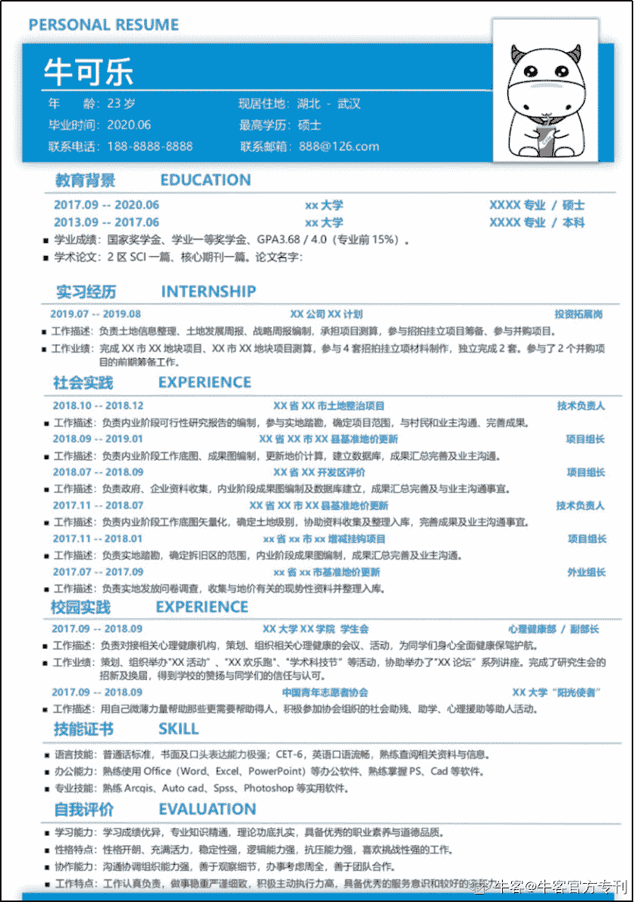
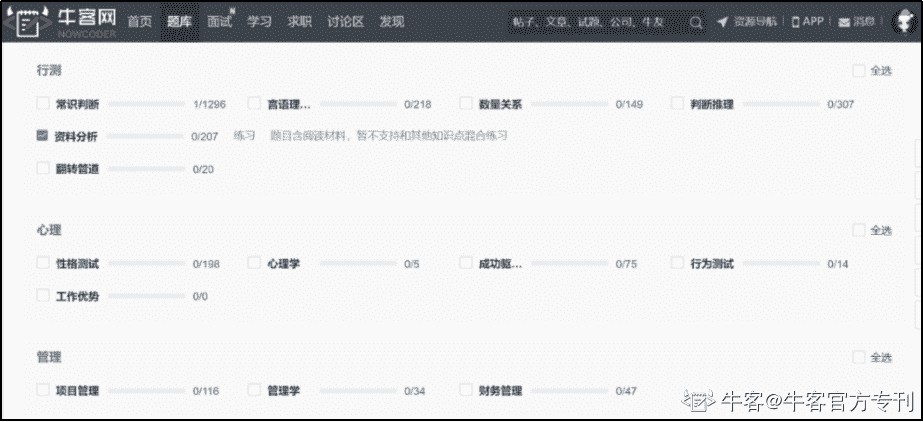

# 第四章 第 3 节 求职攻略指南

> 原文：[`www.nowcoder.com/tutorial/10022/6f94a6f03cd842968908ad8904c4296d`](https://www.nowcoder.com/tutorial/10022/6f94a6f03cd842968908ad8904c4296d)

# **1****.1** **准备工作**

## **1、制作简历**

下图为简历参考示意图

 

简历是帮助 HR 快速认识你的一张名片，下面将按照地产公司所看重的加分项依次给大家建议和解释。

**·实习经历：**不管是有暑期实习经历还是日常实习经历都应该写上去，尽量写和地产有关的经历。注意总结自己所做的工作，每段实习的起始时间，实习岗位及公司名称。

一般来说地产公司会更倾向于招实习过相同岗位的同学，如果你实习了 A 岗位但是想投递 B 岗位也未尝不可，但你需要准备好应对答案，例如为什么会有这个决定？对 B 岗位的了解程度有多高？A 岗位和 B 岗位之间有什么样的联系等等。

**·教育背景：**写自己从本科开始的学校及起始时间，如果有交流经历，比如说出国交流或者学校之间的交流，则一定要写上去，双学位也一定要写上去。

**·校园实践：**主要包括学生会干部任职情况、奖学金得奖情况。学生会任职则需要总结自己干了什么工作，比如策划了什么活动，举办过多少次论坛等等。

**·社会实践：**硕士同学应该都参与过导师的项目，可以是横向的也可以是纵向的项目，总结起来写进简历，也是一个不错的加分项。

**·荣誉情况：**写自己获得过什么等级的奖励，如果没有获得过建议这一部分和校园经历合并。

**·基本情况：**包括姓名、性别、年龄、联系方式、证件照、兴趣爱好等等。

**·自我评价：**这一部分建议去看自己的岗位所需的性格特别是什么，和自己真实的性格特点相结合，艺术化处理。

## **2、资料准备**

经验告诉我们到了面试高峰期的时候，面对一天好几场的面试，我们没有时间也没有精力再去准备资料，因此需要提前准备。包括：

**自我介绍：**自我介绍应该要准备**一个****90s****版本的，一个****180****s 版本的。**自我介绍建议有侧重点的介绍自己，找自己和自己所投递的岗位的契合点作为切入展开阐述，并且不能空喊口号，要有实例补充，形成完整逻辑。自我介绍稿子写好后要熟记背下来，对着镜子一遍遍训练，录音记时，不断调整。

**投递岗位信息：**首先必须要知道自己的**岗位负责什么职责**，在之前岗位介绍里会有相关描述。其次要思考要完成这些工作**需要具备什么样的能力**，自己有一些什么样的真实事例能够证明自己具备这样的能力。也要了解一下目前房地产行业自身岗位所处的环境如何，自己如何理解和思考。

**投递公司信息：**所投递的公司**企业文化价值观、高光时刻**（比如在哪拿了个地王，在哪是销冠），进驻了多少个城市，有没有完成全国化布局，在排行榜上所处的位置等等，如果是财务方向的岗位最好去查查企业的半年报、年报，对于企业的融资成本、毛利率、年销售额、净利率等等财务指标有一个大概的了解，并和行业平均水平相对比。

**HR****面所需信息：**HR 面通常会测试你的性格，包括你最自豪的事，你最难过的事，你最挫败的事等等，这些最好也要你提前想好，最难过挫败的事一定要注意之后要把自己的解决办法，或者怎么走出这个困局的办法给说出来，如果真的是彻彻底底没有反转的失败最好还是换一个吧。

**师兄师姐面试经验：**最为重要的一点，虽然不同公司的面试风格不一样，但纵向来看应该差别不大，所以**看面经是一个很不错的提高面试技能和让自己心里更有底气的方法**，推荐去牛客网。牛客网上会有针对不同地产公司不同岗位的师兄师姐面经，公司和岗位丰富多样，内容非常详尽。

**手机端面经地址：牛客 A****PP****-社区-讨论区-笔经面经**

**电脑端面经地址：**[`www.nowcoder.com/discuss/experience/index`](https://www.nowcoder.com/discuss/experience/index)

# **1.2** **网申/宣讲会**

制作完简历之后，就可以进行网申了，很多地产公司 8 月份就已经开始网申，所以建议早点网申，越到后面时间越宝贵，能省出不少时间来备战。网申需要注意的点在于可以找找自己在房地产公司工作的学长学姐，让他们帮忙进行内推，可以增大自己简历的曝光度。如果不怎么认识学长学姐，也可以通过牛客讨论区来找内推，有很多拿到 offer 的前辈分享经验以及内推名额。

**电脑****端地址****：**牛客网>讨论区>招聘信息[`www.nowcoder.com/discuss?type=7`](https://www.nowcoder.com/discuss?type=7) 

**小程序地址：**扫描上方二维码即可观看

关注牛客论坛，随时查看同行动态、校招/内推信息、offer 比较、技术交流等等。

同时有很多地产公司，比如龙湖，是需要按照他们公司自己的模板填简历的，这种不但要好好填，填完以后要记得拍照保存，不然去面试这家公司自己都不记得自己填了什么就尴尬了。

地产公司举行校园宣讲会基本上都是全国巡讲，每个省选择 1-2 所重点院校进行，具体行程可以关注各地产公司官方网站或者学校就业中心发布的信息。

宣讲会一般是地产公司截止网申和开始面试的一个时间点，也就意味着宣讲会结束当晚会停止简历网申，等 HR 筛选完简历之后开始进行面试流程，也有少数地产公司会直接在宣讲会后开始面试。

同时宣讲会也是地产公司向应届生们介绍自己的一个契机，我建议如果有时间可以去听听，很多宣讲会会现场接受纸质版的简历，有利于简历曝光，也有很多公司会有精美伴手礼。在会上提问的话还有机会获得 pass 卡，pass 卡就是能让你免一轮或者几轮的面试，很省时间，是个好东西，可以尽量争取一下。

还有一些公司会只邀请参加宣讲会的同学进行面试，据我所知今年就有中南置地、中梁等等，还有公司宣讲会后会现场举行面试，这样也会比较节省时间。如果去听宣讲会了可以做做笔记，一般都会介绍企业文化、学长学姐的经验、福利待遇等等，之后在面试中不经意间提到，我在宣讲会上听到某个问题，并对这个问题做出自己的理解和思考，会让面试官觉得你很尊重他们，是个不错的加分项。

# **1****.3** **笔试**

大部分公司都会在网申结束，通过简历筛选后给你的联系邮箱发链接进行笔试测评，所以这时候要天天检查自己的垃圾箱看有没有某公司的笔试测评躺在里面。

地产公司的笔试测评比较简单，一般分为性格测试、职业行为测试、行测题三个部分。

行测题包括数学题，逻辑图，图形题等等，是这三类里唯一需要动脑子的题，推荐上牛客网刷行测题。 

我认为不需要费很多精力和时间去准备，地产公司的主要考验在面试环节，笔试门槛较低，所以只要**去牛客网上刷行测题基本就可以满足地产笔试需求啦**。

地产笔试题库：牛客网>题库>专项练习>行测题库

（[`www.nowcoder.com/intelligentTest?categories=6`](https://www.nowcoder.com/intelligentTest?categories=6)）

 

# **1****.4** **面试**

## **1.4.1** **无领导小组讨论/即兴演讲/对抗辩论**

无领导小组讨论和即兴演讲相信大多数同学都有所耳闻。因为每年报地产的人数实在是太多了，所以必须通过群面这种快速的方式淘汰一大批。

### **1、无领导小组讨论**：

指 10-12 位同学临时组成一个小组，面试官发完题目之后不再给出任何信号，在规定的时间内小组完成题目讨论并推选出一名同学向面试官进行汇报的过程。

当然在讨论的全程面试官也会时刻关注大家的表现。里面有 2 个角色我觉得大家还是可以去争取一下，一个 Leader，一个 Reporter。Leader 负责根据题目所给的材料和要解决的问题提出一个有逻辑性的框架，引导大家往这个框架里补充东西，而 Reporter 负责向面试官汇报小组的讨论结果，Reporter 一定要在纸上详细的记录大家的发言，之后才能够顺利的汇报。之前和一个面试官沟通过，其实**无领导小组讨论需要自己表现出逻辑性，神色自若，不要过分的去钻牛角尖和争论，努力推动小组讨论结果的达成**。

地产一组群面通常 10 个人，通过率 40%左右。

【题目案例】

如果唐僧去西天取经，可以带八个人去，李魁、孔子、瓦特、林黛玉、郑和、武则天、牛顿、李白，请你把这八个人按照你想带的意愿从强到弱排个序，并解释为什么这么排序。

【问题解析】

首先思考这个题要达成什么目的？即完成西天取经。接着要思考解决问题的框架，可以按照八个人的特点分类，再根据分类的特征对完成西天取经的重要程度进行排序。管理经验和才能：郑和、武则天。武力担当：李魁。技术担当：牛顿、瓦特。文化交流：孔子、李白。负担：林黛玉。这就是解决问题的框架，可能在讨论的时候会在微观处和同学意见相左，例如有人可能就觉得西天取经的时候是唐朝，牛顿瓦特又不会说中文，比林黛玉更没用。这时候切记别钻牛角尖，努力去形成问题解决方案的达成，这样人力会更加青睐。更多案例可以去牛客网上参考！

### **2、即兴演讲**

考生现场抽一个题目，然后立刻进行一分钟或者 90 秒的演讲。主要考察的是同学的心理素质，平时的知识储备。这个可以事先准备一个万能模版，简单介绍两个比较好用的模版：

① 用 60 个字左右解释关键词是什么；用 60 个字解释这个关键词目前大家有什么看法；再用 80 个字发表我对这个关键词的看法。

② 如果这个关键词是贬义或者和贬义相关，想办法转换到对立面，如果这个关键词是褒义或者褒义相关的话直接用，我们达到这个关键词，要做到不忘初心、努力思考、争取创新这三个方面，每方面用 60 个字的篇幅举例支撑，例如在不忘初心方面我们可以说愚公移山；努力思考方面我们可以说爱迪生发明电灯泡，牛顿发现万有引力；争取创新我们可以说改革开放。

题目例如有：初心、匠心、蔡徐坤、亲爱的那不是爱情、流量、空白等等词。同时还需要注意时间的把控，可以提前测试一下自己一分钟能说多少个字，然后按照这个去制作自己的模版，**宁可少说一点时间也不可以超过时间，地产对时间的把控是非常严格的！**

### **3、对抗辩论**

对抗辩论一般是将同学随机分为两队，然后按照正反两方对一个题目去进行辩论。形式一般都是先花一部分时间进行队内讨论，并且选出队长和总结者，之后进行两队间自由辩论。一般队长负责在开始自由辩论前的队伍看法及理由，总结者负责自由辩论后的队伍看法及总结陈述。所以队长需要记录队内讨论时的队员观点，并总结形成一个框架进行陈述。总结者需要记录自由辩论时两队的观点碰撞并总结一个框架进行陈述。这两个角色的通过率较大，建议争取。

【辩题案例】

在日渐下行的房地产市场，产品为王还是营销为王。

【辩题解析】

以产品为王作为辩题的队伍观点应该要有：

1.产品好会导致口碑好，口碑好导致品牌溢价。

2.如果产品不够好，引发安全问题，引发客户索赔和政府管控更得不偿失。

3.举例说明产品好的标杆房企，例如龙湖、中海、绿城等等。

以营销为王作为辩题的队伍观点应该要有：

1.题干背景是日渐下行的房地产市场，如果忽略营销的话会导致回款慢，企业资金压力大。

2.营销为王并非忽略产品质量，只是不追求极致，不至于引发安全问题。

3.做得再好的房子不靠营销也不会美名远扬，品牌建立并非产品一家居功，营销宣传权重更大。辩论的时候只要言辞不要太犀利，有理有据，说话有逻辑即可。既然需要辩论肯定是双方都会有道理。

## **1.4.2 HR****面**

终于来到了万里长征第二步了，在此之前先介绍一下面试的几个常用技巧和方法。

### **1、STAR 面试法：**

STAR 面试法是企业招聘面试过程中可采用的技巧。STAR 是 Situation**（背景）**、Task**（任务）**、Action**（行动）**和 Result**（结果）**四个英文单词的首字母组合。这时候我们就要对自己的背景（校招主要是学业背景和实习背景）、导师/公司上司给过我们什么样的任务、我们针对这些任务采取过什么行动、最后结果怎么样有一个大概的梳理，并且最好是能和房地产行业相关的背景、任务、行动和结果。

举例说明，说一件团队协作印象最深的事情：在三月份的时候**（背景）**，为了完成政府某个基准地价更新项目，需要对某个县城 100 多个村进行实地探访**（任务）**，当时特别冷，村与村之间的交通方式又不发达（进一步说明背景情况），于是我们决定租小电驴作为交通工具**（行动）**，虽然骑车的时候很冷，但是互相鼓气坚持了下来，探访了一周完成了任务，获得了很多详实的一手数据，为后来成果的形成打下坚实基础**（结果）**。

### **2****、压力面试法（s****tress interview）:**

指有意制造紧张，以了解求职者将如何面对工作压力。因为房地产行业工作压力较大，所以这也是面试官常用的面试方式之一。面试人通过提出生硬的、不礼貌的问题故意使候选人感到不舒服，针对某一事项或问题做一连串的发问，打破沙锅问到底，直到无法回答。这时候我们千万要保持冷静，保持礼貌，沉着面对。压力场景：面试官对你的穿着表示不满，对你的仪态表示不满，对你回答的问题答案表示否定，不停用反问句问问题。

### **3****、金字塔式面试法：**

“金字塔”策略是一种层次性、结构化的思考、沟通技巧，其基本形状是“金字塔”状，各个层次之间含有一定的逻辑关系。

“金字塔”塔尖，即最顶层是我们所要表达的**核心观点或主题思想**。

第二层，我们从不同角度用以**支撑核心观点或主题思想的分论点**。此时的分论点既是观点也是支持上一层核心观点的理由。

第三层，是**支持理由的具体事实**。

金字塔结构主要以向上、向下两种方式相互关联。上一层次的思想是对下一层次思想的概括，下一层思想是对上一层次思想的解释和理解。在面试中如果想提出核心观点或主题思想，最好的方式就是进行“金字塔式”的结构化思考。

【题目案例】

你如何看待如今房地产行业的“夕阳”化论？

【题目解析】

我认为目前未到“夕阳”，但房企竞争更激烈了**（金字塔顶核心观点）**。

理由如下：

1.政府政策严控**（二层分论点）**，住建强调房住不抄，一城一策，并且在供需端持续发力，加强金融监管，稳定楼市秩序，且提出稳妥实施房地产市场健康长效发展机制方案**（三层具体事实）**。

2.房地产是目前中国支柱产业**（二层分论点）**，中国目前最大的制造业还是房地产，上下产业链最长的行业，每年依旧保持着 10 万亿级别的市场**（三层具体事实）**。

3.行业马太效应愈趋明显**（二层分论点）**，top50 房企货值集中度日益提高，每年都有很多小房企宣布破产，市场上公司并购事件屡见不鲜**（三层具体事实）**。所以我认为房地产行业未到“夕阳”，但行业竞争日趋激烈。

除了以上介绍的三种面试方法外，还有很多专业的方法，可以直接到牛客网讨论区的笔经面经处查看，多看看前辈的面试经验会发现受益匪浅。

**更多面经资料地址：牛客网>****讨论区>****笔经面经（附录处也有面经汇总）**

**地址：**[`www.nowcoder.com/discuss/experience/index`](https://www.nowcoder.com/discuss/experience/index)

HR 面考核的主要是同学们的性格、逻辑思维、语言表达以及和公司的文化契合度。首先肯定是会让做一个自我介绍，自我介绍怎么做在之前准备工作中已经提到。

在逻辑思维和语言表达方面，面试官每问一个问题可以不用立刻回答，短时间思考，理一个 123 点出来再进行作答。

**常见问题及技巧：**

1、HR 首先会根据你的简历内容进行提问，比如有实习经历，可能会问你在实习中遇到过什么困难？你是怎么解决的？

此处主要考察逻辑思考和语言表达方面。

2、对于简历中出彩的地方会问得比较细，比如这个活动具体是怎么策划的？在这个项目中遇到过什么困难，怎么解决的？

此处则要求我们要对自己简历上的内容很清楚，最好事前把自己的实习、校园经历、项目经历进行复盘，尤其是对遇到的困难和解决办法重点总结。

3、你迄今为止最自豪的事/最挫败的事是什么？

这类问题可以提前准备，注意语言逻辑。“自豪的事”可以是自己某件事赢得了很多人的信任，取得的成果是出彩的或者是独一无二的，也可以是受到了自己崇拜的人的认可。“最挫败的事”这个部分需要把之后怎么解决或者怎么走出来的说一下，最好还是能有一个比较圆满的结果。

【参考回答】

**自豪的事：**

我最自豪的事是有一次班里投票选优秀研究生，班上一共 30 个同学，有 3 个候选人不可以投票，我获得了 23 票。

（分析：能够通过简历筛选、群面的同学都很不错，如果没有特别优秀的事，说说人缘好反而能让 HR 觉得眼前一亮，会觉得这位同学虽然优秀但是自己也不因此沾沾自喜）

**挫败的事：**

保研失利，当时看到身边的好朋友都保研了，而自己为了保研付出的努力付之东流觉得很挫败，经过和老师谈心，自己慢慢调整后重新建立信心考研，并且通过努力考到了专业第一名。

（分析：保研没有保上，但是周围好朋友保上了，并且自己为了保研付出很多心血，肯定会有很大的挫败感，但是并没有因此而一蹶不振，说明抗压能力很强，之后自己调整考研获得第一名，证明自己实力比较强）。

4、最后会考核你的文化契合度，主要是需要熟知应聘公司的企业文化。

比如像融创、旭辉等公司崇尚的是狼性文化，奋斗与拼搏。面试这种公司最自豪和最遗憾的事情就不要太爱与和平，要体现其文化。像国企如保利、华润等一般就是以和为贵、以人为本。**所以我们需要在之前把各个投递公司的文化先整理准备好，要面试之前直接拿资料看。**

## **1****.4.3** **专业面（刷人重点环节）**

专业面试一般都是专业条线的负责人对你进行面试。考察你的对岗位的理解，以及你的自身的气质是否与岗位相符合。对岗位的理解通常不局限于岗位本身，还有和岗位相关的专业知识你是否全盘掌握。

下文会以投资岗为例做一个分析。

首先要求你做一个自我介绍，自我介绍一定要和自己申报的岗位密切联系，有理有据，切勿空喊口号。在专业问题方面，如果有实习的同学，肯定会被问及到实习中的细节问题，因此同学们一定要复盘自己实习时候所做过的事情。

以投资岗为例，被问得较多的问题有：

### 1、你认为投资岗所需要的能力是什么？

【参考回答】

要有沟通协调能力，投资岗做测算时需要和公司各线条沟通协调，稳定测算，对外谈项目的时候也需要去判断对方的核心需求，要想办法将自己的底线和对方的需求磨合，这都需要沟通协调能力（说需要什么，还得说为什么需要）；要有数据分析和感知能力，投资面对市场上的地块时，对周边的价格要了然于胸，对于这块地公司达到盈利目的的底线价格也要迅速反应，因此需要对数据有分析和感知能力；还要有强健的体魄，投资可能白天在外看地，晚饭在应酬，晚上回公司还要加班赶报告，如果没有强健的身体是应付不过来的。

### 2、如果公司要新进一个城市，报告怎么做？

【参考回答】

首先看城市的整体情况，包括城市区位，离最近的大城市/城市圈距离，城市有无通高铁，离最近的大城市/城市圈最快到达时间。再看城市本身情况，GDP，常住人口数量，人均 GDP，房产去库存周期，最近供地情况，地王情况，有无品牌房企进入，销冠楼盘情况等等。最后看城市板块，根据行政区划或者自然阻隔将城市分为多个板块，需要比较每个板块的房价、地价、去化速度、人口，gdp 等等指标，选择公司首进板块。

### 3、对目前中国房地产政策的看法？

【参考回答】

目前中国房地产市场供求端持续发力，加强金融监管，坚持居住属性，稳控楼市秩序。国家定调：房住不炒，要稳妥实施房地产市场健康发展长效机制方案。地方政府因城施策，一城一策。在需求侧限购限售限贷，在供给侧方面增加土地供应、增加有效供给比重。拍地环节设置更多限制，整顿新房、存量房、商办销售市场、限价。地方因城施策，一线城市增加有效供给、合理调整住房供应结构，明显提升共有产权住房、租赁住房在各类住房中的比例。二线城市，人才引进与调控协同。三四线城市，货币安置因地制宜调整。一二线城市成交面积与去年同期略增长，三线城市市场降温。2018 年中央经济工作会：构建房地产市场健康发展长效机制，坚持房子是用来住的，不是用来炒的定位，因城施策、分类指导，夯实城市政府主体责任，完善市场体系和住房保障体系。

### 4、对“房地产长效机制”这个热词的理解？

【参考回答】

房地产长效机制：综合运用金融、土地、财税、投资、立法等手段，建立符合国情、适应市场规律的基础性制度和长效机制。建立长效机制要满足三个条件。充分考虑房地产市场特点、这和近两年房地产市场需求多元化、市场结构分化等因素有关；紧紧把握房子居住的属性和定位。实现短期和长期的机制沟通，限购等政策要为供给侧结构性改革提供更好的缓冲期。做到高端有市场，中端有支持，低端有保障。中高收入阶层住房问题，交给市场解决。对于夹心阶层可以提供“共有住权产房、限价房”等性质的住房，同时提供类似于公积金贷款等低息贷款渠道。低端有保障主要是指面向低收入阶层，将提供更多的廉租房。因城施策是关键。

### 5、项目测算的具体内容。

因为面试者在实习的时候接触过项目测算，所以被问及到测算的具体内容，包括地块大小、容积率、计容面积、起拍价、项目利润和 irr、装修标准、车库个数、各业态售价及总货值、最终地块成交价等等内容，特别详细，所以复盘实习内容很关键。

### 6、对于你所投递区域的城市基本面和房地产市场情况要非常注意。

【问题解析】

城市基本面包括：城市人口数量、GDP、城市在全国大概排位、城市特色产业，城市规划情况，房地产市场情况包括城市各区/各板块房价、地价，城市最近地王情况，城市土地流拍情况，土地平均溢价率，品牌房企入驻及销售情况，你所投递公司在这个城市最近买地情况，城市房地产政策，包括限购限贷政策等等。

### 7、对目前房地产市场的看法与建议？

【参考回答】

住建部多次强调房住不炒，中央经济会议也强调短期内不用房地产刺激经济，在房企融资收紧，限购限贷等政策背景下，供给和需求两侧都限制了资金流入，国家意在让房地产可持续发展，房地产市场竞争确实日益激烈。

近年来房地产市场仍旧保持着年 10 万亿级别的市场规模，远未到夕阳产业。从侧面来看，房地产行业是上下游产业链最长的行业，如果凉了那后果不堪设想。但是我认为马太效应会越来越明显，强者会越来越强，这时候其实是很考验各智囊团的智慧的。战略或者说方向的选择尤为重要。如何从激烈的竞争中活下来，脱颖而出，需要公司有强大的人才储备，结合团队的智慧去达到想要的目的。

在过去的 10 年中，只要有地有钱有政府关系就能赚钱，但是现在不是了，竞争日趋激烈，现在的房企很看人才的架构。只有各线条标准化、精细化了，才能实现高周转。节省边际成本换取利润。投资还需要很大的想象力和创新，目前招拍挂市场要么双限没有想象空间，要么抬价其实跟营销打价格战没有什么两样，在追求品质的今天，可以在投资上发挥想象力另辟蹊径，拿地方式灵活。

（注意此处是专业面，和 HR 面相比这个最后要落实到专业上来）

### 8、收并购的流程大致阐述？

【参考回答】

收并购是在非公开市场上获取土地的方式。相对于招拍挂更加复杂。流程大致为获取土地信息、看地踩盘、项目资料收集---和业主谈判，确定核心诉求，大致研判---合作框架的谈判与拟定、上报立项---合作框架的签订，支付意向金---尽职调查，包括财务和法务---过户股权、价款支付，资料移交，项目交底。

### 9、对城市更新的理解？

【参考回答】

城市更新就是对城市中已经不适应现代化城市社会生活的地区作必要的、有计划的改建活动。在土地资源管理人的眼中是集约利用土地，促进存量土地高效利用的一种手段。对房地产商而言主要包括旧厂、旧村改造。旧村改造的基本流程：前期介入—法定合作主体落实—方案及***补偿协议表决通过--项目上报认定—土地使用权取得—***—开发建设。城市更新旧厂改造的周期短一点，旧村改造的周期要长很多，5 年起步。随着近年来政府出让土地数量的减少，在珠三角等发达城市是一种新型的、主流的拿地方式，一般一个旧村的土地数量可观，所以收益也很可观。需要良好的政商关系（在取得各项阶段的证需要政府支持）和良好的民商关系（需要去村民业主谈，表决的时候确定企业，***补偿方案的确定等等）。

### 10、对投资拓展岗的理解？

【参考回答】

投资拓展岗简单的来说就是帮助公司拓展项目的岗位，拓展项目的方式有很多种，招拍挂、收并购、勾地、城市更新、合作开发、贴牌代建等等。以招拍挂为例，看到政府挂牌文件后要去实地看地踩盘，对地块本身的大致情况，地块周边的配套设施、地块周边竞品有一个大概了解，并进行初步研判。立项后启动公司多线联动，投资牵头设计、成本、财务、运营、营销一起稳定测算，根据公司的立项标准算出授权价，再交由集团进行评审。总的来说，投资拓展就是需要去利用各方资源和自己的思考对一个项目的好坏进行判断，并且能够拿下好项目的一个工作。个人理解是投资拓展岗所需要人的综合素质比较高，因为这个岗位站在一个比较高的层次去看问题。首先投资所需要接触到的人中有高级政府官员、有土地业主，能够给予这个岗位比较高的眼界。其次对内，投资对房地产每条线的运作都需要一定的了解，共同决定了投资这个岗位所需的综合素质高，锻炼人。

备注：需要我们对设计的各项指标有个大概了解，成本的各项数据也要有大概了解，运营铺排计划可行性，是否有提前空间，营销的售价是否有调高的空间（通过踩盘得知），都需要有一定的了解才能够去做好测算，为自己的出价能力做一个保证。

除了以上常见问题，各公司的面试问题还有很多，具体可以直接到牛客网面试资料馆查看学习，同时推荐牛客网的 AI 模拟面试，**在线模拟现场面试场景，锻炼面试应答能力。**

**面试资料馆地址**：牛客网>面试>面经汇总（[www.nowcoder.com/interview/center](http://www.nowcoder.com/interview/center)）

**A****I****模拟面试地址：**牛客网>面试>AI 模拟面试（[www.nowcoder.com/interview/ai/index](http://www.nowcoder.com/interview/ai/index)）

## **1****.4.4** **体验之旅**

如果能通过严苛的专业面，那么说明你真的很优秀，已经进入到公司候选人之列了。一般体验之旅的晋级概率是 40%左右，但实际上要比这个高。因为有很多同学手握好几个 offer，但分身乏术只能去一家公司任职，所以就算你的对手晋级了，也有可能不去，这个 offer 就轮到你了。所以说进入到体验之旅的同学都很优秀，但是也不能掉以轻心噢。

言归正传，体验之旅一般是集团总部或者区域总部组织的，把全国各地的候选人召唤到总部进行为期 1-2 天的考察，当然都是包吃包住的。

体验之旅第一个任务一般是会让全部的小伙伴组队，分成几个小队，然后每个队自己选举出队长、商量出队名、口号等等。考察从这里就开始了，如果能当上队长增加曝光几率的话，是有更大可能晋级的。组完小队破冰后，就会有团队协作的任务，有可能是群面的形式，也有可能需要大家动手去完成，万变不离其宗，**记住无论什么时候都要展现出自己的逻辑能力，表达能力和团队协作能力。**

体验之旅当然也不会全程都要你做任务，一般都会安排参观项目或者公司总部，但是在这里也同样不可以掉以轻心放飞自我，比如参观项目的时候可以拿个小本本记要点，认真参观，肯定比拿着手机聊微信要给 HR 的印象好很多。

参观完项目后，通常 HR 也会针对性的问同学们有什么想法或者意见，所以在参观项目的时候多多关注细节和与自身岗位相关的专业性问题，比如投资的同学可以问问这块地买的时候地价如何呀？工程的同学可以问问这个外立面是什么结构呀？运营的同学可以问问这个楼盘怎么定位的呀？设计的同学可以多多关注室内户型设计、小区园林设计等等，这些都是加分点。

体验之旅的行程安排一般都是非常紧凑的，所以同学们一定要休息好，以饱满的精神姿态去面对。

## **1****.4.5** **终面**

如果是通过体验之旅之后的终面，那么恭喜你，基本上都是走个流程。只要别表现得太怯场一般没有多大问题。这一轮的终面大多都是高管面，很少提专业性的问题，类型倒和 HR 面很像但是会更加宏观一点。

这一轮考察的点是：自信、语言表达、逻辑能力、是否真诚。所以最重要的是自信和真诚。通过了 HR 面和体验之旅说明你的逻辑思维、语言表达都是没有问题的，所以只要做到自信和真诚。高管都是身经百战的，看你都是看小孩子一样，所以有什么就回答什么，千万不要撒谎，他们一眼就能看出来。诚信最重要！到这一步了，就把皮鞋擦亮，穿上一身帅气西装，头发梳成大人模样，自信的去面对吧。

经常被问到的问题包括：

1、介绍一下你从小到大的成长经历。

2、说说你为什么想要进入到房地产行业。

3、说说自己的三个优点和三个缺点。

诸如此类的，因人各异，所以这里的经验就是真诚与自信。

最后，希望这份攻略能对学弟学妹们找工作有所帮助，在面试前多到牛客网刷刷真题、看看面经，让心里更有底，发挥更稳定，拿到更好的 offer。

附录里将总结下所有求职资源即地址，祝大家一切顺利。有任何疑问都可以到“牛客地产行业求职交流群”咨询，扫描下方二维码，回复【求职群】即可。

 

 扫码关注【地产校招实习】及时获取最新资源